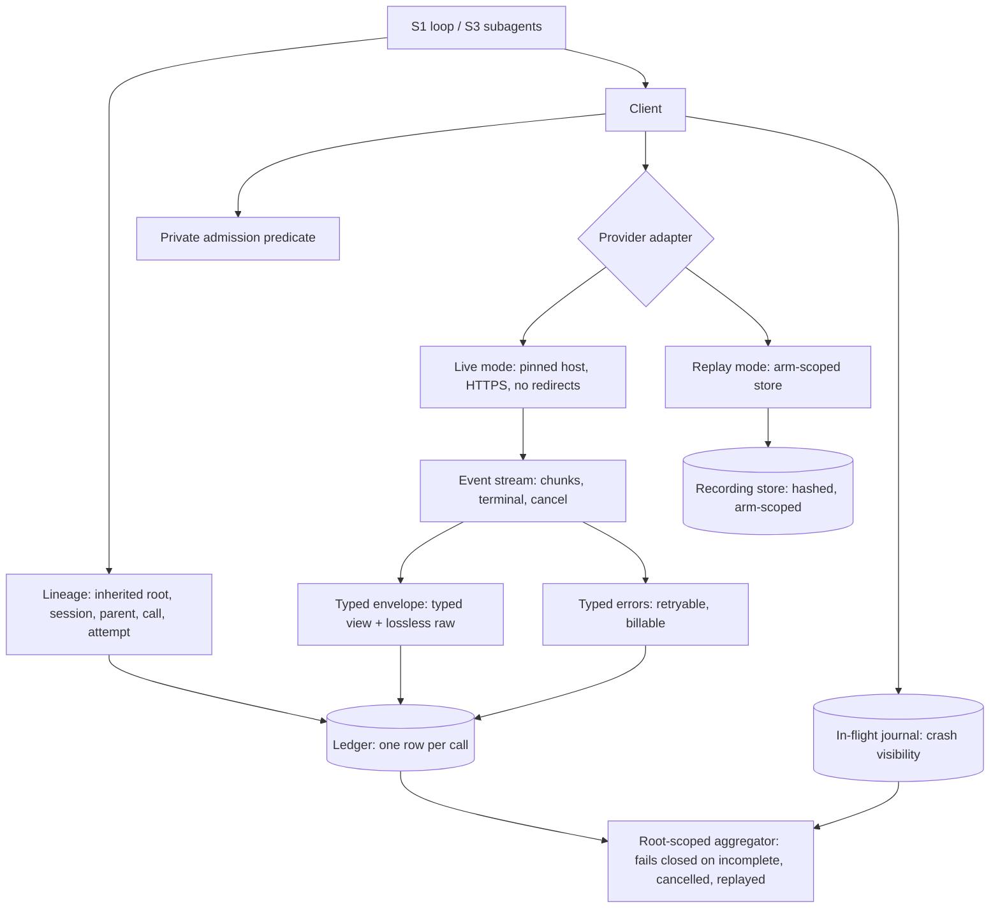

# DeepSeek PCB Harness S0 Provider Transport - Plan

## Goal Capsule

- **Objective:** Build the provider transport layer for a self-owned agent harness on the official DeepSeek API, so every later layer (loop, kernel, subagents, memory) calls one client whose failure modes, cost, and fidelity are already proven.
- **Deliverable:** A new `packages/temper-harness/` Python package providing a DeepSeek client, a typed error taxonomy, an exact cost/token ledger with session lineage, a record/replay store, a three-tier fidelity oracle, and the CI wiring that makes its own suite run.
- **Authority:** This plan is authoritative for S0. `docs/superpowers/specs/2026-09-17-deepseek-pcb-harness-design.md` is the parent design and is authoritative for S1–S7. Where they conflict, the conflict is recorded on the affected KTD.
- **Execution profile:** Python, test-first per unit. No Rust, no pyo3 boundary, no optimizer work.
- **Prerequisite:** a provisioned production DeepSeek API key, read from an environment variable. **Satisfied** — a key was provisioned, U1 ran against the live API on 2026-09-17, and the resulting captures are committed. The key is not, and must not be, in the tree.
- **Stop conditions:** Stop and report rather than absorbing a change, if any of these hold: no provisioned key is available (never substitute a hand-written fixture); the provider cannot express parallel tool calls or strict tool schemas; a required usage field is absent with no substitute; or the transport contract must change shape rather than gain a case.
- **Tail ownership:** S0 ends at a proven transport. The loop, L1 assembly, compaction, budget enforcement, and retry policy are S1 and are out of scope here.

---

## Product Contract

### Summary

This plan builds only the substrate: one DeepSeek client, one error taxonomy, one cost ledger, one replay store, one fidelity oracle. It deliberately does not build the agent loop. The reason to isolate it is that the parent design makes descendant-inclusive cost accounting and a transport-versus-model failure distinction load-bearing for a later fixed-expenditure experiment, and both are cheap now and rewrites later.

### Problem Frame

The 2026-09-09 → 2026-09-17 harness attempt spent 2,676,994,364 tokens across 477 threads, 73.7% of it in subagent workers, and never ran its headline experiment. Two of the defects that made that possible live in the transport layer: accounting that would have been root-only, and provider failures that were indistinguishable from model failures. S0 exists so that neither can recur, and so that the parent design's own falsification test — can the official API sustain a recursive, high-fan-out call pattern — can be run at all.

### Requirements

**Session lineage and cost accounting**

- R1. Every transport call carries registered lineage: root session, session, parent session, call, attempt. Root identity is inherited from process context, never supplied by the caller; opening a new root is an explicit, recorded act. A call whose lineage is absent, or whose parent chain does not resolve to a registered root, is a hard error.
- R2. Cost aggregation has exactly one entry point. It takes a root session and returns root-exclusive, descendant, and root-inclusive totals, with the inclusive total equal to the sum of the other two.
- R3. Every attempted call produces exactly one append-only ledger row, including calls that fail before reaching the provider, calls that are retried, and calls that are cancelled or truncated. Retries are never collapsed into one row.
- R4. Usage fields the provider does not report are `null`, never `0`. Each row records where its usage came from and whether it was served live or replayed.
- R15. An aggregate fails closed when any row in the selected subtree is incomplete, cancelled, or replayed, or else returns an explicitly labelled lower bound. It never silently sums a missing or unknown quantity as zero.

**Transport behavior**

- R5. The transport exposes an event-yielding, cancellable interface. A buffered implementation is the S0 default.
- R6. Provider failures are classified into distinct typed errors carrying retryable and billable flags, so a transport failure is never recorded as a model failure. The taxonomy covers pre-connection failures (DNS, connection refused, TLS) as well as the post-connection cases, and no exception on the send path propagates unclassified.
- R7. The client preserves arbitrary JSON Schema in tool definitions and the exact pairing and ordering of tool calls with their results. A malformed message array raises locally, before any network I/O.
- R8. A recorded response retains the lossless raw payload alongside a typed view.
- R16. The live adapter is pinned to the official DeepSeek host over HTTPS. A host override, a non-HTTPS scheme, and a redirect are all refused.

**Replay**

- R9. Live and replay are explicit, mutually exclusive modes. A missing recording in replay mode is a hard typed error, and no code path leads from a failed live call to a recording.
- R10. Recordings carry request and response content hashes plus provider, model, schema identity, and the arm and attempt that produced them. A request-hash mismatch refuses to serve rather than replaying a near-miss, and a recording never serves a request from a different arm.
- R11. No credential reaches disk, in any artifact the transport writes. Recordings, ledger rows, error records, captured fixtures, and canary evidence all carry an allowlisted header subset only.

**Verification and gating**

- R12. The fidelity oracle has three tiers: Tier A recorded (CI, deterministic), Tier B live canary (opt-in, hashed evidence), and Tier C socket fault injection (no model). Until Tier B has run, Tier A is a reproducibility instrument and must not be described as a fidelity instrument.
- R13. Every gate fails closed on an empty scan, and each ships a committed fault-injection test that fails on the exact input it exists to catch.
- R14. Ledger, error, store, envelope, and usage records are defined by committed schema files, not inline constants.
- R17. The harness suite and its gates run in CI under a required context. The new package adds explicit trigger wiring rather than relying on inheritance.

### Scope Boundaries

**Deferred to later sub-projects**

- Retry and backoff policy, budget enforcement, L1 assembly, and compaction — S1.
- Tool registry, dispatch, and permissioning — S2.
- Subagent session tree, daemon, message queues, and recursive fan-out — S3. S0 supplies lineage hooks and a bounded concurrency probe only.
- Continual Harness — S4. Agents View — S5. Long-horizon controls — S6. The experiment — S7.

**Outside this work's identity**

- A multi-provider framework. One interface, one DeepSeek adapter, one fixture adapter.
- A hand-written mock provider. Recorded fixtures are used instead, because a hand-written mock encodes the author's assumptions and proves nothing.
- A local tokenizer as an authoritative usage source.
- A general "run the harness offline" mode. The store serves tests and the oracle.
- An injectable admission-policy seam. S0 ships one private admission predicate; S3 introduces the interface when it has a second implementation to justify it.

### Dependencies

- The official DeepSeek API and a provisioned key, read from an environment variable and never from a file in the repo. **Satisfied: U1 has run.** All six units depend transitively on U1, so this was the critical path and it is now clear.
- Third-party runtime dependencies (an HTTP client and a JSON Schema validator) plus a regenerated `uv.lock`, both committed.
- The parent design's L2/L3 boundaries, so the store's scope does not drift into S1's offline-run mode.

### Outstanding Questions

- **Resolved (operational):** the DeepSeek key was provisioned as an environment variable and U1 ran. No blocking question remains for S0's offline units.
- **Deferred:** which git ref carries the Zapote Rust validators and the Python/KiCad adapter. Blocks S2.
- **Deferred:** the interlock unit's acceptance checklist in machine-readable form. Blocks S1 and the S7 scalar.
- **Deferred:** the interlock verifier's end-to-end latency and the pre-registered fixed cost `C*`. Blocks S7.
- **Deferred:** whether the recursive fan-out scenario belongs to S3's acceptance or a pre-S7 pilot. A bounded concurrency probe is in S0; the session-tree version is not.

### Sources

- Parent design: `docs/superpowers/specs/2026-09-17-deepseek-pcb-harness-design.md`.
- Prior control plane on the unmerged ref `origin/codex/buck-harness-experiment-plan`: `harness-lab/run_zen_trials.py` (a recorder/relay that validates the tool catalog against expected schemas and writes one request/status/response triple per call), `harness-lab/STREAM-DIAGNOSTIC.md` (five socket fault cases), and `harness-lab/telemetry.py` (the inline `SCHEMA_VERSION` anti-pattern). Port the fault tests, not the policy.
- Repo precedents for fail-closed recorded artifacts: `scripts/oracle_hashes.json` with `scripts/check_oracle_hashes.py`, `scripts/_lib/qualification_replay.py`, and `tools/wasm/r19_agreement_ledger.py`.
- CI mechanics: `.github/required-checks.json`, `scripts/check_required_checks.py`, `scripts/classify_changed_paths.py`.
- Measurement discipline: `docs/solutions/best-practices/a-measurement-carries-its-commit-2026-07-26.md`, `docs/evidence/2026-08-07-drc-ceiling-provenance-identity-incident.md`, `docs/solutions/logic-errors/drc-api-wrapper-components-and-location-always-empty.md`, `docs/evidence/2026-08-19-measurement-instruments-that-lie.md`.

---

## Planning Contract

### Key Technical Decisions

- KTD1. **S0 ships as `packages/temper-harness/`, a member of the existing uv workspace, and wires its own CI triggers.** (session-settled: user-directed — chosen over a new top-level `harness/` tree: `packages/**` is already a trigger path, whereas a new top-level tree matches none and would ship with no required contexts.) The inheritance claim is partial and is not the whole rationale: `packages/**` does trigger **Repo Hygiene & Import Gates**, **Fast Gates**, and **Cargo/Rustc Smoke Check**, but it does **not** trigger **Core Tests**, whose `job_triggers.paths` enumerates specific packages, and it does not trigger the job that runs `check_vacuous_gates.py`. No CI step invokes a bare root `pytest`, so adding the suite to root `testpaths` is a developer convenience only. R17 and U1 therefore make the missing wiring an explicit deliverable. This is also a deliberate exception to the repo-wide Rust preference in `AGENTS.md`: the runtime is a Python-dominant subsystem that is not a port of existing Rust logic. Python is the language with precedent here — `requests` is already declared in `packages/temper-workflow/pyproject.toml`.
- KTD2. **The fidelity oracle's authority is a live canary; recorded replay is the regression guard.** (conflict call-out: the approved parent design's S0 gate reads "fidelity tests pass against recorded responses". That wording is necessary but not sufficient, and if it is the only gate it is the self-consistency trap this repo has already hit twice — `test_clearance_rust_differential.py` pinned Rust equal to Python bit-for-bit and could not see a rotation-sign error, and the `R(+theta)` incident reproduced `kicad-cli` to four decimals while being the mirror of the truth. Recorded replay proves the client is reproducible, never that it carries the provider's semantics. The decision stands as the parent design's intent; the gate wording is strengthened per the evidence, not the decision reversed.) Per R12, the recorded tier is called a reproducibility instrument until Tier B has run.
- KTD3. **Accounting is descendant-inclusive by construction.** Root identity is inherited from context rather than supplied by the caller (R1), usage merges across all stream chunks, unknown fields stay `null` (R4), and the aggregate fails closed on any incomplete, cancelled, or replayed row (R15). Chosen over a single-process counter upgraded once subagents exist, because the prior attempt's numbers make the cost concrete: 6 root sessions reported 331.9 M tokens against a true 2.68 B. Two failure shapes drive the R15 clause specifically — a crashed call whose unmeasured usage would otherwise vanish behind a reassuring `incomplete` row, and a cancelled call whose partial usage a scored run could otherwise drop.
- KTD4. **U1 probes the live provider and freezes the schema from captured bytes.** Chosen over coding against the documented shape, because cache fields, whether reasoning tokens sit inside or beside completion tokens, parallel tool-call support, strict-schema support, and which stream chunk carries usage are all unverified for this provider's flash tier here. All five turned out to need correction, and the model id itself was wrong — see the captured-behaviour list in the Definition of Done.
- KTD5. **The ledger is an append-only JSONL file holding one row per call, appended once at terminal resolution.** Chosen over a locked database so the S3 daemon can append from multiple processes without a server (canonical JSONL mirrors `tools/wasm/r19_agreement_ledger.py`). Crash visibility comes from a separate append-only in-flight journal, not from mutating a row: an in-flight entry is opened before the request and a terminal entry appended after, so a crash leaves an unclosed in-flight entry. This resolves the tension between "exactly one row per call" (R3) and "a crash is visible" — an append-only file cannot close a row in place, so the two facts live in two records and R15 makes an unclosed entry fail the aggregate closed.
- KTD6. **Store scope is capture plus deterministic replay for tests and the oracle.** Chosen over a general offline-run mode, which belongs to S1's record/replay row in the parent design. Mode-exclusivity invariants stay in S0 because the seam is here.
- KTD7. **USD is derived from a versioned price table at `packages/temper-harness/pricing/<version>.json`, with its schema committed and its version identity recorded per row.** Both provider-reported and computed cost are retained. Chosen over a hardcoded rate, because a rate change would silently shift the fixed-expenditure comparison. A rate change adds a new version; existing rows keep the identity that produced them. Field names carry the convention (`billed_usd` versus `estimated_usd`) rather than a bare `cost`. Because both arms of a later comparison would share the same wrong table, U1 additionally asserts that computed and provider-reported cost agree on the probe set within a stated tolerance, so the arithmetic has an external check rather than certifying itself.
- KTD8. **The live canary is opt-in and does not run in CI by default.** It needs the production key, so it follows the `scripts/check_pad_world_position_oracle.py --verify-live-oracle` precedent: run on demand, evidence hashed and committed. Per R12, until it has run the recorded tier is reported as a reproducibility instrument.
- KTD9. **A recording is scoped by arm and attempt, and refuses to serve across them** (R10). Chosen because a shared store would otherwise hand a later experiment arm an earlier arm's complete model output, which defeats the parent design's "fresh isolated state per attempt" and "solution hidden" rules. Recordings produced by scored attempts are gitignored, never committed.

### High-Level Technical Design

The caller never talks to a raw HTTP response. The adapter is the only place that knows the wire format; the envelope is what every later layer consumes. Live and replay are the only two adapters, and mode selection is explicit.

### Assumptions

- ~~The official DeepSeek API supports a chat-completions surface with tool calling, and its `usage` block is reachable from a non-streaming call.~~ **VERIFIED.** Both hold: tool calling works (including parallel calls and strict schemas), and `usage` is reachable from both a non-streaming and a streamed call. The contract did not need to change shape, though six *values* it carries did — enumerated in the Definition of Done. One further assumption was falsified: the model id the plan named does not exist on this provider.
- The provider exposes no billing reconciliation endpoint reachable from this client. **Partially verified, and worse than assumed:** no billing endpoint was probed, but the completion response carries no cost field either, so there is no provider-reported figure to reconcile against at all. KTD7's tolerance assertion is therefore unavailable, **but the price table is now committed and its rates verified against the account's own balance** (see the U1 findings). The reconciliation is against a balance *delta* rather than a per-call cost field, and its precision is bounded by the two decimals the balance is quoted to — which the table's own schema states.

---

## Implementation Units

### U1. Probe the live provider, freeze the schema, and wire CI

**Goal:** Replace every assumption about the provider's wire behavior with captured bytes, and make the package's own gates actually run.

**Requirements:** R4, R11, R14, R17. **Depends on:** a provisioned API key.

**Files:** `packages/temper-harness/pyproject.toml`, `packages/temper-harness/src/temper_harness/provider/probe.py`, `packages/temper-harness/pricing/<version>.json`, `packages/temper-harness/schemas/` (JSON Schema files), `packages/temper-harness/tests/provider/test_probe.py`, fixtures under `packages/temper-harness/tests/fixtures/captured/`, plus edits to root `pyproject.toml` (`testpaths`, `pythonpath`), `.github/required-checks.json`, and `uv.lock`.

**Approach:** Issue a small number of real requests covering: a plain completion; a completion with parallel tool calls; a completion with a strict-schema tool definition containing `additionalProperties: false`, `required`, `enum`, `$defs`/`$ref` and a nested `oneOf`; a streamed completion; and a deliberately invalid request. Capture request and response **bodies** verbatim, and headers through the same allowlist R11 imposes on the store — never the raw header block. Write the committed schemas for the typed envelope, the usage record, the error record, the ledger row, and the recording. Record which fields the provider does not emit in the Definition of Done's unknowns list. Wire the suite into CI: add `packages/temper-harness/**` to the `Core Tests` job trigger paths in `.github/required-checks.json`, and add an explicit step that runs the harness suite with a `pytest_guard.py` minimum-test floor, so the suite cannot pass by collecting nothing.

**Test Scenarios:** Captured fixtures parse into the committed schemas. A schema file exists for the envelope, usage, error, ledger row, and recording, and each is validated in CI. No captured fixture contains an `Authorization` header or the key value. Every captured response's `usage` is present and non-null, or the gap is recorded as a named unknown. Parallel tool calls appear with distinct ids and stable ordering, or the limitation stops the plan per the Goal Capsule stop conditions. Reasoning content is either absent or captured, and its token accounting is stated as inside-or-beside completion tokens from the observed bytes, never inferred. Computed and provider-reported cost agree on the probe set within the stated tolerance. A CI-diff simulation touching only `packages/temper-harness/**` shows the harness suite's job scheduled, not skipped.

**Verification:** The captured fixtures and five schemas are committed; the CI wiring is present and a simulated path-diff schedules the job; the recorded unknowns are enumerated in the Definition of Done.

### U2. Cost ledger, in-flight journal, and session lineage

**Goal:** Make descendant-inclusive accounting structural rather than a convention.

**Requirements:** R1, R2, R3, R4, R14, R15. **Depends on:** U1.

**Files:** `packages/temper-harness/src/temper_harness/ledger/`, `packages/temper-harness/schemas/ledger_row.schema.json`, `packages/temper-harness/tests/ledger/`.

**Approach:** Root identity is resolved from process context and registered once by an explicit open-root call; a caller cannot name its own root. Opening a root, opening a call, and closing a call each append a record; the ledger holds one row per call, appended at terminal resolution, and the in-flight journal holds the unclosed entries that make a crash visible. Aggregation is a single function whose only argument capable of selecting spend is a root session id, and it fails closed when the subtree contains an incomplete, cancelled, or replayed row. Usage merges across all stream chunks; unknown fields are `null`. The price table is versioned data whose identity is recorded on every row.

**Test Scenarios:** A synthetic tree of a root, two children, and a grandchild with known spend satisfies inclusive equal to exclusive plus descendants, and a partial sum cannot be produced through the public API. A child that attempts to register its own root is rejected and its spend is attributed to the true root. A call with no registered lineage raises. A row whose parent chain does not resolve to a registered root makes the aggregate fail closed rather than being omitted. A simulated crash between call-open and terminal resolution leaves an unclosed in-flight entry, and an aggregate over that subtree fails closed or returns a labelled lower bound. A call that fails before reaching the provider still produces a row. A failed call and its retry produce two rows. A usage field absent from the provider response is `null`, not `0`. A response whose usage arrives split across chunks is merged correctly. A row retains the price-table identity that produced its USD.

**Verification:** `uv run --no-sync pytest packages/temper-harness/tests/ledger` passes, including the self-rooting rejection, the unresolved-parent-chain failure, the crash case, and the reconciliation invariant.

### U3. Transport interface, error taxonomy, and provider adapter

**Goal:** One client seam whose failures are classified before any later layer sees them.

**Requirements:** R5, R6, R7, R8, R16. **Depends on:** U1, U2.

**Files:** `packages/temper-harness/src/temper_harness/provider/`, `packages/temper-harness/schemas/error.schema.json`, `packages/temper-harness/tests/provider/`.

**Approach:** The interface yields events and supports cancellation; a buffered implementation is the default. Errors are distinct types for pre-connection unavailability, rate limit, server error, timeout, malformed stream, incomplete stream, context-length exceeded, tool-schema rejection, and content filtering, each carrying retryable and billable flags, and any exception on the send path is classified rather than propagated raw. The live adapter pins the official host, requires HTTPS, and refuses redirects and configured host overrides. Admission is one private predicate on the adapter. The message builder enforces tool-call id pairing and ordering and raises before network I/O. The DeepSeek adapter is the only module that knows the wire format; a fixture adapter reads the U1 captures.

**Test Scenarios:** Two or more tool calls in one response preserve ids, indices, and nested or unicode arguments, and the typed view re-serializes to the captured bytes for provider-emitted fields. A tool message whose id matches no preceding call raises locally with zero network calls. A message array with an assistant tool-call turn followed by two tool results round-trips in order. Provider schema rejection is a distinct error from content filtering and from rate limiting. A connection refused and a DNS failure each classify as pre-connection unavailability with defined retryable and billable flags, and produce a ledger row. A truncated stream raises an incomplete-stream error, retains partial usage, and is not billed as complete. A cancelled stream leaves a row whose usage is explicit-unknown or a labelled lower bound, never a silent zero, and the root aggregate reflects it. A 200 response with a non-JSON body raises a malformed-response error with raw bytes retained. A redirect and a non-HTTPS base URL are both refused. Request-as-sent equals request-as-constructed, proving no hidden mutation or truncation.

**Verification:** `uv run --no-sync pytest packages/temper-harness/tests/provider` passes. `finish_reason` is asserted present on every terminal event.

### U4. Record and replay store with mode and arm exclusivity

**Goal:** Deterministic reruns without network, that cannot silently substitute for a live call or leak across arms.

**Requirements:** R8, R9, R10, R11, R14. **Depends on:** U1, U3.

**Files:** `packages/temper-harness/src/temper_harness/store/`, `packages/temper-harness/schemas/recording.schema.json`, `packages/temper-harness/tests/store/`.

**Approach:** A recording is the request body, the response body, an allowlisted header subset, content hashes of each, and the provider, model, schema, arm, and attempt identity that produced it. Mode is selected explicitly at construction. A request-hash mismatch or an arm mismatch is a hard error; there is no nearest-match fallback and no path from a failed live call into a recording. Recordings from scored attempts are gitignored.

**Test Scenarios:** A request-hash mismatch refuses to serve. An arm mismatch refuses to serve. Replay mode with a missing recording raises and makes zero live calls. A live call that fails never falls back to serving a recording. An aggregate over a subtree containing a replayed row fails closed rather than summing it. A recording round-trips to byte-identical response bytes. A redaction canary scans every artifact the transport writes — store, ledger, in-flight journal, error records, captured fixtures, and canary evidence — for a planted key and fails if found. An empty recording scan fails rather than reporting clean. A recording whose schema version is unparseable fails. The store cannot be written during a replay run.

**Verification:** `uv run --no-sync pytest packages/temper-harness/tests/store` passes, including the arm-mismatch refusal, the live-failure-no-fallback test, the replayed-row aggregate failure, and the widened redaction canary.

### U5. Recorded oracle and fault injection

**Goal:** Make each S0 gate demonstrably fail on the input it exists to catch.

**Requirements:** R12, R13, R14. **Depends on:** U3, U4.

**Files:** `packages/temper-harness/src/temper_harness/oracle/`, `packages/temper-harness/tests/oracle/`, `packages/temper-harness/tests/faults/`.

**Approach:** Tier A runs the recorded corpus in CI and is deterministic. Tier C injects the five socket faults, without a model. Each gate carries a committed perturbation test proving it goes red. The perturbations are chosen to attack provider *semantics*, not just bytes: reordering tool-call results, and dropping a required field from the typed view while leaving the raw bytes valid. Vacuity-sensitive aggregation lives under `src/`, because `check_vacuous_gates.py` excludes test modules from its scan by filename convention.

**Test Scenarios:** Perturbing a tool schema makes the oracle fail. Reordering two tool-call results in the typed view makes the oracle fail while the raw bytes stay valid. Dropping a required field from the typed view makes the oracle fail while the raw bytes stay valid. Dropping a usage field makes the ledger fail closed. Mutating one response byte makes replay detect the mismatch. An empty recorded corpus fails the oracle. Interleaving a full system, user, assistant-tool-call, tool, tool, assistant sequence round-trips with ordering intact. A duplicate provider tool-call id raises a protocol error. A chunk boundary inside a UTF-8 codepoint reassembles without mojibake. The five socket faults each classify into their intended error type, and a 429 followed by a success produces two ledger rows with the failed row retained and not billable. Each perturbation's guard-removed failing run is captured as hashed evidence, not performed as an unrecorded manual act.

**Verification:** `uv run --no-sync pytest packages/temper-harness/tests/oracle packages/temper-harness/tests/faults` passes. `uv run --no-sync python scripts/check_vacuous_gates.py` covers the oracle's aggregation modules under `src/`.

### U6. Live canary and bounded concurrency probe

**Goal:** Anchor the oracle to the real provider and measure its behavior under concurrency.

**Requirements:** R12, R2, R15, R16. **Depends on:** U2, U3, U4.

**Files:** `packages/temper-harness/tests/canary/`, `packages/temper-harness/tests/canary/test_fanout.py`, `packages/temper-harness/README.md`.

**Approach:** An opt-in canary issues the U1 probe set against the live API and compares shapes against the recorded corpus, writing hashed evidence that contains only hashes, the model id, the date, and redacted shape summaries. The concurrency probe issues a bounded number of simultaneous transport calls with distinct lineage, to measure rate-limit behavior and per-call attribution into the root aggregate. It is a probe of the transport, not a session tree: no parent/child session semantics, no `rlm` primitive, no daemon. Both are documented as on-demand, not CI gates, consistent with KTD8.

**Test Scenarios:** Every concurrent call is attributed to its own session and included in the root aggregate. A live shape change from the recorded corpus fails the canary. The canary's committed evidence contains no request body, no response body, and no key material. Running the canary without a key produces a typed blocked error, not a skip that reports clean.

**Verification:** The canary is run once by hand against the live API and its evidence committed under `packages/temper-harness/tests/canary/evidence/`, or the report states plainly that S0's fidelity claim rests on reproducibility alone. The concurrency probe's attribution assertions pass.

---

## Verification Contract

| Command | Applies to | Proves |
|---|---|---|
| `uv run --no-sync pytest packages/temper-harness/tests` | all units | Unit, oracle, and fault suites pass |
| Simulated path-diff against `.github/required-checks.json` | U1, R17 | A diff touching only `packages/temper-harness/**` schedules the harness job |
| `uv run --no-sync python scripts/check_vacuous_gates.py` | U5 | No unguarded vacuous aggregation in gate paths under `src/` |
| `uv run --no-sync python scripts/check_orphaned_python_modules.py` | all units | No production module has zero importers anywhere; test-only-reachable modules are tagged, not failed |
| `uv run --no-sync python scripts/check_hash_order_determinism.py` | U2, U4 | No new `PYTHONHASHSEED`-dependent ordering in a determinism-bearing artifact |
| `uv run --no-sync python scripts/import_linter_gate.py` | all units | Import boundaries hold |
| `uv run --no-sync python scripts/check_manifest_gate.py` | if scripts are added | Any new `scripts/*.py` carries a manifest entry |
| `uv run --no-sync python scripts/vulture_gate.py` | all units | No new dead code. **Added after the fact**: this gate runs in `Repo Hygiene & Import Gates`, a required context that `packages/**` triggers, and it was failing on three new findings — two fixtures used only for their side effect and an unsatisfiable ternary. The contract did not list it, so the branch went to CI red. |
| `uv run --no-sync python scripts/check_rust_coverage_illusions.py --self-test` then without `--self-test` | all units | A new production module whose *name* overlaps a Rust file must be triaged in `.rust-coverage-illusion-inventory`. **Added after the fact**: `temper_harness.schema_registry` collided on the word "schema" with `temper-design-bundle/src/schema_validator.rs` and the gate hard-fails on an unledgered pairing. The row records why it is a false positive; the alternative resolutions the ledger names (port the Python, rename the Rust) are both wrong here, because nothing Rust implements a JSON Schema registry. |
| `uv export --all-packages --no-emit-workspace --format requirements-txt --no-hashes > requirements-ci.txt` and `git diff --exit-code` | U1 | The committed CI requirements export matches the lock. **Added after the fact**: adding `requests` to the package updated `uv.lock` (which the contract did list) but left this derived export stale, and the same job failed on it. |
| `uv lock` with the result committed | U1 | Third-party dependencies are pinned |
| `make regen` | plan landing | Generated package and plan counts match |
| `make extensions-check` | not applicable | S0 adds no pyo3 crate; recorded as not applicable rather than skipped silently |

`packages/temper-harness/tests` and `packages/temper-harness/src` are added to root `testpaths` and `pythonpath` for local developer convenience. That wiring does **not** make CI run the suite; the CI step added by U1 does.

---

## Definition of Done

**Global**

- **Met.** All six units' test scenarios pass. Every gate has been observed failing on its motivating input: the oracle's nine guards via the committed guard-removal evidence, the redaction canary via a planted key in each artifact kind, the allowlist via fault injection, the replay refusals via perturbed corpora, and the two implementation guards (mode exclusivity, request-hash refusal) by removing them from the source and watching exactly their tests go red.
- **Met.** **Seven** schema files are committed and validated in CI — the five R14 names, plus `canary_evidence.schema.json` and `pricing.schema.json` (KTD7 asks for the price table's schema explicitly), added because the canary's evidence is a record we commit and a claim that gets checked, so its shape belongs in a file rather than in a dataclass. No `SCHEMA_VERSION` constant exists inline in Python, and the field lists, header allowlist, recording versions, and evidence format version are all read from those files rather than restated. The anti-inline-version check was **widened** from the literal `SCHEMA_VERSION` spelling to any `\w*SCHEMA_VERSION`: a prefixed name had walked straight past it, and one had (`EVIDENCE_SCHEMA_VERSION`).
- **Met.** The harness suite runs in CI under a required context, with the floor at the measured test count. Simulated path-diff: a diff touching only `packages/temper-harness/**` schedules **Core Tests** (via `packages/temper-harness/**`), **Cargo / Rustc Smoke Check** and **Repo Hygiene & Import Gates** (both via `packages/**`). Reproduce with `matching_patterns(changed, job_triggers[job].paths)` from `scripts/check_required_checks.py` — note the argument order, and that `changed` must be a list rather than a single string, or the call iterates the path's characters and reports a false negative.
- **Met.** Descendant-inclusive aggregation is the only public way to obtain a cost total, it fails closed on an incomplete, cancelled, or replayed row, and it now reconciles against the provider's own `total_tokens`.
- **Met.** The live canary has run against the official API — 2026-09-17, `deepseek-flash`, all **twelve** probes matching — and its hashed evidence is committed. Tier A is therefore anchored to a live *shape* observation. See "What Tier B anchors, precisely" for how far that claim reaches and where it stops.
- **Met.** Unknown provider behaviours found in U1 are enumerated in the unknowns list, including the ones that could not be resolved: cost, the context-length and content-filter message texts, the 401 body shape, and whether a 429 carries `retry-after` here.
- **Met.** No abandoned probe scripts or throwaway adapters remain: `probe.py` is the probe, the adapters are the two the design calls for, and the one removed guard (`error_classified`) was deleted from the source rather than left as a comment.
- **Met.** `make regen-check` is clean and the branch is pushed.

**Landing status**

Opened as PR #1603, 17 commits, 459 tests, and the CI floor follows the count. The PR's own two gates pass in the required
contexts — **Core Tests** (19m50s, which is what actually runs this suite with the
`--min-tests` floor) and **Repo Hygiene & Import Gates** (9m51s) — and the simulated
path-diff confirms that a diff touching only `packages/temper-harness/**` schedules
**Core Tests** rather than skipping it.

The PR reads `BLOCKED` for a reason that has nothing to do with it:
`Rust Checks (cargo check + clippy)` fails on **main** at
`clearance_grid_hv_expansion_fence` (`packages/temper-orchestration/tests/d3_stages_runner.rs:529`,
"HV expansion appends one log entry", left 0 right 1). This branch's diff contains zero
`.rs` files and nothing under `packages/temper-orchestration/`, and main fails the same
workflow in 6 of 6 recent runs. Filed as #1604 with the evidence; #772 is an older,
staler trunk-health issue naming a different gate. Two of the three `red` checks are
downstream of it (`Required Python Tests` is an aggregator; `Board, Provenance &
Requirements Gates` is advisory and already red on main).

Follow-up with the measurements nobody has taken, and the cost of each: #1602.

**Per unit**

- U1 complete when the captured fixtures and five schemas are committed, no fixture carries a credential, the CI wiring schedules the suite, and every unverified provider behavior is named.
- **U2 complete.** Self-rooting is rejected, an unresolved parent chain fails the aggregate closed, a crash leaves an unclosed in-flight entry that fails the aggregate, and the reconciliation invariant holds — against the provider's own `total_tokens`, which is the only external check available.
- **U3 complete.** A malformed message array raises before network I/O (and one captured fixture is the provider's refusal of exactly that array, so the local guard is aligned with a real refusal rather than an imagined one). A pre-connection failure is classified and carries defined retryable/billable flags. A cancelled stream cannot be confused with a completed one, because a turn with no `finish_reason` is never `ok`. The live and replay adapters share one decoder, and their typed views are asserted equal on the same bytes.
- **U4 complete** for the offline half: request-hash and arm mismatches refuse to serve, a failed live call cannot fall back to a recording, the store cannot be written during a replay run, and the redaction canary fails on a planted key in every artifact kind R11 names. The provider-facing adapter is now built (U3), so replay is wired end to end.
- **U5 complete.** Nine guards, each with a perturbation crafted to trip it and only it, and each observed accepting that perturbation once disabled — recorded in `packages/temper-harness/tests/oracle/evidence/guard_removal.json` and re-derived on every run so it cannot drift. The five socket faults are ported from the prior attempt's diagnostic, mechanism kept and expectations re-derived.
- **U6 complete.** The concurrency probe attributes every call to its own session and every one of them to the root aggregate, in CI and without a model. **The live canary has run** (2026-09-17, `deepseek-flash`): all twelve probes matched their recorded shapes, so Tier A is anchored to a live observation rather than resting on reproducibility alone. Its evidence is committed at `packages/temper-harness/tests/canary/evidence/canary.json` and carries no request body, no response body, and no credential.

  **The first run had dirty provenance and was re-run to fix it.** It was made from a
  tree whose canary code was still uncommitted at the HEAD it named (`e596a1b80`, the U5
  commit), and the evidence said so — `harness_dirty: true` — because the provenance
  discipline records dirt instead of assuming it away. That is the field earning its
  keep: without it the file would have looked identical to a reproducible one. The
  re-run at `51a789926` (a commit that contains all seven canary files, worst case
  checked with `git ls-tree`) recorded `harness_dirty: false`, all twelve probes matched
  again, and the committed evidence is therefore reproducible from the commit it names.

### What Tier B anchors, precisely

The canary has run, so S0 may make a fidelity claim — and it is worth stating exactly
how much that is worth, because "the canary passed" is easy to over-read.

It anchors the **wire shape**: no field was renamed, moved, dropped, or added between the
recording and a live observation; usage still arrives on the final stream chunk with a
reconciling total; a 400 is still a 400; the `[DONE]` sentinel is still there. Those are
the changes that would break this client silently, and they are now ruled out as of the
canary's date rather than assumed.

It does **not** anchor anything about the model's semantics. It does not show that a
recorded completion would be reproduced, that the reasoning-token subset relation is
universal, that the model's PCB judgements are any good, or that the harness beats a
direct agent. Per KTD2, a recorded corpus can never carry the provider's meaning; the
canary narrows the gap to the wire and no further. Physical, electrical, and safety
claims remain untouched and unclaimed.

### Found while building the canary and the probe (U6) — two more

17. **The concurrency probe mis-attributed every worker's spend as the root's own.**
    The aggregate decides "root exclusive" from whether a row's session has a parent,
    and the probe registered its six workers as root-level sessions — so 231 tokens of
    descendant spend were filed under the root. That is the prior attempt's incident
    reproduced *inside the instrument built to detect it*, and a test caught it because
    the test asserted the descendant bucket rather than the total. The probe now
    registers its workers as children of a root session, and `FanoutResult.descendant_tokens`
    names the figure a root-only sum cannot see.
18. **`contextvars` do not cross a bare thread boundary.** The active root is invisible
    in a worker, so each worker must `attach_root` explicitly. The refusal for not doing
    so is typed, which is the property that matters: an unattached worker fails loudly
    instead of minting a sibling root whose spend would be invisible to the parent's
    total. Both halves are pinned by tests.

### Found while building the oracle and the faults (U5) — six more corrections

11. **A read timeout mid-stream was not classified at all.** Only the initial request
    was wrapped, so a `ReadTimeout` during the body propagated raw out of the send
    path (R6). Porting the stall fault is what found it.
12. **`requests`' `Timeout` inherits from `OSError`, and the general classifier checks
    `OSError` — so a read timeout was reported as a pre-connection failure.** That is
    the opposite of what happened, and it flips `billable` in the wrong direction:
    a request that was sent and may have generated would have been recorded as a free
    failure. `classify_request_exception` now translates the client's hierarchy, with
    `ConnectTimeout` checked before `Timeout` because it inherits from both and means
    nothing was sent.
13. **Cancellation was instance state, so two overlapping streams on one transport
    clobbered each other.** `LiveTransport.stream` reset a `_cancelled` flag at entry
    and one `cancel()` stopped every call on the instance. `Transport` now has no
    `cancel()` at all: closing the event iterator unwinds the adapter and runs its
    `finally`, which is per-call, idiomatic, and impossible to point at the wrong
    stream. Porting the concurrency fault is what found it.
14. **A duplicate tool-call id across two indices was accepted.** Each result is keyed
    by id, so a duplicate makes the pairing ambiguous and the array unreconstructable.
    Now a `MalformedStream`.
15. **`Retry-After` had nowhere to go.** It is the only actionable fact on a 429, and
    a header not captured at the moment of the refusal cannot be recovered later, so
    the error record gained `retry_after`. The HTTP-date form is deliberately not
    converted: that would put a clock inside a classifier. Ported from the
    rate-limit fault, which asserted header capture for the same reason.
16. **One oracle guard was unfalsifiable, and was removed rather than kept.** An
    `error_classified` check would have re-derived an error record from the status and
    body and compared it to itself — no input could make it fail. An unfalsifiable
    check in a gate is a shape this repo has paid for before, so the guard is gone and
    the reason is recorded where it used to be. The same suite also caught a
    *wrong* check: a verbatim substring search for tool-call arguments in the raw
    payload, which fires on a perfect recording because the payload JSON-escapes the
    quotes inside an argument string. It was replaced by a direct read of the
    provider's own JSON.

Perturbations trip exactly one guard each, and `test_with_every_guard_disabled_nothing_is_rejected`
shows that with no guards at all every one of them passes — which rules out a
rejection coming from something structural rather than from the guard named.

### Captured provider behaviour (U1) — measured, not documented

Ten probes were issued live against `deepseek-flash`; the bytes are committed under
`packages/temper-harness/tests/fixtures/captured/` with a manifest carrying each
request hash, status, and response digest. Six assumptions the plan made turned out
to be wrong, and each is worth more than the fixture it changed:

1. **`deepseek-v4.1-flash` is not a model this provider serves.** The account offers
   `deepseek-flash` and `deepseek-v4-pro`; the API's own 400 names them. The plan's
   model id belongs to a different provider's catalogue, so every reference in this
   plan and in the code is corrected to `deepseek-flash`. The plan's Assumptions
   section is falsified here and amended below.
2. **`reasoning_content` must be replayed.** The provider runs in a thinking mode and
   refuses an assistant tool-call turn that omits it — but only when it does not
   already recognize the `tool_call` id. Measured 5/5 accepted with the field present
   versus 5/5 refused without it against ids the provider had not seen, on an
   otherwise identical body. A client cannot inspect that server-side state, so the
   rule is *always* replay it. `ChatMessage.to_wire` silently dropped the field, which
   would have produced a transport that worked in a quick test and failed later.
3. **Reasoning tokens sit inside completion tokens.** `completion_tokens=18` with
   `completion_tokens_details.reasoning_tokens=15` and three tokens of visible
   content. The aggregate summed both, over-reporting output tokens by 83 % on that
   sample. The additive set is now `prompt_tokens + completion_tokens` only, and
   `total_tokens` is reconciled against it.
4. **Usage is not fragmented in streaming.** It arrives complete on the final chunk,
   directly beside the `finish_reason`, and the stream terminates with an SSE
   `data: [DONE]` record. Accumulating across chunks would have produced a null usage
   block for every streamed call — a systematically-zero column.
5. **A 400 is not a tool-schema rejection.** All four captured 400s carry
   `type: invalid_request_error` and `code: invalid_request_error`: a bad model name,
   an orphaned tool result, a malformed tool schema, and a dropped reasoning field.
   The status cannot discriminate; the body can. `for_http_status(400)` now maps to a
   new non-retryable `request_rejected` category, and `classify_http_response`
   refines to `tool_schema_rejected` from the message.
6. **Tool-call arguments fragment character by character** (`{`, `"`, `reference`, …),
   so a split inside an escape sequence is the norm rather than an edge case.
   Continuation fragments carry only `index` and `arguments` — no `id`, no `name`,
   and no `type`. The reassembler is now also run over the real fragments in CI.

Also measured: parallel tool calls and strict schemas (including `$defs`, `$ref`,
nested `oneOf`, `additionalProperties: false`) are both supported; the provider
validates tool schemas server-side; `system_fingerprint` is present on every
success; a tool-call turn reports `content` as an empty string, not null; absent
stream delta fields are explicit `null`; and the response carries **no cost field**.

### Found while building the adapter (U3) — four more corrections

7. **The request identity depended on a Python scalar's type.** A captured
   `"temperature": 0` and a client that passed `0.0` encode differently, so a
   refactor that changed nothing observable would have changed every request hash
   and silently invalidated the corpus. `canonical_request_bytes` now normalizes
   integral floats to ints, so a request's identity is its numeric *value*.
8. **The client could not bound a completion.** `max_tokens` was absent from
   `build_wire_request`, which means a harness that cannot bound a turn cannot bound
   what it spends — and S7's fixed-expenditure comparison is denominated in exactly
   that bound. Added, and the captured bodies already carried it, so the fixtures
   are reproducible by the client's own encoder byte for byte.
9. **A recording without its status line replays a failure as a success.** The
   recording schema gained `http_status`, and the adapter records successes only: a
   refusal's evidence is the ledger row and the captured 400 fixtures, while a
   replay corpus entry that reproduces a truncated turn would be worse than none.
10. **Two more error categories were reachable and misclassified.** A 401/403 fell
    through to the unknown catch-all, which is retryable — so a wrong key would have
    been retried forever against a provider that refuses it identically every time.
    Both map to `request_rejected` now, with the status retained on the record. And
    a missing credential, which happens on this side before any I/O, needed its own
    category (`credential_missing`) because R3 still requires a row for a call that
    failed before reaching the provider.

The corpus is also a corpus rather than a log: `test_probe` re-derives each
captured request's hash through the client's own encoder, so a fixture that no
replay could ever look up fails the suite. The one exception is
`orphan_tool_result`, which is *deliberately* a body the client refuses to build —
that is what its fixture is evidence for.

### Found by an adversarial review of this branch (post-U6) — nine corrections

The branch was reviewed adversarially against its own claims before landing. Nine
defects came back; all nine are fixed and pinned by tests, and two of them are the
class this repository documents most insistently.

19. **`wire_body` silently dropped `max_tokens`** — the field correction #8 says was
    added so a harness could bound what it spends. The `Request` carried it and
    `build_wire_request` accepted it; the wire path never passed it. **Nothing noticed,
    because every test compared `wire_body`'s output against `wire_body`'s output, and
    the captured fixtures agreed with the omission — having been produced through the
    same function.** Correction #8's own claim that "the captured bodies already carried
    it" was therefore false. This is the "correct by coincidence" shape, in this branch,
    in the one field that bounds cost. Fixed, and pinned — after an adversarial review
    pointed out that the first version of the pinning test *enumerated* seven keys while
    claiming to "walk the fields `Request` carries", so a newly added field would have
    passed it. It is now structural: a table of `Request` field to wire key, asserted to
    cover the dataclass exactly, so a new field fails the suite until someone decides what
    happens to it on the wire (finding 41).
20. **The ledger's `seq` was not unique, and a test asserted that it was.** The counter
    lived on the instance, so two threads read the same value and two processes each
    seeded from their own read of the file. Measured: sixty concurrent appends wrote
    sixty rows with **three** distinct sequence numbers. The single-threaded test could
    not see it, and KTD5 explicitly designs for append from multiple processes. The
    allocation now happens **inside the file**, under an exclusive lock, with the read
    taken from the file's tail. Measured after: 60/60 unique.
21. **Concurrent recording of the same request corrupted the write.** The staged temp
    name was keyed on the pid alone, so every thread in a process shared one path: the
    first `os.replace` unlinked it and the rest raised `FileNotFoundError`. Measured: 40
    threads, 32 failures. The transport is explicitly shareable and the design names the
    case it breaks — "a recursive fan-out where every worker asks the same question".
    Fixed with a per-call unique staged name; measured after: 40 threads, 0 failures.
22. **A local store refusal was reclassified as a retryable provider failure.**
    `_record` runs inside the block that classifies send-path exceptions, and a
    `StoreError` is not one — so a `ModeViolationError` surfaced as
    `unknown_transport`, whose `retryable` flag is True. Deterministic local refusals
    were being handed to S1's backoff policy as things to retry forever, which is the
    collapse the store's own taxonomy exists to prevent.
23. **`except BaseException` around the request would have ledgered a Ctrl-C as a
    retryable transport failure.** Now `except Exception`, with the reason written down.
24. **`classify_exception` misclassified the client's timeouts, and only the adapter's
    choice of a second entry point hid it.** `requests`' `Timeout` is not Python's
    `TimeoutError` and *is* an `OSError`, so the documented catch-all reported a read
    timeout as a pre-connection failure — flipping `billable` in the wrong direction.
    There were two entry points; there is now one, and it knows the client's hierarchy,
    with `ConnectTimeout` matched before `Timeout` because it inherits from both.
25. **A 3xx from a replay mapped to the retryable catch-all.** The live path intercepts
    redirects, so this only bit a hand-edited or imported recording — which is exactly
    where a silent misclassification is hardest to notice.
26. **`Aggregate.call_count` counted rows the lower bound had excluded**, so a lower
    bound could claim a non-vacuous agreement (`reconciles` gates on a non-zero count)
    over rows it had not summed.
27. **`compare_shapes` iterated only the recorded keys**, so a wholly new shape key was
    silently ignored — while the docstring claimed the opposite property and the
    addition it *did* report was a different one. Union iteration now.

Two smaller ones: `CanaryReport.ok` was flagged by `check_vacuous_gates` (the expression
was correct, the gate is deliberately syntactic, and the early-return form it wants
reads better), and one oracle guard had been left behind as a dead function while the
plan claimed it had been deleted — it is now a comment, so the deletion is the deletion.

The review also found the canary-evidence provenance problem recorded under U6 — the
first run was made from a dirty tree — which the `harness_dirty` field then made
visible, and which a clean re-run closed. It confirmed the credential discipline held:
no committed file contains a key, an `Authorization` value, or a response body carrying
one, re-verified after every live run.

### Found by reading the provider's own documentation (post-review) — six more

The provider publishes an error-code page and four quick-start pages. U1 measured the wire
and never read them, which was a mistake worth naming: every finding below was available
for free, and two of them are defects the captures could not have revealed because nothing
in the corpus exercises those paths.

28. **402 and 422 were unclassified.** The documented codes are 400 (Invalid Format), 401
    (Authentication Fails), 402 (Insufficient Balance), 422 (Invalid Parameters), 429 (Rate
    Limit Reached), 500 (Server Error) and 503 (Server Overloaded). This client handled
    400, 401, 403, 408, 429, 3xx and 5xx — so 402 and 422 fell through to
    `UnknownTransportError`, whose `retryable` flag is True. An empty account and a bad
    parameter would each have been retried forever while every row read as an unknown
    transport fault. Fixed by drawing the line at *remedy*: 422 joins 400 in
    `request_rejected`; 402 becomes `insufficient_balance` because the request may be
    perfect and the refusal still happens; 401/403 become `auth_rejected`, distinct from
    `credential_missing` which is our refusal before any I/O. A table transcribed from the
    published codes now pins the mapping, and a second test pins retryability to the
    documentation's own advice — retry on 429 and the 5xx family, change something on 4xx.
29. **`temperature` is accepted and silently ignored.** Thinking mode is enabled by default,
    and the documentation states it does not support `temperature`, `presence_penalty`, or
    `frequency_penalty`: setting them "will not trigger an error but will also have no
    effect". **Every probe in the corpus sets `temperature: 0` and it does nothing.** So a
    caller cannot buy determinism with it on this model, and no response says so. Documented
    on `Request` and `build_wire_request`; it takes effect only with `thinking=False`.
30. **The price table cannot be flat.** Every rate is quoted at two prices and off-peak is
    exactly half of peak, with peak a wall-clock window (weekdays, 01:00-04:00 and
    06:00-10:00 UTC). A table carrying one number per rate would be wrong by a factor of two
    for part of every day. KTD7 asked for a versioned table and did not know this; the table
    now carries the window definition, and a cost requires a timezone-aware timestamp.
31. **`user_id` is the documented arm-isolation control.** The provider documents it as the
    isolation for KVCache, content safety, and scheduling. That makes it load-bearing for S7
    rather than cosmetic: two arms sharing a cache would have one arm's input priced at
    cache-hit rates for text the other arm paid to cache — a fiftyfold difference on the
    input half, enough to corrupt a fixed-expenditure comparison with no error appearing
    anywhere. The parameter is now on `Request` and validated against the documented shape.
32. **`thinking` and `reasoning_effort` are documented controls the client lacked.**
    `thinking=False` is the only way to make `temperature` effective, and the cheapest way to
    reduce output tokens, because reasoning tokens bill as output. `reasoning_effort` is
    validated against the documented set, with the documented *mapping* kept in the client
    because a caller asking for `medium` receives `high`.
33. **Keep-alives are documented, not incidental.** Streaming responses carry `: keep-alive`
    SSE comments and non-streaming ones carry empty lines while a request is queued, and the
    server closes a connection whose inference has not started within ten minutes. The
    parser already ignored comments — foresight rather than knowledge — and a test now pins
    the documented string, because a parser that treated one as a payload would fail exactly
    when the provider is loaded.

The documentation also settled three of the named unknowns below, and one earlier finding
becomes more precise: `deepseek-flash`'s documented **model version is DeepSeek-V4.1-Flash**,
so the plan's original id was the version and only the *API name* was wrong. The U1 conclusion
stands — `deepseek-v4.1-flash` is rejected as a model name — but the reason is now exact.

**And the judgement call flagged at review is resolved.** I removed an `error_classified`
oracle guard because no input could make it fail. The value it would have provided — a
regression that made a deterministic refusal retryable — is now provided by
`test_retryability_follows_the_providers_own_advice`, which is falsifiable because it
enumerates the documented codes and asserts the flag for each. A corpus-level duplicate of
that would have been a second home for one fact, which is the thing this plan keeps warning
about.

### Found by measuring the things the docs only implied (post-docs) — five more

Two new probes were added (`thinking_disabled`, `max_tokens_out_of_range`) and the price
table was verified against the provider's own accounting. The corpus is twelve probes.

34. **The `max_tokens` range is `[1, 393216]`, measured.** An out-of-range value returns a
    400 naming the bounds exactly, so the ceiling is no longer inferred from the model
    page's "384K". 393216 is 384K, so the two agree -- which is the point: the documented
    figure is now confirmed rather than trusted, and the adapter still does not clamp.
35. **`finish_reason: "length"` is real and was observed.** Forcing a truncation at
    `max_tokens` produced 60,000 completion tokens with `finish_reason: "length"`, closing
    a named unknown. It is *not* added to the probe set: reproducing it costs about $0.07 in
    output tokens every canary run, which is a poor trade for a value the envelope already
    permits. Recorded here as a measurement with its date and usage instead.
36. **Non-thinking mode has a different usage shape, and it is not just "fewer tokens".**
    With `thinking` disabled the provider omits `completion_tokens_details` **entirely**, so
    `reasoning_tokens` is *absent* rather than zero -- exactly the distinction the usage
    schema exists to keep (R4) -- and `prompt_tokens` falls (11 against 37 for the same
    short prompt), because thinking mode injects hidden prompt overhead. Both are now pinned
    by tests that assert the absence rather than tolerating it, so a *thinking-mode* capture
    that loses its reasoning tokens cannot hide in the same branch.
37. **`thinking.type` accepts `adaptive`, which is undocumented.** The documentation lists
    `enabled` and `disabled`; the API's own error names three variants
    (`adaptive`, `enabled`, `disabled`). One call with `adaptive` behaved like thinking-on
    (reasoning content present, the same inflated prompt count), but what it *means* is
    unspecified and one sample cannot distinguish it from `enabled`. It is therefore not
    expressible in `Request`: an undocumented mode whose behaviour is unknown is not
    something to expose as a switch.
38. **Every out-of-range parameter returns 400, not 422.** Six deliberately invalid requests
    (negative `max_tokens`, a string `temperature`, an unknown `thinking.type`, `top_p: 5`,
    a missing `messages`) all returned 400 with detail in the message. So the documented 422
    "Invalid Parameters" exists on paper and was not observed once. The mapping stays --
    a documented status must not be unclassifiable -- but it is documented-and-unobserved,
    and the observed behaviour is that the provider describes the specific defect in a 400
    rather than escalating the status.

**The price table is now measured, not just transcribed.** Two controlled calls, each
verified against the account's own balance:

| what | tokens | computed | observed delta | allowed interval |
|---|---|---|---|---|
| input cache-miss, peak | 493,539 | $0.1481 | $0.14 | (0.130, 0.150) |
| output, peak | 60,000 | $0.0720 | $0.08 | (0.070, 0.090) |

The method's worth is bounded by its instrument and the table says so: the balance is
quoted to two decimals, so a delta is known to about ±0.01, and `tolerance_usd` is twice
that. That is enough to exclude the two transpositions most likely to be made in
transcription -- peak/off-peak (2×) and cache-hit/miss (50×) -- and *not* enough to catch a
small typo, which is why the schema's description says so rather than leaving a reader to
assume a stronger claim. The observation records the *usage* and not a pre-computed figure,
so the test recomputes the cost from the table as it stands: editing a rate breaks the
verification instead of leaving a stale `measured` badge, confirmed by perturbing the peak
output rate to the off-peak value and watching both that assertion and the 2× relationship
fail.

**And one defect in the test suite itself, of the same shape as the `max_tokens` one.** The
helper that reconstructs a client `Request` from a captured wire body existed in **four**
copies across the suite, one of them dead. When `thinking`, `user_id` and `reasoning_effort`
were added, two copies silently did not learn them -- and `thinking_disabled` then
reconstructed to `plain`'s body *exactly*, so the corpus reported a duplicate request hash
between two genuinely different requests rather than a missing field. A helper whose whole
job is to mirror another function is a defect generator when it exists more than once; there
is now one copy, and the hash-identity test is what caught it.

### Found by a second adversarial review, of the work above (post-pricing) — seven more

The reviewer independently confirmed all nine defects from the first pass are genuinely
closed -- it tried to falsify each and could not -- and then found seven in the new work.
Two are in the money path.

39. **An unpriced call was summed as `$0.00`, and the aggregate still said `reconciles`.**
    `_usd` returned `0.0` for a `None` figure, so an all-unpriced run reported
    `inclusive_usd == 0.0` with `call_count > 0` and `reconciles is True` -- which reads as a
    free run, and is exactly what a fixed-expenditure comparison would quote. R4 says a
    missing number is null and never zero; that held for token fields and had never been
    applied to USD, and the price-table integration is what made it reachable. Worse, **a test
    asserted it**, calling the zero "labelled as such" when nothing labelled it. `Aggregate`
    now carries `priced_rows` and a `usd_is_complete` property, `_usd` returns ``None``, and
    the test asserts the flag instead of the zero.
40. **The peak window depended on the ambient locale, and it halved every weekday bill.**
    `strftime("%A")` returns a *localised* weekday name. Measured: with `LC_TIME=C` a Monday
    02:00 UTC gave "Monday" and `peak`; with `de_DE` it gave "Montag" and `off_peak`; with
    `fr_FR`, "lundi" and `off_peak`. Every weekday would have been priced off-peak, with no
    error and a perfectly well-formed figure. The window now compares `weekday()` indices,
    which no locale can move, and an unrecognised weekday name in the table fails closed
    rather than being skipped. *This is the same shape as the `R(+theta)` incident: correct
    under the ambient environment and wrong under another.*
41. **The test written to pin finding 19 was not the test it claimed to be.** It enumerated
    seven literal keys while its docstring and the commit message said it "walks the fields
    `Request` carries", so a *newly added* field that never reached the wire would have passed
    it. It is now structural -- a table of `Request` field to wire key, asserted to cover the
    dataclass exactly -- so adding a field fails the suite until someone decides what happens
    to it on the wire.
42. **`REASONING_EFFORT_MAP` was never applied, and its test restated the constant.** Only
    membership was validated; the requested effort is sent verbatim, which is correct,
    because the *provider* performs the documented mapping. The commit message's claim that
    the client "keeps the documented mapping" implied more than that, and the test asserted
    the dict against the literals it was defined from -- a check that could only ever restate
    the code. The mapping is now documented as the provider's, and the test asserts the
    behaviour: every documented effort is accepted and sent verbatim.
43. **`validate_user_id` accepted a trailing newline.** `^[a-zA-Z0-9\-_]+$` matches `"abc\n"`
    because `$` also matches before a final newline, so a value the provider's documented
    shape forbids was sent after local validation said it was fine -- falsifying the
    docstring's promise that such a value is refused locally. Now `fullmatch`.
44. **A priced row recorded the table but not the window, so its USD was not auditable.**
    Off-peak is exactly half of peak, so a stored `estimated_usd` carried a factor-of-two
    ambiguity that nothing on the row could resolve later. The row now carries `price_window`,
    and the plan's claim that the moment is "recorded in the call's own timestamp" is
    corrected: the *window* is recorded, the timestamp is not (see the unknowns).
45. **The capture manifest had no dirty flag and named a commit that cannot reproduce it.**
    The twelve-probe corpus was captured from a dirty tree whose probe code was committed
    later, so checking out the named commit yields a ten-probe corpus -- and, unlike the
    canary's evidence, nothing in the file said so. The manifest now carries
    `harness_dirty`, and the committed one is marked `true`; a clean re-capture is
    outstanding and needs the credential.

### Named unknowns (U1) — stated, not inferred away

- **No cost reconciliation is possible from this provider.** The response has no cost
  field and no billing endpoint was probed. KTD7's "computed and provider-reported
  cost agree" check therefore cannot be satisfied; `provider_reported_usd` stays null
  and `estimated_usd` stays null because **no price table can be populated from
  evidence in this environment**. KTD7's versioned price table remains unbuilt on
  purpose: inventing rates would be a fabricated measurement, which is worse than an
  absent one. Token counts are exact and reconcilable; USD is not, and must not be
  quoted as though it were.
- **The context-length and content-filter message texts are unverified, and the docs make
  that more interesting rather than less.** The error-code page lists only 400, 401, 402,
  422, 429, 500 and 503 — there is **no documented content-filter status and no documented
  context-length status**. So a filtered response or an over-long request arrives as one of
  those seven carrying a message this client has never seen, which is why the message
  markers matter more than the status and why they stay wired while declared unverified.
- **No 429 was produced, and the documentation does not promise any header on one.** The
  rate-limit page describes a 429 as what an account receives for exceeding its concurrency
  limit (2500 for `deepseek-flash`, account-wide) and names no header at all. So
  `retry-after` and the `x-ratelimit-*` family remain *permissions* with nothing behind them,
  kept because the cost of retaining a permission is zero and the cost of dropping the one
  actionable fact on a rate-limit response is not.
- **The authentication-failure body is unverified.** No probe used an invalid key, so
  a 401 is classified from its status and the provider's general error envelope
  rather than from a captured auth body. The classification is still the right
  shape — non-retryable, not billable, status retained — but the message text is an
  inference, and it is the one place a probe is cheap and was skipped deliberately:
  spending a call to confirm the shape of a failure the adapter already refuses to
  provoke is a poor trade against the credential it would put on the wire.
- ~~Whether `finish_reason` can be `length` or `content_filter`.~~ **`length` is now
  measured** (a truncation at `max_tokens` reports it, with 60,000 completion tokens); see
  finding 35. `content_filter` remains unobserved, and now looks less likely to exist as a
  finish reason too: the error-code page lists no content-filter status and no probe has
  produced one.
- **Whether `content` can be `null` at the message level** is unknown; only `""` was
  observed on a tool-call turn. The distinction is preserved either way rather than
  normalized.
- **Whether `reasoning_content` can be absent or null on a successful turn** is
  unknown; every captured success carried a string.
- ~~The `max_tokens` ceiling is documented but not measured.~~ **Closed (measured):** the
  valid range is `[1, 393216]`, reported by the provider in its own error, which confirms the
  documented 384K. The adapter still does not clamp — an out-of-range value is a
  non-retryable `request_rejected`, which is the correct outcome for a caller defect.
- **The canary's evidence cannot be authenticated offline.** These tests check its
  schema, its internal consistency, and that it records whether it can be reproduced;
  none of that distinguishes a real live run from a fabricated file. That is inherent,
  and the honest statement of it is that the evidence's trustworthiness rests on the run
  being *reproducible* — `harness_dirty: false` and a commit that contains the canary —
  so the check is to re-run it, not to read it. Stated because "the offline suite
  validates the evidence" is easy to over-read.
- ~~The price table is transcribed, not measured.~~ **Closed (measured):** see the table
  above. Two controlled calls place the input cache-miss and output rates inside the
  intervals the account's two-decimal balance allows. The residual gap is the *precision*,
  not the verification: a sub-20% error in a rate would not be caught by this instrument,
  and the cache-hit rate could not be checked at all (a repeat of the same 1 MB prompt costs
  about $0.003, well below the balance's resolution). Stated so a reader does not read
  "measured" as "exact".
- **The peak-window boundaries are an assumption.** The provider writes the windows as
  "01:00 - 04:00" and "06:00 - 10:00" without saying whether the endpoints are inclusive.
  This table treats them as half-open, so a boundary belongs to exactly one window. Getting
  it wrong doubles or halves a bill, so it is named rather than buried.
- **A call straddling a window boundary has no documented answer.** Which window applies to a
  call that starts off-peak and finishes in peak is not stated. The probe prices a call by
  the moment it was passed, which is the caller's choice and therefore recorded in the
  call's own timestamp rather than guessed at.
- **The 401, 402 and 422 response bodies are uncaptured.** The codes are documented and now
  classified, but no captured body shows what the provider puts in one. 422 in particular
  could not be provoked at all: six deliberately invalid requests each returned 400. The
  classification does not depend on the body — it is made from the status — so this is a gap
  in message text, not in behaviour.
- **`thinking.type: adaptive` is undocumented and uncharacterised.** The API names it; the
  documentation does not. One sample behaved like thinking-on, which cannot distinguish it
  from `enabled`, so it is not expressible in `Request` and its semantics are unknown.
- **The `top_p` bounds are documented and confirmed only at the edges.** The documented range
  is `(0, 1.0]`, and thinking mode floors it at 0.95; an out-of-range value returns 400
  naming the range. The floor itself was not measured — it would need a distribution over
  many samples to observe.
- **The committed capture corpus cannot be reproduced from its named commit.**
  `harness_dirty: true` -- the twelve-probe capture came from a dirty tree whose probe code
  landed later. A clean re-capture at a committed HEAD is outstanding, and the canary's
  evidence went through the same two-step for the same reason. The *canary* evidence is
  clean; the corpus is not.
- **The ledger records no timestamp at all.** A priced row now carries its table identity and
  its window, which resolves the factor-of-two ambiguity, but not the moment. So a row's
  window cannot be re-derived or cross-checked, and two rows priced in the same window months
  apart are indistinguishable. No consumer needs the moment today; it is named because
  `estimated_usd` is not a figure anyone can independently recompute from the row.
- **The price verification is a consistency check, not an external one.** The rates and the
  observed balance deltas live in one file, so an edit to a rate *plus* a matching edit to
  `observed_usd` would pass the ratchet. It catches a rate edited alone, or a transcription
  error the observation contradicts, and it is not an independent audit. The alternative
  would be a committed balance reading, which the endpoint does not provide as a stable
  artifact.
- **Only the Flash peak rates are covered by a measurement.** The off-peak rates are inferred
  from the documented halving, `deepseek-v4-pro`'s rates are transcription only, and a
  *consistent* mis-transcription of both windows for one model passes the `off_peak == peak/2`
  invariant. The cache-hit rate is unverifiable at a 1M context, as recorded above.
- **The package resolves its data by source-tree path.** `pricing.py` and
  `schema_registry.py` both use `Path(__file__).parents[2]`, so a non-editable wheel install
  would find no `schemas/` or `pricing/`. The harness is only ever run from the source tree
  today, and the wheel is declared buildable, so this is a latent packaging gap.
- **The JSONL `seq` is per-file**, allocated in `ledger.jsonl` and `inflight.jsonl`
  independently, so one number appears in both. No consumer needs a global sequence.
- **The store cannot reproduce the *n*-th distinct response to an identical
  request.** Recordings are keyed by request hash, so a recursive fan-out in which
  every worker asks the same question replays one answer for all of them. This is a
  property of deterministic replay, not a defect, and it constrains what S7 can
  score from a recorded corpus.
- U2 complete when self-rooting is rejected, an unresolved parent chain fails the aggregate closed, a crash leaves an unclosed in-flight entry that fails the aggregate, and the reconciliation invariant holds.
- U3 complete when a malformed message array raises before network I/O, a pre-connection failure is classified and produces a row, and a cancelled stream's usage is explicit rather than zero.
- U4 complete when a request-hash or arm mismatch refuses to serve, a failed live call cannot fall back to a recording, and the redaction canary fails on a planted key in any transport-written artifact.
- U5 complete when each perturbation is shown to fail without its guard and the failing run is committed as evidence.
- U6 complete when the concurrency probe attributes every call to its session and the canary evidence is committed or its absence is reported.

**Not claimed**

S0 proves nothing about model capability, PCB design quality, or the harness's advantage over a direct agent. It establishes only that the transport, its accounting, and its fidelity instruments are trustworthy. Physical, electrical, and safety claims remain untouched and unclaimed, per the parent design.
