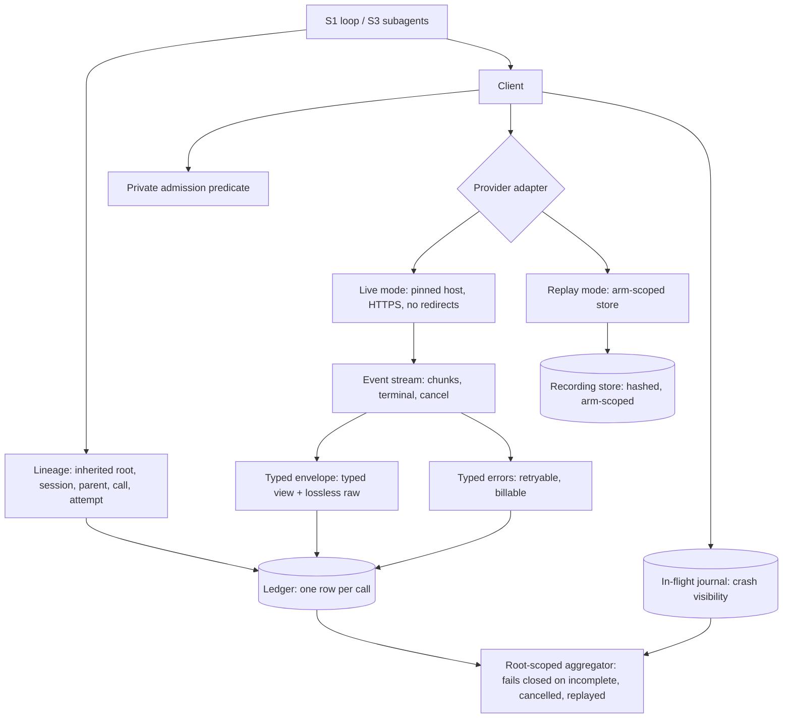

# DeepSeek PCB Harness S0 Provider Transport - Plan

## Goal Capsule

- **Objective:** Build the provider transport layer for a self-owned agent harness on the official DeepSeek API, so every later layer (loop, kernel, subagents, memory) calls one client whose failure modes, cost, and fidelity are already proven.
- **Deliverable:** A new `packages/temper-harness/` Python package providing a DeepSeek client, a typed error taxonomy, an exact cost/token ledger with session lineage, a record/replay store, a three-tier fidelity oracle, and the CI wiring that makes its own suite run.
- **Authority:** This plan is authoritative for S0. `docs/superpowers/specs/2026-09-17-deepseek-pcb-harness-design.md` is the parent design and is authoritative for S1–S7. Where they conflict, the conflict is recorded on the affected KTD.
- **Execution profile:** Python, test-first per unit. No Rust, no pyo3 boundary, no optimizer work.
- **Prerequisite:** a provisioned production DeepSeek API key, read from an environment variable. **Satisfied** — a key was provisioned, U1 ran against the live API on 2026-09-17, and the resulting captures are committed. The key is not, and must not be, in the tree.
- **Stop conditions:** Stop and report rather than absorbing a change, if any of these hold: no provisioned key is available (never substitute a hand-written fixture); the provider cannot express parallel tool calls or strict tool schemas; a required usage field is absent with no substitute; or the transport contract must change shape rather than gain a case.
- **Tail ownership:** S0 ends at a proven transport. The loop, L1 assembly, compaction, budget enforcement, and retry policy are S1 and are out of scope here.

---

## Product Contract

### Summary

This plan builds only the substrate: one DeepSeek client, one error taxonomy, one cost ledger, one replay store, one fidelity oracle. It deliberately does not build the agent loop. The reason to isolate it is that the parent design makes descendant-inclusive cost accounting and a transport-versus-model failure distinction load-bearing for a later fixed-expenditure experiment, and both are cheap now and rewrites later.

### Problem Frame

The 2026-09-09 → 2026-09-17 harness attempt spent 2,676,994,364 tokens across 477 threads, 73.7% of it in subagent workers, and never ran its headline experiment. Two of the defects that made that possible live in the transport layer: accounting that would have been root-only, and provider failures that were indistinguishable from model failures. S0 exists so that neither can recur, and so that the parent design's own falsification test — can the official API sustain a recursive, high-fan-out call pattern — can be run at all.

### Requirements

**Session lineage and cost accounting**

- R1. Every transport call carries registered lineage: root session, session, parent session, call, attempt. Root identity is inherited from process context, never supplied by the caller; opening a new root is an explicit, recorded act. A call whose lineage is absent, or whose parent chain does not resolve to a registered root, is a hard error.
- R2. Cost aggregation has exactly one entry point. It takes a root session and returns root-exclusive, descendant, and root-inclusive totals, with the inclusive total equal to the sum of the other two.
- R3. Every attempted call produces exactly one append-only ledger row, including calls that fail before reaching the provider, calls that are retried, and calls that are cancelled or truncated. Retries are never collapsed into one row.
- R4. Usage fields the provider does not report are `null`, never `0`. Each row records where its usage came from and whether it was served live or replayed.
- R15. An aggregate fails closed when any row in the selected subtree is incomplete, cancelled, or replayed, or else returns an explicitly labelled lower bound. It never silently sums a missing or unknown quantity as zero.

**Transport behavior**

- R5. The transport exposes an event-yielding, cancellable interface. A buffered implementation is the S0 default.
- R6. Provider failures are classified into distinct typed errors carrying retryable and billable flags, so a transport failure is never recorded as a model failure. The taxonomy covers pre-connection failures (DNS, connection refused, TLS) as well as the post-connection cases, and no exception on the send path propagates unclassified.
- R7. The client preserves arbitrary JSON Schema in tool definitions and the exact pairing and ordering of tool calls with their results. A malformed message array raises locally, before any network I/O.
- R8. A recorded response retains the lossless raw payload alongside a typed view.
- R16. The live adapter is pinned to the official DeepSeek host over HTTPS. A host override, a non-HTTPS scheme, and a redirect are all refused.

**Replay**

- R9. Live and replay are explicit, mutually exclusive modes. A missing recording in replay mode is a hard typed error, and no code path leads from a failed live call to a recording.
- R10. Recordings carry request and response content hashes plus provider, model, schema identity, and the arm and attempt that produced them. A request-hash mismatch refuses to serve rather than replaying a near-miss, and a recording never serves a request from a different arm.
- R11. No credential reaches disk, in any artifact the transport writes. Recordings, ledger rows, error records, captured fixtures, and canary evidence all carry an allowlisted header subset only.

**Verification and gating**

- R12. The fidelity oracle has three tiers: Tier A recorded (CI, deterministic), Tier B live canary (opt-in, hashed evidence), and Tier C socket fault injection (no model). Until Tier B has run, Tier A is a reproducibility instrument and must not be described as a fidelity instrument.
- R13. Every gate fails closed on an empty scan, and each ships a committed fault-injection test that fails on the exact input it exists to catch.
- R14. Ledger, error, store, envelope, and usage records are defined by committed schema files, not inline constants.
- R17. The harness suite and its gates run in CI under a required context. The new package adds explicit trigger wiring rather than relying on inheritance.

### Scope Boundaries

**Deferred to later sub-projects**

- Retry and backoff policy, budget enforcement, L1 assembly, and compaction — S1.
- Tool registry, dispatch, and permissioning — S2.
- Subagent session tree, daemon, message queues, and recursive fan-out — S3. S0 supplies lineage hooks and a bounded concurrency probe only.
- Continual Harness — S4. Agents View — S5. Long-horizon controls — S6. The experiment — S7.

**Outside this work's identity**

- A multi-provider framework. One interface, one DeepSeek adapter, one fixture adapter.
- A hand-written mock provider. Recorded fixtures are used instead, because a hand-written mock encodes the author's assumptions and proves nothing.
- A local tokenizer as an authoritative usage source.
- A general "run the harness offline" mode. The store serves tests and the oracle.
- An injectable admission-policy seam. S0 ships one private admission predicate; S3 introduces the interface when it has a second implementation to justify it.

### Dependencies

- The official DeepSeek API and a provisioned key, read from an environment variable and never from a file in the repo. **Satisfied: U1 has run.** All six units depend transitively on U1, so this was the critical path and it is now clear.
- Third-party runtime dependencies (an HTTP client and a JSON Schema validator) plus a regenerated `uv.lock`, both committed.
- The parent design's L2/L3 boundaries, so the store's scope does not drift into S1's offline-run mode.

### Outstanding Questions

- **Resolved (operational):** the DeepSeek key was provisioned as an environment variable and U1 ran. No blocking question remains for S0's offline units.
- **Deferred:** which git ref carries the Zapote Rust validators and the Python/KiCad adapter. Blocks S2.
- **Deferred:** the interlock unit's acceptance checklist in machine-readable form. Blocks S1 and the S7 scalar.
- **Deferred:** the interlock verifier's end-to-end latency and the pre-registered fixed cost `C*`. Blocks S7.
- **Deferred:** whether the recursive fan-out scenario belongs to S3's acceptance or a pre-S7 pilot. A bounded concurrency probe is in S0; the session-tree version is not.

### Sources

- Parent design: `docs/superpowers/specs/2026-09-17-deepseek-pcb-harness-design.md`.
- Prior control plane on the unmerged ref `origin/codex/buck-harness-experiment-plan`: `harness-lab/run_zen_trials.py` (a recorder/relay that validates the tool catalog against expected schemas and writes one request/status/response triple per call), `harness-lab/STREAM-DIAGNOSTIC.md` (five socket fault cases), and `harness-lab/telemetry.py` (the inline `SCHEMA_VERSION` anti-pattern). Port the fault tests, not the policy.
- Repo precedents for fail-closed recorded artifacts: `scripts/oracle_hashes.json` with `scripts/check_oracle_hashes.py`, `scripts/_lib/qualification_replay.py`, and `tools/wasm/r19_agreement_ledger.py`.
- CI mechanics: `.github/required-checks.json`, `scripts/check_required_checks.py`, `scripts/classify_changed_paths.py`.
- Measurement discipline: `docs/solutions/best-practices/a-measurement-carries-its-commit-2026-07-26.md`, `docs/evidence/2026-08-07-drc-ceiling-provenance-identity-incident.md`, `docs/solutions/logic-errors/drc-api-wrapper-components-and-location-always-empty.md`, `docs/evidence/2026-08-19-measurement-instruments-that-lie.md`.

---

## Planning Contract

### Key Technical Decisions

- KTD1. **S0 ships as `packages/temper-harness/`, a member of the existing uv workspace, and wires its own CI triggers.** (session-settled: user-directed — chosen over a new top-level `harness/` tree: `packages/**` is already a trigger path, whereas a new top-level tree matches none and would ship with no required contexts.) The inheritance claim is partial and is not the whole rationale: `packages/**` does trigger **Repo Hygiene & Import Gates**, **Fast Gates**, and **Cargo/Rustc Smoke Check**, but it does **not** trigger **Core Tests**, whose `job_triggers.paths` enumerates specific packages, and it does not trigger the job that runs `check_vacuous_gates.py`. No CI step invokes a bare root `pytest`, so adding the suite to root `testpaths` is a developer convenience only. R17 and U1 therefore make the missing wiring an explicit deliverable. This is also a deliberate exception to the repo-wide Rust preference in `AGENTS.md`: the runtime is a Python-dominant subsystem that is not a port of existing Rust logic. Python is the language with precedent here — `requests` is already declared in `packages/temper-workflow/pyproject.toml`.
- KTD2. **The fidelity oracle's authority is a live canary; recorded replay is the regression guard.** (conflict call-out: the approved parent design's S0 gate reads "fidelity tests pass against recorded responses". That wording is necessary but not sufficient, and if it is the only gate it is the self-consistency trap this repo has already hit twice — `test_clearance_rust_differential.py` pinned Rust equal to Python bit-for-bit and could not see a rotation-sign error, and the `R(+theta)` incident reproduced `kicad-cli` to four decimals while being the mirror of the truth. Recorded replay proves the client is reproducible, never that it carries the provider's semantics. The decision stands as the parent design's intent; the gate wording is strengthened per the evidence, not the decision reversed.) Per R12, the recorded tier is called a reproducibility instrument until Tier B has run.
- KTD3. **Accounting is descendant-inclusive by construction.** Root identity is inherited from context rather than supplied by the caller (R1), usage merges across all stream chunks, unknown fields stay `null` (R4), and the aggregate fails closed on any incomplete, cancelled, or replayed row (R15). Chosen over a single-process counter upgraded once subagents exist, because the prior attempt's numbers make the cost concrete: 6 root sessions reported 331.9 M tokens against a true 2.68 B. Two failure shapes drive the R15 clause specifically — a crashed call whose unmeasured usage would otherwise vanish behind a reassuring `incomplete` row, and a cancelled call whose partial usage a scored run could otherwise drop.
- KTD4. **U1 probes the live provider and freezes the schema from captured bytes.** Chosen over coding against the documented shape, because cache fields, whether reasoning tokens sit inside or beside completion tokens, parallel tool-call support, strict-schema support, and which stream chunk carries usage are all unverified for this provider's flash tier here. All five turned out to need correction, and the model id itself was wrong — see the captured-behaviour list in the Definition of Done.
- KTD5. **The ledger is an append-only JSONL file holding one row per call, appended once at terminal resolution.** Chosen over a locked database so the S3 daemon can append from multiple processes without a server (canonical JSONL mirrors `tools/wasm/r19_agreement_ledger.py`). Crash visibility comes from a separate append-only in-flight journal, not from mutating a row: an in-flight entry is opened before the request and a terminal entry appended after, so a crash leaves an unclosed in-flight entry. This resolves the tension between "exactly one row per call" (R3) and "a crash is visible" — an append-only file cannot close a row in place, so the two facts live in two records and R15 makes an unclosed entry fail the aggregate closed.
- KTD6. **Store scope is capture plus deterministic replay for tests and the oracle.** Chosen over a general offline-run mode, which belongs to S1's record/replay row in the parent design. Mode-exclusivity invariants stay in S0 because the seam is here.
- KTD7. **USD is derived from a versioned price table at `packages/temper-harness/pricing/<version>.json`, with its schema committed and its version identity recorded per row.** Both provider-reported and computed cost are retained. Chosen over a hardcoded rate, because a rate change would silently shift the fixed-expenditure comparison. A rate change adds a new version; existing rows keep the identity that produced them. Field names carry the convention (`billed_usd` versus `estimated_usd`) rather than a bare `cost`. Because both arms of a later comparison would share the same wrong table, U1 additionally asserts that computed and provider-reported cost agree on the probe set within a stated tolerance, so the arithmetic has an external check rather than certifying itself.
- KTD8. **The live canary is opt-in and does not run in CI by default.** It needs the production key, so it follows the `scripts/check_pad_world_position_oracle.py --verify-live-oracle` precedent: run on demand, evidence hashed and committed. Per R12, until it has run the recorded tier is reported as a reproducibility instrument.
- KTD9. **A recording is scoped by arm and attempt, and refuses to serve across them** (R10). Chosen because a shared store would otherwise hand a later experiment arm an earlier arm's complete model output, which defeats the parent design's "fresh isolated state per attempt" and "solution hidden" rules. Recordings produced by scored attempts are gitignored, never committed.

### High-Level Technical Design

The caller never talks to a raw HTTP response. The adapter is the only place that knows the wire format; the envelope is what every later layer consumes. Live and replay are the only two adapters, and mode selection is explicit.

### Assumptions

- ~~The official DeepSeek API supports a chat-completions surface with tool calling, and its `usage` block is reachable from a non-streaming call.~~ **VERIFIED.** Both hold: tool calling works (including parallel calls and strict schemas), and `usage` is reachable from both a non-streaming and a streamed call. The contract did not need to change shape, though six *values* it carries did — enumerated in the Definition of Done. One further assumption was falsified: the model id the plan named does not exist on this provider.
- The provider exposes no billing reconciliation endpoint reachable from this client. **Partially verified, and worse than assumed:** no billing endpoint was probed, but the completion response carries no cost field either, so there is no provider-reported figure to reconcile against at all. KTD7's tolerance assertion is therefore unavailable and the price table is unpopulated by design — see the named unknowns in the Definition of Done.

---

## Implementation Units

### U1. Probe the live provider, freeze the schema, and wire CI

**Goal:** Replace every assumption about the provider's wire behavior with captured bytes, and make the package's own gates actually run.

**Requirements:** R4, R11, R14, R17. **Depends on:** a provisioned API key.

**Files:** `packages/temper-harness/pyproject.toml`, `packages/temper-harness/src/temper_harness/provider/probe.py`, `packages/temper-harness/pricing/<version>.json`, `packages/temper-harness/schemas/` (JSON Schema files), `packages/temper-harness/tests/provider/test_probe.py`, fixtures under `packages/temper-harness/tests/fixtures/captured/`, plus edits to root `pyproject.toml` (`testpaths`, `pythonpath`), `.github/required-checks.json`, and `uv.lock`.

**Approach:** Issue a small number of real requests covering: a plain completion; a completion with parallel tool calls; a completion with a strict-schema tool definition containing `additionalProperties: false`, `required`, `enum`, `$defs`/`$ref` and a nested `oneOf`; a streamed completion; and a deliberately invalid request. Capture request and response **bodies** verbatim, and headers through the same allowlist R11 imposes on the store — never the raw header block. Write the committed schemas for the typed envelope, the usage record, the error record, the ledger row, and the recording. Record which fields the provider does not emit in the Definition of Done's unknowns list. Wire the suite into CI: add `packages/temper-harness/**` to the `Core Tests` job trigger paths in `.github/required-checks.json`, and add an explicit step that runs the harness suite with a `pytest_guard.py` minimum-test floor, so the suite cannot pass by collecting nothing.

**Test Scenarios:** Captured fixtures parse into the committed schemas. A schema file exists for the envelope, usage, error, ledger row, and recording, and each is validated in CI. No captured fixture contains an `Authorization` header or the key value. Every captured response's `usage` is present and non-null, or the gap is recorded as a named unknown. Parallel tool calls appear with distinct ids and stable ordering, or the limitation stops the plan per the Goal Capsule stop conditions. Reasoning content is either absent or captured, and its token accounting is stated as inside-or-beside completion tokens from the observed bytes, never inferred. Computed and provider-reported cost agree on the probe set within the stated tolerance. A CI-diff simulation touching only `packages/temper-harness/**` shows the harness suite's job scheduled, not skipped.

**Verification:** The captured fixtures and five schemas are committed; the CI wiring is present and a simulated path-diff schedules the job; the recorded unknowns are enumerated in the Definition of Done.

### U2. Cost ledger, in-flight journal, and session lineage

**Goal:** Make descendant-inclusive accounting structural rather than a convention.

**Requirements:** R1, R2, R3, R4, R14, R15. **Depends on:** U1.

**Files:** `packages/temper-harness/src/temper_harness/ledger/`, `packages/temper-harness/schemas/ledger_row.schema.json`, `packages/temper-harness/tests/ledger/`.

**Approach:** Root identity is resolved from process context and registered once by an explicit open-root call; a caller cannot name its own root. Opening a root, opening a call, and closing a call each append a record; the ledger holds one row per call, appended at terminal resolution, and the in-flight journal holds the unclosed entries that make a crash visible. Aggregation is a single function whose only argument capable of selecting spend is a root session id, and it fails closed when the subtree contains an incomplete, cancelled, or replayed row. Usage merges across all stream chunks; unknown fields are `null`. The price table is versioned data whose identity is recorded on every row.

**Test Scenarios:** A synthetic tree of a root, two children, and a grandchild with known spend satisfies inclusive equal to exclusive plus descendants, and a partial sum cannot be produced through the public API. A child that attempts to register its own root is rejected and its spend is attributed to the true root. A call with no registered lineage raises. A row whose parent chain does not resolve to a registered root makes the aggregate fail closed rather than being omitted. A simulated crash between call-open and terminal resolution leaves an unclosed in-flight entry, and an aggregate over that subtree fails closed or returns a labelled lower bound. A call that fails before reaching the provider still produces a row. A failed call and its retry produce two rows. A usage field absent from the provider response is `null`, not `0`. A response whose usage arrives split across chunks is merged correctly. A row retains the price-table identity that produced its USD.

**Verification:** `uv run --no-sync pytest packages/temper-harness/tests/ledger` passes, including the self-rooting rejection, the unresolved-parent-chain failure, the crash case, and the reconciliation invariant.

### U3. Transport interface, error taxonomy, and provider adapter

**Goal:** One client seam whose failures are classified before any later layer sees them.

**Requirements:** R5, R6, R7, R8, R16. **Depends on:** U1, U2.

**Files:** `packages/temper-harness/src/temper_harness/provider/`, `packages/temper-harness/schemas/error.schema.json`, `packages/temper-harness/tests/provider/`.

**Approach:** The interface yields events and supports cancellation; a buffered implementation is the default. Errors are distinct types for pre-connection unavailability, rate limit, server error, timeout, malformed stream, incomplete stream, context-length exceeded, tool-schema rejection, and content filtering, each carrying retryable and billable flags, and any exception on the send path is classified rather than propagated raw. The live adapter pins the official host, requires HTTPS, and refuses redirects and configured host overrides. Admission is one private predicate on the adapter. The message builder enforces tool-call id pairing and ordering and raises before network I/O. The DeepSeek adapter is the only module that knows the wire format; a fixture adapter reads the U1 captures.

**Test Scenarios:** Two or more tool calls in one response preserve ids, indices, and nested or unicode arguments, and the typed view re-serializes to the captured bytes for provider-emitted fields. A tool message whose id matches no preceding call raises locally with zero network calls. A message array with an assistant tool-call turn followed by two tool results round-trips in order. Provider schema rejection is a distinct error from content filtering and from rate limiting. A connection refused and a DNS failure each classify as pre-connection unavailability with defined retryable and billable flags, and produce a ledger row. A truncated stream raises an incomplete-stream error, retains partial usage, and is not billed as complete. A cancelled stream leaves a row whose usage is explicit-unknown or a labelled lower bound, never a silent zero, and the root aggregate reflects it. A 200 response with a non-JSON body raises a malformed-response error with raw bytes retained. A redirect and a non-HTTPS base URL are both refused. Request-as-sent equals request-as-constructed, proving no hidden mutation or truncation.

**Verification:** `uv run --no-sync pytest packages/temper-harness/tests/provider` passes. `finish_reason` is asserted present on every terminal event.

### U4. Record and replay store with mode and arm exclusivity

**Goal:** Deterministic reruns without network, that cannot silently substitute for a live call or leak across arms.

**Requirements:** R8, R9, R10, R11, R14. **Depends on:** U1, U3.

**Files:** `packages/temper-harness/src/temper_harness/store/`, `packages/temper-harness/schemas/recording.schema.json`, `packages/temper-harness/tests/store/`.

**Approach:** A recording is the request body, the response body, an allowlisted header subset, content hashes of each, and the provider, model, schema, arm, and attempt identity that produced it. Mode is selected explicitly at construction. A request-hash mismatch or an arm mismatch is a hard error; there is no nearest-match fallback and no path from a failed live call into a recording. Recordings from scored attempts are gitignored.

**Test Scenarios:** A request-hash mismatch refuses to serve. An arm mismatch refuses to serve. Replay mode with a missing recording raises and makes zero live calls. A live call that fails never falls back to serving a recording. An aggregate over a subtree containing a replayed row fails closed rather than summing it. A recording round-trips to byte-identical response bytes. A redaction canary scans every artifact the transport writes — store, ledger, in-flight journal, error records, captured fixtures, and canary evidence — for a planted key and fails if found. An empty recording scan fails rather than reporting clean. A recording whose schema version is unparseable fails. The store cannot be written during a replay run.

**Verification:** `uv run --no-sync pytest packages/temper-harness/tests/store` passes, including the arm-mismatch refusal, the live-failure-no-fallback test, the replayed-row aggregate failure, and the widened redaction canary.

### U5. Recorded oracle and fault injection

**Goal:** Make each S0 gate demonstrably fail on the input it exists to catch.

**Requirements:** R12, R13, R14. **Depends on:** U3, U4.

**Files:** `packages/temper-harness/src/temper_harness/oracle/`, `packages/temper-harness/tests/oracle/`, `packages/temper-harness/tests/faults/`.

**Approach:** Tier A runs the recorded corpus in CI and is deterministic. Tier C injects the five socket faults, without a model. Each gate carries a committed perturbation test proving it goes red. The perturbations are chosen to attack provider *semantics*, not just bytes: reordering tool-call results, and dropping a required field from the typed view while leaving the raw bytes valid. Vacuity-sensitive aggregation lives under `src/`, because `check_vacuous_gates.py` excludes test modules from its scan by filename convention.

**Test Scenarios:** Perturbing a tool schema makes the oracle fail. Reordering two tool-call results in the typed view makes the oracle fail while the raw bytes stay valid. Dropping a required field from the typed view makes the oracle fail while the raw bytes stay valid. Dropping a usage field makes the ledger fail closed. Mutating one response byte makes replay detect the mismatch. An empty recorded corpus fails the oracle. Interleaving a full system, user, assistant-tool-call, tool, tool, assistant sequence round-trips with ordering intact. A duplicate provider tool-call id raises a protocol error. A chunk boundary inside a UTF-8 codepoint reassembles without mojibake. The five socket faults each classify into their intended error type, and a 429 followed by a success produces two ledger rows with the failed row retained and not billable. Each perturbation's guard-removed failing run is captured as hashed evidence, not performed as an unrecorded manual act.

**Verification:** `uv run --no-sync pytest packages/temper-harness/tests/oracle packages/temper-harness/tests/faults` passes. `uv run --no-sync python scripts/check_vacuous_gates.py` covers the oracle's aggregation modules under `src/`.

### U6. Live canary and bounded concurrency probe

**Goal:** Anchor the oracle to the real provider and measure its behavior under concurrency.

**Requirements:** R12, R2, R15, R16. **Depends on:** U2, U3, U4.

**Files:** `packages/temper-harness/tests/canary/`, `packages/temper-harness/tests/canary/test_fanout.py`, `packages/temper-harness/README.md`.

**Approach:** An opt-in canary issues the U1 probe set against the live API and compares shapes against the recorded corpus, writing hashed evidence that contains only hashes, the model id, the date, and redacted shape summaries. The concurrency probe issues a bounded number of simultaneous transport calls with distinct lineage, to measure rate-limit behavior and per-call attribution into the root aggregate. It is a probe of the transport, not a session tree: no parent/child session semantics, no `rlm` primitive, no daemon. Both are documented as on-demand, not CI gates, consistent with KTD8.

**Test Scenarios:** Every concurrent call is attributed to its own session and included in the root aggregate. A live shape change from the recorded corpus fails the canary. The canary's committed evidence contains no request body, no response body, and no key material. Running the canary without a key produces a typed blocked error, not a skip that reports clean.

**Verification:** The canary is run once by hand against the live API and its evidence committed under `packages/temper-harness/tests/canary/evidence/`, or the report states plainly that S0's fidelity claim rests on reproducibility alone. The concurrency probe's attribution assertions pass.

---

## Verification Contract

| Command | Applies to | Proves |
|---|---|---|
| `uv run --no-sync pytest packages/temper-harness/tests` | all units | Unit, oracle, and fault suites pass |
| Simulated path-diff against `.github/required-checks.json` | U1, R17 | A diff touching only `packages/temper-harness/**` schedules the harness job |
| `uv run --no-sync python scripts/check_vacuous_gates.py` | U5 | No unguarded vacuous aggregation in gate paths under `src/` |
| `uv run --no-sync python scripts/check_orphaned_python_modules.py` | all units | No production module has zero importers anywhere; test-only-reachable modules are tagged, not failed |
| `uv run --no-sync python scripts/check_hash_order_determinism.py` | U2, U4 | No new `PYTHONHASHSEED`-dependent ordering in a determinism-bearing artifact |
| `uv run --no-sync python scripts/import_linter_gate.py` | all units | Import boundaries hold |
| `uv run --no-sync python scripts/check_manifest_gate.py` | if scripts are added | Any new `scripts/*.py` carries a manifest entry |
| `uv lock` with the result committed | U1 | Third-party dependencies are pinned |
| `make regen` | plan landing | Generated package and plan counts match |
| `make extensions-check` | not applicable | S0 adds no pyo3 crate; recorded as not applicable rather than skipped silently |

`packages/temper-harness/tests` and `packages/temper-harness/src` are added to root `testpaths` and `pythonpath` for local developer convenience. That wiring does **not** make CI run the suite; the CI step added by U1 does.

---

## Definition of Done

**Global**

- All six units' test scenarios pass, and each gate has been observed failing on its motivating input, with the guard-removed run captured as hashed evidence.
- Five schema files are committed and validated in CI; no `SCHEMA_VERSION` constant exists inline in Python.
- The harness suite runs in CI under a required context, demonstrated by a simulated path-diff.
- Descendant-inclusive aggregation is the only public way to obtain a cost total, and it fails closed on an incomplete, cancelled, or replayed row. Both are demonstrated by tests.
- The live canary has run once against the official API and its hashed evidence is committed. If it has not, the report names Tier A a reproducibility instrument and S0 makes no fidelity claim.
- Unknown provider behaviors discovered in U1 are enumerated, not inferred away.
- Cleanup: any abandoned probe scripts, throwaway adapters, and dead branches from approaches that did not pan out are removed, not left in the diff.
- `make regen-check` is clean, and the branch is pushed.

**Per unit**

- U1 complete when the captured fixtures and five schemas are committed, no fixture carries a credential, the CI wiring schedules the suite, and every unverified provider behavior is named.

### Captured provider behaviour (U1) — measured, not documented

Ten probes were issued live against `deepseek-flash`; the bytes are committed under
`packages/temper-harness/tests/fixtures/captured/` with a manifest carrying each
request hash, status, and response digest. Six assumptions the plan made turned out
to be wrong, and each is worth more than the fixture it changed:

1. **`deepseek-v4.1-flash` is not a model this provider serves.** The account offers
   `deepseek-flash` and `deepseek-v4-pro`; the API's own 400 names them. The plan's
   model id belongs to a different provider's catalogue, so every reference in this
   plan and in the code is corrected to `deepseek-flash`. The plan's Assumptions
   section is falsified here and amended below.
2. **`reasoning_content` must be replayed.** The provider runs in a thinking mode and
   refuses an assistant tool-call turn that omits it — but only when it does not
   already recognize the `tool_call` id. Measured 5/5 accepted with the field present
   versus 5/5 refused without it against ids the provider had not seen, on an
   otherwise identical body. A client cannot inspect that server-side state, so the
   rule is *always* replay it. `ChatMessage.to_wire` silently dropped the field, which
   would have produced a transport that worked in a quick test and failed later.
3. **Reasoning tokens sit inside completion tokens.** `completion_tokens=18` with
   `completion_tokens_details.reasoning_tokens=15` and three tokens of visible
   content. The aggregate summed both, over-reporting output tokens by 83 % on that
   sample. The additive set is now `prompt_tokens + completion_tokens` only, and
   `total_tokens` is reconciled against it.
4. **Usage is not fragmented in streaming.** It arrives complete on the final chunk,
   directly beside the `finish_reason`, and the stream terminates with an SSE
   `data: [DONE]` record. Accumulating across chunks would have produced a null usage
   block for every streamed call — a systematically-zero column.
5. **A 400 is not a tool-schema rejection.** All four captured 400s carry
   `type: invalid_request_error` and `code: invalid_request_error`: a bad model name,
   an orphaned tool result, a malformed tool schema, and a dropped reasoning field.
   The status cannot discriminate; the body can. `for_http_status(400)` now maps to a
   new non-retryable `request_rejected` category, and `classify_http_response`
   refines to `tool_schema_rejected` from the message.
6. **Tool-call arguments fragment character by character** (`{`, `"`, `reference`, …),
   so a split inside an escape sequence is the norm rather than an edge case.
   Continuation fragments carry only `index` and `arguments` — no `id`, no `name`,
   and no `type`. The reassembler is now also run over the real fragments in CI.

Also measured: parallel tool calls and strict schemas (including `$defs`, `$ref`,
nested `oneOf`, `additionalProperties: false`) are both supported; the provider
validates tool schemas server-side; `system_fingerprint` is present on every
success; a tool-call turn reports `content` as an empty string, not null; absent
stream delta fields are explicit `null`; and the response carries **no cost field**.

### Named unknowns (U1) — stated, not inferred away

- **No cost reconciliation is possible from this provider.** The response has no cost
  field and no billing endpoint was probed. KTD7's "computed and provider-reported
  cost agree" check therefore cannot be satisfied; `provider_reported_usd` stays null
  and `estimated_usd` stays null because **no price table can be populated from
  evidence in this environment**. KTD7's versioned price table remains unbuilt on
  purpose: inventing rates would be a fabricated measurement, which is worse than an
  absent one. Token counts are exact and reconcilable; USD is not, and must not be
  quoted as though it were.
- **The context-length and content-filter message texts are unverified.** No probe
  produced either, so `_CONTEXT_LENGTH_MARKERS` and `_CONTENT_FILTER_MARKERS` are
  declared unverified in code and exercised only against synthetic bodies. Both
  categories stay wired, because a category that can never be reached makes the
  taxonomy a claim rather than a mechanism.
- **No 429 was produced**, so whether `retry-after` and the `x-ratelimit-*` family
  appear on a rate-limit response is unknown. They remain on the header allowlist as
  structurally-necessary names with no capture behind them.
- **Whether `finish_reason` can be `length` or `content_filter`** is unknown; only
  `stop` and `tool_calls` were observed. The envelope's enum keeps both.
- **Whether `content` can be `null` at the message level** is unknown; only `""` was
  observed on a tool-call turn. The distinction is preserved either way rather than
  normalized.
- **Whether `reasoning_content` can be absent or null on a successful turn** is
  unknown; every captured success carried a string.
- **The store cannot reproduce the *n*-th distinct response to an identical
  request.** Recordings are keyed by request hash, so a recursive fan-out in which
  every worker asks the same question replays one answer for all of them. This is a
  property of deterministic replay, not a defect, and it constrains what S7 can
  score from a recorded corpus.
- U2 complete when self-rooting is rejected, an unresolved parent chain fails the aggregate closed, a crash leaves an unclosed in-flight entry that fails the aggregate, and the reconciliation invariant holds.
- U3 complete when a malformed message array raises before network I/O, a pre-connection failure is classified and produces a row, and a cancelled stream's usage is explicit rather than zero.
- U4 complete when a request-hash or arm mismatch refuses to serve, a failed live call cannot fall back to a recording, and the redaction canary fails on a planted key in any transport-written artifact.
- U5 complete when each perturbation is shown to fail without its guard and the failing run is committed as evidence.
- U6 complete when the concurrency probe attributes every call to its session and the canary evidence is committed or its absence is reported.

**Not claimed**

S0 proves nothing about model capability, PCB design quality, or the harness's advantage over a direct agent. It establishes only that the transport, its accounting, and its fidelity instruments are trustworthy. Physical, electrical, and safety claims remain untouched and unclaimed, per the parent design.
