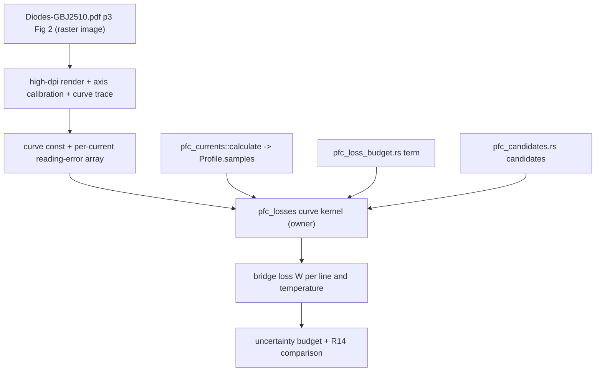

# PFC Bridge Loss Pinning - Plan

## Goal Capsule

- **Objective:** Replace the input bridge's assumed 0.85/1.30 V forward-drop band with a curve-integrated loss pinned tightly enough to rank rectifier architectures.
- **Product authority:** The project engineer. This unit owns the bridge's *electrical* loss for the GBJ2510-F part only. Architecture ranking, the bridge's thermal/mounting work, and the switching measurement are separate units, not active scope here.
- **Bar:** The precision the unit must reach is set by the **achievable net saving of the specific rectifier alternatives being compared**, including each alternative's own added losses and complexity — not by the ordering against the switching term, which is itself physically uncertain and cannot be resolved by a bridge measurement alone. A candidate whose net saving is smaller than the budget yields an unresolved comparison, not a win.
- **Execution profile:** Rust model change plus a specified, separately authorized bench protocol. Stage 2 is not executed by this plan.
- **Stop conditions:** Stop and report if the digitized curve cannot be bound to the retained PDF hash, or if the uncertainty budget exceeds the comparison it must support (R10).
- **Tail ownership:** `ce-work` implements Units 1-6. Unit 7 produces a protocol document only.

---

## Product Contract

**Product Contract preservation:** restructured, no scope change; three requirements re-worded under user direction. R6 was re-pointed: its original wording named a location that does not exist (planning found four bridge-loss homes), so it now names the owner and its GBJ scope. R9 adds the part-to-part spread a single specimen cannot bound and the case-versus-junction distinction. R10 and R14 base the comparison on the achievable net saving of each alternative rather than a precision requirement derived from the switching term, which is itself uncertain. R1-R5, R7, R8, R11, R12, R13 and R15 are unchanged.

### Summary

Pin the passive input bridge's real loss so rectifier architectures can be ranked against a number instead of an assumed band. Stage 1 traces the per-element forward-characteristics curve from the retained datasheet's plot image and integrates it over the C1 rectified waveform at 25 °C. Stage 2 confirms the temperature dimension with a DC forward-drop sweep. Stage 3 is the uncertainty budget.

### Problem Frame

The input bridge is the largest loss term that no independent comparison has challenged: about 28.30 W at C1 nominal, derived from a single datasheet test point (1.05 V at 12.5 A, 25 °C) applied as a constant drop across a 60 Hz rectified waveform whose current spans zero to tens of amps.

The model records why it is a guess: `zapote/packages/zapote-harness/src/pfc_candidates.rs:37` states the retained datasheet "has no forward-drop curve and no high-temperature point", so an 0.85/1.30 V band is carried as an explicit assumption. That statement is false. Page 3 of the retained PDF carries Fig. 2, "Typical Forward Characteristics, Per Element", on a log current axis at T_J = 25 °C. The curve is nonlinear: forward drop is roughly 0.7 V near 1 A and about 1 V at 12.5 A. So the constant-drop term is wrong in shape, not only in value, and the 0.85/1.30 V band does not represent a shape error.

On a ~28.30 W term, that band spans roughly 23-35 W. That is a 12 W uncertainty on the largest unchallenged term. It also exceeds the ~1.5 W margin between the bridge term and the switching term, so the ordering statement cannot be made from the band.

The absence was missed because `pdftotext` returns the datasheet's numeric tables and silently drops its plots, and because the plots are embedded raster images rather than vector paths. The claim "the source has no curve" was really "my extractor showed me no curve".

### Key Decisions

- **Curve-integrated loss over a single effective drop.** (session-settled: user-approved — chosen over the effective-drop shortcut: the datasheet curve is nonlinear in current, so one scalar keeps the shape error the ranking bar cannot tolerate.)
- **Staged, source-first.** (session-settled: user-approved — chosen over bench-primary: read the free source-only signal before spending a bench authorization.)
- **Tight enough to rank architectures, not merely a bound.** (session-settled: user-directed — chosen over a bound-only or best-available bar: the pinned loss exists to enable candidate ranking.)
- **One owner for the forward-drop functional form across the GBJ consumers.** Governs R6. Planning found four bridge-loss homes; the functional owner becomes a shared kernel, and the two `zapote-thermal` GBU homes are explicitly exempt because they model a different part.
- **Thermal, mounting and contact work stays with the GBJ thermal study.** This unit supplies the electrical loss that work consumes; it does not re-open the study's scope.

### Requirements

**Evidence**

- R1. Stage 1 traces Fig. 2 from the retained GBJ2510-F datasheet at its recorded content hash, and records the render/extraction method, the axis calibration, and the reading error as a function of current.
- R2. The claim that the retained datasheet has no forward-drop curve is corrected at every source comment that states it and at every in-scope artifact that repeats it.
- R3. The unit specifies, but does not execute, a Stage 2 measurement of forward drop against current on the actual GBJ2510-F at a cold and a hot case temperature across the waveform's current range, recording the fixture, the measurement method and how each temperature is established and verified.
- R4. Every reported number carries an evidence class — measured, source-bound, modelled, or assumed — and no number is reported under a stronger class than its provenance supports.

**Loss model**

- R5. Bridge loss is integrated over the C1 rectified waveform using forward drop as a function of instantaneous element current, at each C1 line voltage, at the digitized curve's 25 °C reference, and at each temperature measured under R3 when that data exists.
- R6. Forward-drop functional form and its waveform integration have exactly one owner across the GBJ bridge consumers. The loss kernel in `zapote/packages/zapote-erc/src/pfc_losses.rs` owns it; the loss-budget term and the candidates screen delegate to it, and neither keeps a private drop model. The two `zapote-thermal` GBU consumers are exempt and tracked as a separate alignment follow-up.
- R7. A regression demonstrates that, given a constant forward-drop curve, the integrated model reproduces the previous constant-drop result.
- R8. The number of conducting elements in the line path is stated, and any parallel-element or parallel-bridge current-sharing assumption is declared explicitly with its effect reported rather than averaged away.

**Uncertainty and acceptance**

- R9. The result carries an explicit uncertainty budget whose terms include digitization error as a function of current, part-to-part spread that a single measured specimen does not bound, temperature with case and junction temperature distinguished, element count, and any sharing assumption; the budget is expressed as a number.
- R10. The unit states whether its uncertainty is small relative to the achievable net saving of each rectifier alternative it is compared against, where the net saving includes that alternative's own added losses and complexity. The bridge-versus-switch ordering is reported as an observation conditioned on both quantities being bounded, never as the precision requirement. When the uncertainty is not small relative to a candidate's net saving, the unit reports that comparison as unresolved instead of asserting a ranking.
- R11. When Stage 2's authorization is unavailable, Stage 1's result stands alone, temperature is bounded analytically from the retained thermal resistance and a forward-voltage temperature coefficient, and any remaining gap is reported as an explicit residual rather than filled by a silent assumption.

**Integrity**

- R12. An absence claim about a source document is verified against that document's rendered content, including its images, not only against a text extraction.
- R13. No blanket correction factor is derived from any model-versus-model or model-versus-measurement disagreement; discrepancies are reported per condition and their applicability stated.
- R14. The unit reports the pinned bridge loss against the current 28.30 W constant-drop figure, states whether the bridge-versus-switch ordering changes, and states the unresolved uncertainty on the switching term that limits how far that ordering statement can be taken.
- R15. Overlapping loss boundaries within this unit's scope — notably diode reverse recovery and junction capacitance against forward conduction — are named, and each is either counted once or explicitly excluded.

### Acceptance Examples

- AE1. **Covers R7.** Given a constant forward-drop curve supplied to the integrated model, when its output is compared to the retained constant-drop result at the same C1 point, then the two agree within the stated numerical tolerance.
- AE2. **Covers R11.** Given Stage 2 is unauthorized, when the unit reports, then the 25 °C curve-integrated result is present, the temperature term carries an analytic bound, and any remaining gap is named as a residual with no assumed value.
- AE3. **Covers R10.** Given the uncertainty budget exceeds the comparison it must support, when the unit reports, then it states that the ranking bar was not met and makes no ranking claim.
- AE4. **Covers R12.** Given a claim that a source lacks a curve, table, or figure, when the claim is checked, then it is checked against the rendered document including embedded images, and not only extracted text.

### How This Work Fits Together

<!-- ce-section: work-relationships -->

This plan owns the bridge's electrical loss. The surrounding breakdown is the current understanding, not a committed roadmap.

- **Rectifier architecture screening** — depends on this plan. It ranks passive GBJ, lower-drop passive, parallel passive, active/synchronous and bridgeless options; it needs this unit's pinned loss as its passive baseline.
- **Bridge thermal, mounting and contact work** — can proceed independently. Owned by the existing GBJ thermal study, which left mounting geometry, installed fan operating point and pad/contact current distribution open.
- **Switching double-pulse measurement** — can proceed independently and in parallel; separately authorized.
- **GBU forward-drop alignment in `zapote-thermal`** — still to decide. A tracked follow-up after this unit lands, so the tree can eventually claim one forward-drop owner.
- **Broader architecture search (interleaved, bridgeless, totem-pole)** — still to decide. Kept open; not active scope here.

### Success Criteria

- A pinned bridge loss at each C1 line and at the curve's reference temperature, with a numeric uncertainty budget and an explicit statement of whether it meets the relevant comparison.
- The corrected curve claim, so no later reader re-derives the 0.85/1.30 V band from the false premise.
- A regression tying the new integrated model to the retained constant-drop result.

### Scope Boundaries

- **Deferred for later:** ranking the rectifier architectures themselves; the GBU forward-drop alignment in `zapote-thermal`.
- **Outside this unit:** the bridge's thermal, mounting, contact and cooling work; the switching double-pulse measurement; the interleaved/bridgeless/totem-pole studies; any CAD, BOM or production-board change.

### Dependencies / Assumptions

- The retained GBJ2510-F datasheet, SHA-256 `c7d9657711588ecf8d9adf4e1438435d488b21b7733e99caaead3c2490728a02`, at `zapote/power-entry/loss-budget/sources/Diodes-GBJ2510.pdf`.
- The existing matched-power and rectified-waveform model supplies the per-line waveform the loss is integrated over.
- Stage 2 requires a bench authorization the PFC experiment campaign does not provide.
- Assumed: the published per-element characteristic is representative of the populated part; element-to-element and lot variation is carried as a stated typical-versus-maximum term, not invented.

### Outstanding Questions

- **Deferred to planning:** the exact reading-error model for a raster trace; the bench fixture, current range and temperature points; the numerical tolerance for the R7 regression; which non-provenanced artifacts U4 regenerates.
- **Open, and the next thing to settle:** what measurement precision actually changes a design decision. The bridge measurement's required precision follows from the achievable net saving of the alternatives it is meant to separate, so that saving has to be estimated before a precision target is set. Without it, a small and uncertain ordering difference risks becoming an optimization target in its own right.

### Sources / Research

- `zapote/power-entry/loss-budget/sources/Diodes-GBJ2510.pdf` — page 3, Fig. 2 (typical forward characteristics, per element, T_J = 25 °C, 300 µs pulse, V_F 0-2.0 V linear, I_F 0.01-100 A log) and Fig. 1 (current derating vs case temperature). The page's plots are embedded raster images; `pdfimages -list` reports four image objects on page 3.
- `zapote/packages/zapote-harness/src/pfc_candidates.rs` — the 0.85/1.30 V band, the false no-curve comment, and the bridge-bearing candidates.
- `zapote/thermal/gbj-study/README.md` — thermal context: the 40 W bridge allowance and 1.0 °C/W per-element RθJC.
- `zapote/power-entry/loss-budget/campaign/LOSS-ACCOUNTING-AUDIT.md` — the 28.30 W figure and the ~1.5 W bridge-versus-switch margin.
- `docs/solutions/best-practices/calibration-point-must-equal-design-point-2026-07-28.md`, `docs/solutions/best-practices/verify-the-binding-axis-not-the-headline-rating-2026-07-28.md`, `docs/solutions/best-practices/measurement-convention-must-be-stated-2026-07-28.md`, `docs/solutions/best-practices/model-certificates-need-semantic-binding.md`, `docs/solutions/best-practices/solver-independence-is-not-model-independence-2026-07-09.md`.
- `docs/solutions/best-practices/datasheet-curves-hide-in-plots-raster-traces-can-mislead-2026-09-17.md` and `docs/solutions/best-practices/plan-premises-are-claims-verify-home-and-number-2026-09-17.md` — the learnings this unit produced.

---

## Planning Contract

### Key Technical Decisions

- KTD1. **The forward-drop kernel lives in `zapote-erc::pfc_losses`.** Governs R6. `pfc_losses::diode_w(mean_a, rms_a, intercept_v, slope_ohm)` is today a linear V(I) form, and `pfc_candidates::bridge_constant_drop_w` is its only production caller. The curve kernel becomes the single owner and expresses the flat curve as its own simplest case. `diode_w` is retained only as a thin flat-curve wrapper over the kernel, or retired once its caller moves; the unit states which and adds a test proving no independent linear drop path survives.
- KTD2. **The kernel takes the curve, the weighted waveform, an element count, and a per-branch current scale.** Governs R5, R8. `pfc_losses::Moments` carries no samples and `LineModel` discards the profile, so the kernel takes a `pfc_currents::Profile` or an equivalent weighted sample slice. The element count and the sharing scale are explicit parameters, not constants, because a nonlinear curve makes the parallel-bridge split-current and single-bridge cases diverge; hardcoding the element count inside the kernel would make every parallel-passive number wrong, and scaling in the candidate would create the second functional home R6 forbids. Weight only `weight > 0` samples, matching `rectified_mean_a`; with a flat curve the weighted sum reduces to `element_count * V_f * rectified_mean_a`.
- KTD3. **The curve is traced from a raster plot and carried as a typed const with a per-current error.** Governs R1. Page 3's plots are embedded raster images (`pdfimages -list` reports four image objects; `pdftocairo -svg` emits four `<image>` elements and only glyph paths). The vector method in `zapote/power-entry/loss-budget/EOSS-REV1-REBIND.md` does not transfer. Extraction renders the page at high dpi, calibrates both axes from the figure's own labelled ticks, and traces the curve. The curve is a Rust const point array with a companion per-point or per-decade reading-error array, in the module that consumes it, following the `BOOST_EOSS_CURVE_J` shape but not its scalar error const — a single scalar cannot represent an error that grows across a log current axis. The curve type carries its source document hash so binding has a carrier.
- KTD4. **R7 is a self-consistency regression, not physical validation.** Governs R7. Two implementations sharing one model agree while both may be wrong. The flat-curve identity proves the integration arithmetic is correct and the refactor did not move the constant-drop result; it is not evidence that the curve model is physically right. Physical anchoring remains open and is what Stage 2 addresses.
- KTD5. **The term is a typical curve replacing a maximum test point.** Governs R9. Fig. 2 is labelled typical; the value it replaces (1.05 V) is a datasheet maximum. The 0.85/1.30 V band stood in for part-to-part spread, so retiring it without a replacement term would understate uncertainty. A typical-versus-maximum term is retained in the budget.
- KTD6. **Slope-bearing extrapolation anchors at a reference current, not at the origin.** `zapote/packages/zapote-thermal/src/physical_model.rs:560-563` records `Vref*I + rd*I^2` as the common but incorrect double-intercept form. The kernel interpolates the traced points directly.

### High-Level Technical Design

Data flow for the integrated bridge term:

The four bridge-loss homes found at planning time, three of them constant-drop forms, and their disposition:

| Home | Current form | Disposition |
| --- | --- | --- |
| `pfc_loss_budget.rs:577-579` | constant `2.0 * 1.05 * rectified_mean_a` | **This is the 28.30 W figure.** Becomes the integrated term. |
| `pfc_candidates.rs:213-221` | `bridge_constant_drop_w` delegating to `diode_w` | Delegates to the curve kernel; the band constants retire. |
| `zapote-thermal/joint_model.rs:567-573` | `fixed_vf_loss_estimate_w` | Exempt (GBU part, GBJ-study consumer). Tracked follow-up, not touched here. |
| `zapote-thermal/physical_model.rs:546-570` | already integrated linear `V(i)` | Exempt (GBU2510A, different bound PDF). Precedent and near-neighbour, not the same part. |

### Assumptions and Constraints

- The curve kernel must keep every existing never-zero-filled assertion true: a term is positive or absent, never zero.
- `pfc_candidates.rs` private items (`LineModel`, the bridge constants) cannot be reached from an integration test, so the flat-curve differential lives in that file's in-file `#[cfg(test)] mod tests`.
- The evidence-run JSON reports sit beside `provenance.json` records that pin their SHA-256 and an executable hash for a specific prior revision. They are historical evidence, not regenerable derived artifacts; this unit corrects the claim in source and in artifacts whose generator it actually re-runs.
- The `bridge_drop_w_per_v_of_forward_drop` and `..._per_0p1v...` sensitivity thresholds assume linearity in forward drop. U3 makes them absent-or-curve-fed rather than leaving a superseded linear number beside a curve-integrated term.

### Sequencing

U1 (trace) gates the source-derived integration: U3 (replace the term) and U6
(the curve-dependent budget). Everything else is independent of it. U2 (kernel)
and U4 (claim correction) are complete; U5's flat-curve regression and
source-hash rejection use the kernel's own curve and also run without U1; U7 is a
document. Preliminary architecture screening can proceed on the current
constant-drop figure with explicit uncertainty, so a stalled trace delays the
final number rather than the whole investigation.

---

## Implementation Units

### U1. Trace the per-element forward-characteristics curve

- **Goal:** Produce a traced V_F(I) curve, with per-current reading error, bound to the retained datasheet.
- **Requirements:** R1, R4, R12
- **Files:** `zapote/power-entry/loss-budget/sources/Diodes-GBJ2510.pdf` (read), `zapote/power-entry/loss-budget/evidence/<change>/gbj-page3.png` (new), `zapote/power-entry/loss-budget/<change>-digitization.md` (new), `zapote/packages/zapote-harness/src/pfc_loss_budget.rs` (curve const plus per-point error array)
- **Approach:** Render page 3 at high dpi and retain the rendered page. The plots are embedded raster images, so trace the curve from the bitmap: calibrate both axes from the figure's labelled ticks, sample V_F at the currents the waveform reaches, and record the reading error per point or per decade. Bind the curve to the PDF hash. Follow the caveat style in `docs/solutions/best-practices/verify-the-binding-axis-not-the-headline-rating-2026-07-28.md`: state what was traced rather than tabulated.
- **Patterns:** `BOOST_EOSS_CURVE_J` in `zapote/packages/zapote-harness/src/pfc_loss_budget.rs` for the const shape; `zapote/power-entry/loss-budget/EOSS-REV1-REBIND.md` for the method record format.
- **Test Scenarios:** The retained render exists and is referenced by the method doc. The PDF hash in the method doc matches the file on disk. Traced points are finite, positive, and monotonically ordered in current. The traced point at 12.5 A, at a 25 °C junction, does not exceed the retained datasheet's 1.05 V maximum. That is a **point check, not a curve bound**: the maximum is stated at one current and one junction temperature, and a correct trace legitimately exceeds it above 12.5 A.
- **Execution note (2026-09-17):** an attempt at automated raster tracing was abandoned. Three tracer variants returned 0.833 V, 0.961 V and 1.100 V at 12.5 A; the third exceeds the datasheet's 1.05 V maximum, and the 0.27 V spread is roughly five times the ~0.055 V that corresponds to the ~1.5 W bridge-versus-switch margin. The unit needs a specified trace method with the maximum-voltage gate above, not an opportunistic one.
- **Verification:** Method doc renders; curve const compiles; point count and error array length agree.

### U2. Add the curve kernel to `pfc_losses`

- **Goal:** One owner for forward-drop-as-a-function-of-current and its waveform integration.
- **Requirements:** R5, R6, R7, R8
- **Files:** `zapote/packages/zapote-erc/src/pfc_losses.rs`
- **Approach:** Add a curve type carrying its points and source hash, and an integration function alongside `diode_w` that takes the curve, the weighted waveform, an element count and a per-branch current scale. Validate finite, ordered, non-negative points and error above the last point, mirroring `eoss_from_curve`. Weight only `weight > 0` samples. Re-express or retire `diode_w` per KTD1.
- **Patterns:** `pfc_losses::eoss_from_curve` (`zapote/packages/zapote-erc/src/pfc_losses.rs:163-195`) for validation and interpolation; `diode_w` (`:107`) for the existing caller.
- **Test Scenarios:** A constant curve reproduces `element_count * V_f * rectified_mean_a` to `1e-12` at element count 2. A nonlinear curve weights high current more heavily than the constant. Halving the per-branch scale changes the parallel-bridge result, proving the scale is live. A point below the curve's first current clamps rather than going negative. A current above the last point errors. Non-finite or unordered points are rejected. No independent linear drop path survives.
- **Verification:** `cargo test -p zapote-erc` passes.

### U3. Replace the loss-budget term and delegate the screen

- **Goal:** Every in-scope bridge consumer uses the single kernel; the superseded linear threshold stops being emitted.
- **Requirements:** R5, R6, R8, R14
- **Files:** `zapote/packages/zapote-harness/src/pfc_loss_budget.rs`, `zapote/packages/zapote-harness/src/pfc_candidates.rs`
- **Approach:** Replace the constant term at `pfc_loss_budget.rs:577-579` with the integrated kernel. Route `pfc_candidates::bridge_constant_drop_w` and `bridge_slope_w_per_ohm` callers through the kernel. Retire `BRIDGE_VF_BAND_V` and the `bridge_drop_at_*` keys. Make `bridge_drop_w_per_v_of_forward_drop` and `..._per_0p1v...` absent-or-curve-fed so the report never carries a superseded linear sensitivity beside a curve-integrated term. Pass the element count and sharing scale explicitly; keep `parallel_passive_bridges`'s sharing question reported rather than averaged.
- **Patterns:** Existing `candidate_points` closure shape (`pfc_candidates.rs:238-243`); `document_hashes` source binding (`pfc_loss_budget.rs:288-302`).
- **Test Scenarios:** Existing screen tests that assert band keys are updated and still assert positive-or-absent values. The 1.05 V maximum point is retained somewhere in the budget per KTD5, not dropped. The sharing question remains reported as unresolved.
- **Verification:** `cargo test -p zapote-harness --lib` passes.

### U4. Correct the false claim

- **Goal:** No in-scope source comment or regenerable artifact asserts the curve is absent.
- **Requirements:** R2, R12
- **Files:** `zapote/packages/zapote-harness/src/pfc_candidates.rs` (comment at line 37; unresolved-term strings at lines 305 and 348), `zapote/packages/zapote-harness/src/pfc_loss_budget.rs` (the `UNKNOWN[8]` string at line 62 and the constant-extrapolation assumption at line 794), `zapote/power-entry/loss-budget/evidence/pfc-loss-simulation-2026-09-17.json` (regenerable, not provenance-pinned)
- **Approach:** Correct the comments and the stale unresolved-term strings, then regenerate only artifacts this unit's generator actually produces, with the real command: `cargo run -p zapote-harness --bin zapote-pfc-loss -- power-entry/shunt-repair/candidate/source-manifest.json`. Do not rewrite the historical evidence JSONs that sit beside `provenance.json` pins.
- **Patterns:** `zapote-pfc-loss` binary output; `document_hashes` binding.
- **Test Scenarios:** A grep for both phrasings (the literal "no forward-drop curve" and the "forward drop beyond single test point" wording, plus the "forward-drop curve and high-temperature points" unresolved term) returns nothing in scope. The regenerated report carries the corrected wording.
- **Verification:** The regeneration command is re-run and its output committed; the grep passes.

### U5. Flat-curve regression and curve-binding rejection

- **Goal:** Prove the refactor preserved the retained result and that the curve is bound to its source.
- **Requirements:** R7, R12
- **Files:** `zapote/packages/zapote-harness/src/pfc_candidates.rs`, `zapote/packages/zapote-harness/tests/curve_binding.rs` (new)
- **Approach:** The flat-curve identity lives in the in-file `#[cfg(test)] mod tests`, since private items are unreachable from an integration test. Add an integration test that rejects a curve whose source hash does not match the retained PDF, using the curve type's binding field from KTD3.
- **Patterns:** `active_rectifier_reports_a_break_even_resistance` (`pfc_candidates.rs:770-789`) for banded numeric assertions; `a_missing_term_is_never_zero_filled` (`:847-878`); `zapote/packages/zapote-harness/tests/pfc_current_binding.rs` for mutation rejection.
- **Test Scenarios:** AE1 flat-curve identity at a stated tolerance. A curve paired with a mismatched source hash is rejected. A never-zero-filled sweep over the new keys passes. The flat-curve identity and the hash-rejection test use the kernel's own curve and do not depend on the traced GBJ data, so they are not blocked by U1.
- **Note:** U1 blocks the final source-derived integration, not all progress. The generic binding and rejection coverage here, and preliminary architecture screening with explicit uncertainty, can proceed before the curve exists.
- **Verification:** `cargo test -p zapote-harness`.

### U6. Uncertainty budget and the bar statement

- **Goal:** Report the pinned loss with its uncertainty and an explicit met/not-met statement.
- **Requirements:** R9, R10, R11, R13, R14, R15
- **Files:** `zapote/power-entry/loss-budget/<change>-bridge-loss.md` (new)
- **Approach:** Combine the per-current reading error, the typical-versus-maximum spread, the analytic temperature bound, element count and sharing into a numeric budget. State the met/not-met test against the committed anchors: the 28.30 W bridge term versus the 26.76 W switching term, about 1.5 W, and the rectifier-candidate differences. State whether the bridge-versus-switch ordering changes. Name R15's boundary terms and say which are counted and which excluded. Carry the source test conditions with every number, per `docs/solutions/best-practices/calibration-point-must-equal-design-point-2026-07-28.md`.
- **Patterns:** `zapote/power-entry/loss-budget/campaign/LOSS-ACCOUNTING-AUDIT.md` for evidence-class and budget presentation.
- **Test Scenarios:** Report produced for all three C1 lines at the curve's reference temperature. If Stage 2 is unauthorized, AE2 holds: the temperature term is bounded analytically and any gap is a named residual.
- **Verification:** The report states a numeric budget and an explicit bar outcome.

### U7. Specify the Stage-2 bench protocol

- **Goal:** A ready-to-authorize DC forward-drop sweep protocol.
- **Requirements:** R3, R11
- **Files:** `zapote/power-entry/loss-budget/<change>-vf-sweep-protocol.md` (new)
- **Approach:** Derive from the existing companion scope in `zapote/power-entry/loss-budget/campaign/PHYSICAL-TEST-PLAN.md`. DC or low-frequency, no fast probes, no deskew. Specify cold and hot case temperatures, the current range including the waveform peak, the fixture, and how temperature is established and verified. Mark it a proposal requiring separate authorization.
- **Patterns:** `zapote/power-entry/loss-budget/campaign/PHYSICAL-TEST-PLAN.md`.
- **Test Scenarios:** None; document-only unit.
- **Verification:** Protocol names the fixture, the current range, both temperature points, and the authorization block.

---

## Verification Contract

Run cargo commands from `zapote/`; run `make` targets from the repository root.

| Check | Command | Applies to |
| --- | --- | --- |
| Kernel unit tests | `cd zapote && cargo test -p zapote-erc` | U2 |
| Retained screen and regression | `cd zapote && cargo test -p zapote-harness --lib` | U3, U5 |
| Integration and binding tests | `cd zapote && cargo test -p zapote-harness` | U5 |
| Regenerate the in-scope report | `cd zapote && cargo run -p zapote-harness --bin zapote-pfc-loss -- power-entry/shunt-repair/candidate/source-manifest.json` | U4 |
| No stale claim in source | `git grep -nE "no forward-drop curve\|forward drop beyond single test point\|forward-drop curve and high-temperature" -- 'zapote/packages/**'` returns nothing | U4 |
| Pinned history untouched | the provenance-pinned `zapote/power-entry/loss-budget/evidence/correction-02/`, `zapote/power-entry/loss-budget/options/verification/` and `zapote/validation/runs/**` records are not rewritten | U4 |
| Full workspace sanity | `cd zapote && cargo test -p zapote-harness -p zapote-erc -p zapote-thermal` | all code units |

Note: the full `-p zapote-harness` suite exceeds 20 minutes in debug because the lib tests replay a 2916-scenario grid. Run the named selections during the loop and the full suite once before declaring done. `make regen-check` does not cover the PFC reports; do not use it for U4.

## Definition of Done

- The traced curve is bound to the retained PDF hash, with its raster extraction method and per-current reading error retained.
- Exactly one forward-drop kernel exists across the GBJ bridge consumers; the loss-budget term and the candidates screen both delegate to it, and neither keeps a private drop model.
- The two `zapote-thermal` GBU homes are explicitly exempt and carry a tracked alignment follow-up.
- The flat-curve regression passes and is labelled a self-consistency check, not physical validation.
- No in-scope source comment or regenerable artifact repeats the false "no forward-drop curve" premise, and the superseded linear threshold is absent or curve-fed.
- A numeric uncertainty budget exists, including a typical-versus-maximum term and an analytic temperature bound, with an explicit bar outcome.
- The Stage-2 protocol is documented and clearly marked unauthorized.
- Abandoned experimental code from the tracing and kernel attempts is removed, not left in the diff.
- `cargo test -p zapote-erc`, `cargo test -p zapote-harness --lib`, the named integration tests, and the regeneration command all pass.
