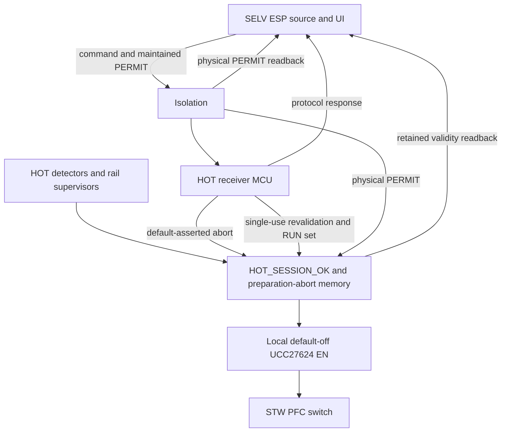
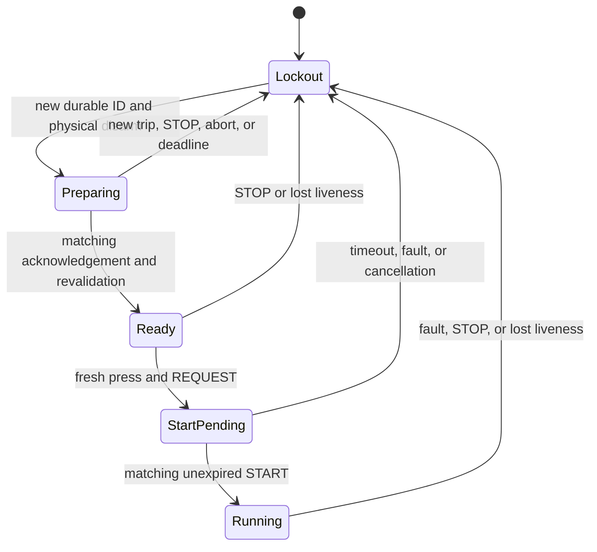

# Power-entry HOT receiver authorization - Plan

## Goal Capsule

Build one source-to-PFC authorization candidate around a small HOT receiver MCU and independent retained HOT shutdown hardware. Use the selected bounded-reset candidate contract: one already-issued, unexpired first START may complete after unexpected ESP execution loss, without extending the reset-to-off deadline. Derive allowable and implementation timing independently as engineering work; keep numerical safety acceptance open until supported by the joined design and physical evidence. Preserve the 54-part passive board as the reference while the new candidate is developed separately. Completion means a joined, auditable digital and native-board candidate with explicit physical qualification still open; it does not mean a safe-to-energize mains assembly.

Authority: the approved `docs/superpowers/specs/2026-09-23-power-entry-hot-receiver-design.md` defines behavior. `zapote/power-entry/passive-reva/protection/ARCHITECTURE-REDUCTION.md` defines the retained baseline and reduced protection scope. Manufacturer data sheets supply device limits; compiled connectivity, host models, and native checks retain their narrower evidence classes.

---

## Product Contract

### Problem frame

Rev37's ESP-only fixture can clear RUN on a brief HOT fault without guaranteeing that its timer restarts or that the source captures the transient. Delayed old commands may then rearm. Rev35 joins a HOT MCU to protection connectivity but has no receiver firmware, complete physical clear, or qualification. The next candidate needs a joined stop and restart contract, not a component-count comparison.

### Requirements

**Retained shutdown and physical interfaces**

- R1. Every qualified session-invalidating trip clears retained HOT session validity and gate permission through hardware; detector recovery cannot restore them.
- R2. Receiver STOP, protocol abort, and receiver reset clear both retained HOT session validity and RUN through a default-asserted physical path, including STOP in READY before PERMIT first rises.
- R3. Physical HOT PERMIT low clears RUN, while a loss after PERMIT was seen high invalidates that session; normal low PERMIT before first assertion allows preparation.
- R4. The source retains physical PERMIT-readback loss and clears its permit latch, with controlled reset of its seen memory only during verified disarm.
- R5. Driver permission is locally default off through invalid and partial-power rail states, including driver supply present while HOT logic supply is absent.

**Session preparation and start**

- R6. Preparation uses a durable, nonrepeating receiver session identifier and matching source acknowledgement of physical disarm before one controlled hardware revalidation.
- R7. A new qualified trip during preparation cancels that attempt even when the HOT session latch is already low; a held revalidation request cannot clock the latch when eligibility returns.
- R8. START may set RUN only for one current, outstanding, unexpired intent created from a fresh local button press after READY.
- R9. Preparation and START have fixed receiver-owned deadlines; timeout or cancellation invalidates the transaction and the source drops PERMIT after a failed start transaction.

**Reset, liveness, and evidence**

- R10. Source and receiver watchdog service distinguishes local execution from fresh end-to-end communication in boot, lockout, preparation, READY, START, and RUNNING states.
- R11. After unexpected ESP CPU-only reset, one already-issued, unexpired, current-session first START may set RUN at most once while hardware permission remains valid; reboot cannot generate or retransmit it. Neither START nor reboot may extend the source-execution watchdog deadline. The same bounded shutdown inequality covers first-start and already-running states; deliberate software restart requires acknowledged physical disarm first.
- R12. Each invalidating fault has a real producer, polarity, capture condition, physical clear path, and independently derived allowable and implementation response times. Unknown inputs stay explicit; numerical acceptance requires implementation worst case plus margin no greater than the hazard-derived allowable time. Faults not interruptible through the gate require separate containment.
- R13. The joined candidate uses actual isolated feedback and detector-to-UCC27624/STW connectivity, with source/native parity and negative mutation checks; model or connectivity PASS is never physical qualification.

### Key decision

Use a small HOT receiver MCU for command identity and sequencing, with fault memory and gate disable owned by independent HOT hardware. (session-settled: user-approved — chosen over the ESP-only timed-edge path: Rev37 lacks a bounded stale-command and brief-fault restart proof.) Governs R1-R13. This selects a function, not ATmega328P as a production part.

### Acceptance examples

- AE1. After a normal RUN, physical PERMIT opens and reconnects; hardware permission stays low, and a new identifier, disarm acknowledgement, READY, and fresh press are required before another START. Covers R3, R4, R6, R8.
- AE2. Receiver STOP occurs in READY while PERMIT has always been low; the physical abort path invalidates session memory and the pending identifier. Covers R2, R6.
- AE3. A short qualified trip occurs after DISARM_ACK while session Q is already low; the pending preparation is discarded, and neither a held clock request nor recovered eligibility produces READY. Covers R1, R7.
- AE4. A matching START is queued past its fixed deadline while other traffic remains healthy; RUN never sets and source PERMIT falls. Covers R8, R9.
- AE5. The ESP unexpectedly resets with retained outputs and one already-issued, unexpired START; the receiver may set RUN once before watchdog detection, but no rebooted retransmission, second watchdog interval, or post-expiry START is accepted. Both this case and an already-running PFC remain subject to one derived reset-to-off bound. Covers R10-R12.

### Scope boundary

This plan delivers a separate integrated candidate and its digital/native evidence. It does not alter `pcb/temper.kicad_pcb`, order parts, fabricate a board, perform powered testing, or close F1/F2 interruption, capacitor energy, thermal, inverter, or appliance compliance. A later physical campaign must follow `zapote/power-entry/passive-reva/protection/interface-integration-24/bench-capture.md` and measure actual fault-to-current cessation before any mains-build claim.

The approved 2026-09-24 product-join supplement selects one Rev38
`VB_BANK`/`HOT0` source feeding an evaluated cooker half bridge and series
tank; see `docs/superpowers/specs/2026-09-24-rev38-single-bank-cooker-design.md`.
This extends the **digital/native candidate** to one power assembly while
leaving inverter operating and physical acceptance open. The old cooker
`PowerInput` doubler and midpoint cannot survive in that product source.

---

## Planning Contract

### Key technical decisions

- KTD1. **Candidate contract, separate safety gate:** Use the bounded-reset candidate behavior in R11. Start by inventorying fault producers and deriving per-class allowable and implementation timing from the actual power stage, recording missing parameters and test needs. Continue parameterized protocol, circuit, and firmware work while limits remain open; numerical timing and physical qualification gate any protected-operation or mains-build claim. If the candidate cannot meet independently derived limits, revise the architecture rather than relaxing them. R11-R12 own the behavior.
- KTD2. **Canonical HOT memory:** Use a separately clocked `HOT_SESSION_OK` and separately retained RUN, with a receiver abort path that physically clears both. Retain a preparation-abort indication even when session Q is already low. This implements R1-R3 and R7 without relying on firmware polling.
- KTD3. **Freshness at the receiver:** Use a durable identifier committed before PREPARE_CHALLENGE and a fixed, receiver-timed REQUEST-to-RUN deadline. CRC may detect accidental corruption but does not establish freshness. This implements R6, R8, and R9.
- KTD4. **Independent return meanings:** Allocate protocol response, physical HOT PERMIT readback, and retained HOT validity as distinct reverse-isolated signals. Rev35's one reverse channel cannot carry the three meanings independently. This implements R4 and R13.
- KTD5. **One joined evidence chain:** Build a new Atopile fixture, inspect exact compiled pin membership with Rust and negative mutations, then compare the native board against source and run independent KiCad/Zapote checks. A net name is not evidence of node voltage or isolation. This implements R5 and R12-R13.

### High-level technical design

Directional topology, subject to part selection and electrical timing review:



Directional transaction; every arrow requires a producer and a bounded consumer in the joined candidate:

```mermaid
sequenceDiagram
  participant ESP as SELV source
  participant RX as HOT receiver
  participant HW as HOT hardware
  ESP->>HW: Hold PERMIT low and observe physical low
  RX->>ESP: PREPARE_CHALLENGE with durable new ID
  ESP->>RX: DISARM_ACK after local and HOT readbacks low
  RX->>HW: Clear historical seen state; one revalidation
  HW-->>RX: Retained validity high, RUN still low
  RX->>ESP: READY for this ID
  ESP->>HW: Fresh press, then PERMIT high
  ESP->>RX: REQUEST, then START before fixed deadline
  RX->>HW: Single RUN-set if still eligible and unexpired
```

Directional state relation; any new qualified trip during preparation goes to a new lockout attempt even when validity was already low:



### Sequencing and stop rules

U1 is first and uses the selected bounded-reset candidate contract. Its timing package derives independent allowable and implementation response bounds where the evidence permits and identifies exact missing parameters elsewhere. Missing numerical inputs do not stop parameterized protocol tests, reset-driver development, or construction of the joined candidate; they do prevent a numerical timing PASS, protected-operation claim, or mains-build decision. U2 and U3 define the receiver and model; U4-U6 build the Rev38 electrical/firmware candidate and supply inputs back to U1's timing analysis. U4b joins that candidate to one cooker bank and inverter source; U7 then evaluates native board parity and digital acceptance. If the candidate cannot meet independently derived limits, revise the watchdog, protection, or reset architecture. Any unselected MCU, isolation device, or detector output is a named unresolved implementation input, never an assumed producer.

---

## Implementation Units

### U1. Establish response contracts and derive timing work

- **Requirements:** R1-R3, R7, R10-R12; AE2, AE3, AE5.
- **Files:** `zapote/power-entry/passive-reva/protection/interface-integration-38/response-contract.md`, `zapote/power-entry/passive-reva/protection/interface-integration-38/fault-response.tsv`, `zapote/power-entry/passive-reva/protection/interface-integration-38/timing-analysis.md`.
- **Approach:** Trace every actual F2/PFC detector, rail, permit, source/receiver reset, watchdog, STOP, and command-timeout producer from Rev35, Rev37, and the retained baseline. Give each a polarity, guaranteed capture minimum, physical clear destination, and independently derived allowable and implementation response-time entries or exact missing-input status. Start the hazard envelope and timing calculations from actual current, energy, voltage, derating, and joined-circuit evidence; include detector, latch, isolation, EN, loaded gate, and commutation where the gate can interrupt the fault. Identify separate containment for faults that gate disable cannot interrupt. For the selected bounded-reset candidate, cover both a first already-issued START and ongoing RUN under one watchdog deadline, including post-reset WDI feed tail. Update the timing analysis as U4-U7 produce part-specific and native evidence; never copy a component delay into an accepted safety limit.
- **Test scenarios:** An ESP CPU reset during RUN; reset just before first START; a receiver-only reset with HOT latches powered; STOP in READY before PERMIT high; a short detector trip while session Q is already low; a rail collapse while driver supply remains present. Each row names the expected physical clear and evidence class.
- **Verification:** The candidate-development gate passes when the reset behavior and the per-fault producer, clear, timing equation, evidence class, and missing-input owner are explicit. Numerical timing acceptance stays OPEN for any class without both independently supported sides of the inequality and adequate margin. No executable implementation test is claimed for this document unit.

### U2. Select the HOT receiver and durable session mechanism

- **Dependencies:** U1 candidate-development gate; numerical timing acceptance may remain open.
- **Requirements:** R2, R6, R8-R10.
- **Files:** `zapote/power-entry/passive-reva/protection/interface-integration-38/receiver-selection.md`, `zapote/power-entry/passive-reva/protection/interface-integration-38/receiver-firmware/README.md`.
- **Approach:** Select a current-production MCU with qualified supply/reset behavior, enough isolated I/O, a suitable clock, and a durable counter store. Define atomic counter reservation before challenge publication, corruption/exhaustion behavior, boot pin defaults, protocol framing, and state-based local/link liveness. Rev35's ATmega328P pin fixture is a reference for function allocation, not the selected BOM.
- **Test scenarios:** Counter write interrupted at each commit boundary fails closed or advances; reboot cannot reuse a published identifier; corrupt storage and exhausted counter forbid READY; receiver reset makes the physical abort active while latches remain powered.
- **Verification:** Part-specific manufacturer limits and a reviewable persistence/pin contract precede firmware and schematic selection.

### U3. Build the restart and cancellation reference model

- **Dependencies:** U1; U2 protocol decisions.
- **Requirements:** R3-R4, R6-R10; AE1-AE4.
- **Files:** `zapote/power-entry/passive-reva/protection/interface-integration-38/model.rs`, `zapote/power-entry/passive-reva/protection/interface-integration-38/protocol-tests.rs`.
- **Approach:** Extend Rev13's session model and Rev37's negative controls as one Rust-owned behavioral oracle. Model physical PERMIT, source/HOT seen memories, receiver abort, preparation-abort memory, single-use revalidation, durable identifier allocation, deadlines, and watchdog state. Keep model outputs separate from claims about silicon timing.
- **Test scenarios:** Normal start then PERMIT break/reconnect and legitimate recovery; STOP in READY and RUNNING; new short trip while Q is already low; fault before/during/after effective revalidation with request held high; matching START past deadline under healthy traffic; stale REQUEST/ACK/START after reset or counter recovery.
- **Verification:** Focused Rust tests include negative controls that demonstrate the Rev37 restart and gated-clock failure modes before the repaired state model passes.

### U4. Join HOT and source hardware into one Atopile candidate

- **Dependencies:** U1-U3.
- **Requirements:** R1-R7, R12-R13; AE1-AE3.
- **Files:** `zapote/power-entry/passive-reva/protection/interface-integration-38/ato.yaml`, `zapote/power-entry/passive-reva/protection/interface-integration-38/elec/src/power_entry_integrated_38.ato`, `zapote/power-entry/passive-reva/protection/interface-integration-38/audit.rs`.
- **Approach:** Join selected receiver/reset circuitry, retained HOT and source memories, independent reverse feedback, actual F2/PFC fault outputs, AUX/rail supervision, and the local UCC27624/STW gate path. Record every forward and reverse isolator channel with producer, consumer, power domain, default state, and failure meaning. Size default-low EN and logic levels from specified corner limits. Trace every physical clear and rail domain by pins, not net labels. Keep the 54-part canonical source and board unchanged.
- **Test scenarios:** Netlist mutation disconnects receiver abort, swaps a reverse feedback channel, bypasses isolation, leaves EN floating, or drops a fault producer; each fails the Rust audit. Qualified PERMIT loss and external/receiver trips reach both retained clear pins and gate inhibit. Driver supply with missing HOT logic, and isolator partial-power states, remain disabled in the electrical corner analysis.
- **Verification:** Offline Atopile 0.2.69 build, exact-pin Rust audit, mutation tests, complete component/isolator-channel census, electrical-corner worksheet, and source/domain graph checks. Connectivity PASS is not analog or physical timing qualification.

### U4b. Join the Rev38 bank to a redesigned cooker source

- **Dependencies:** U4's selected PFC/F2 bank, isolated-signal contract, and the approved single-bank cooker design; U6 supplies the shared ESP pin and control ownership. Numerical inverter acceptance remains open.
- **Requirements:** R5, R12-R13, the selected one-inlet product join, and the original plan's native-candidate Definition of Done.
- **Files:** `zapote/power-entry/passive-reva/protection/interface-integration-38/elec/src/`, `zapote/power-entry/passive-reva/protection/interface-integration-38/audit.rs`, `zapote/power-entry/passive-reva/protection/interface-integration-38/POWER-ASSEMBLY-BOUNDARY.md`, `zapote/power-entry/passive-reva/protection/interface-integration-38/ACCEPTANCE.md`, plus a frozen one-product source receipt. The canonical `elec/src/main.ato` and `pcb/temper.kicad_pcb` remain reference artifacts.
- **Approach:** Compose cooker loads without importing the old `Top` as product source. Feed the half bridge from F2 bank-side `VB_BANK` and bank-capacitor `HOT0`; return the series tank through its CT to `HOT0` and preserve the second CT in the low-side path. Select an isolated SELV 15 V producer for the existing 3.3 V rail; select full-bank OVP, one-bank discharge including open-F2 local energy, and a separate isolated physical HOT RUN indication that defaults the cooker UCC21550 disabled. Derive the high-current connector or copper interface, return/Kelvin layout, voltage/current/thermal envelope, and fault response from the new topology, not the 340 V doubler analysis.
- **Test scenarios:** Duplicate old inlet/doubler/aux path, inverter tied to `VD_LOCAL`, open `HOT0` return, tank CT bypass, low-side CT bypass, PFC shunt polluted by inverter current, HOT-to-SELV short, reverse RUN indicator stuck/open, missing independent inverter disable, open F2 with charged local and bank capacitors, and discharge stuck open/closed. Exact-pin mutations must fail; analog stress cases retain their own quantitative and physical gates.
- **Verification:** Frozen one-product Atopile export, complete power/control BOM, exact-pin and domain Rust audit with negative mutations, selected parts/pins, and a source-to-native interface contract before U7 placement. Host connectivity does not certify tank operating point, discharge time, insulation or fault response.

### U5. Implement receiver firmware against the selected device

- **Dependencies:** U2-U4 interface and pin contract.
- **Requirements:** R2, R6-R10; AE2-AE4.
- **Files:** `zapote/power-entry/passive-reva/protection/interface-integration-38/receiver-firmware/`, `zapote/power-entry/passive-reva/protection/interface-integration-38/receiver-firmware/tests/`.
- **Approach:** Implement the parser, durable counter reservation, session state machine, monotonic deadlines, explicit abort pin, controlled preparation and one-shot RUN-set, and watchdog feed ownership. Host-test protocol logic separately from device I/O, then build for the selected MCU and inspect boot/reset pin configuration. A timely but incorrect firmware loop is not counted as watchdog-detectable.
- **Test scenarios:** Malformed/replayed frames; interrupted durable write; STOP in READY/RUNNING; fault between final input sample and RUN write; START queued beyond deadline; decoder stall; receiver reset while RUN and PERMIT remain high and latches remain powered. A post-fault START cannot reload session memory.
- **Verification:** Host tests, target build, pin-state review, and traceability from each R2/R6-R10 failure case to a physical abort or watchdog path.

### U6. Implement the ESP source driver and cooker integration

- **Dependencies:** U1-U3 and U4 interface contract.
- **Requirements:** R4, R6, R8-R11; AE1, AE4, AE5.
- **Files:** `firmware/main/power_entry_authorization.c`, `firmware/main/power_entry_authorization.h`, `firmware/main/state_machine.c`, `firmware/main/CMakeLists.txt`, `firmware/test/test_power_entry_authorization.c`, `firmware/test/CMakeLists.txt`.
- **Approach:** Give authorization GPIOs one owner and no autonomous WDI/DMA/timer pulse source. Integrate physical local/HOT readbacks, button release/new press, receiver challenge/ACK, cancellation, and fixed deadlines. Distinguish the new source TPS3431 feed from the existing unconditional TPS3823 feed in `firmware/main/state_machine.c`; do not reuse that existing call as authorization evidence. Enforce boot lockout before new session or permit assertion.
- **Test scenarios:** CPU-only reset with retained GPIO; reset after accepted WDI edge; held button; old queued frame/pin write after cancellation; source readback loss followed by legitimate recovery; missing HOT feedback; healthy traffic with expired START; two-core/task progress mismatch.
- **Verification:** Host firmware tests through `firmware/test/CMakeLists.txt`, an ESP-IDF build for the target, and a pin/heartbeat timing review under the U1 reset contract.

### U7. Create native candidate and close digital acceptance

- **Dependencies:** U4-U6 and U4b's selected one-product source, parts and power interfaces.
- **Requirements:** R5, R12-R13; AE1-AE5.
- **Files:** `zapote/power-entry/passive-reva/protection/interface-integration-38/native/section.kicad_sch`, `zapote/power-entry/passive-reva/protection/interface-integration-38/native/section.kicad_pcb`, `zapote/power-entry/passive-reva/protection/interface-integration-38/ACCEPTANCE.md`, `zapote/power-entry/passive-reva/protection/interface-integration-38/bench-capture.md`.
- **Approach:** Export the joined source to a native candidate, assign exact part/footprint/BOM identities, preserve the SELV/HOT isolation boundary, and validate source/native pin and net parity. Route only after U4 electrical review. Prepare low-voltage capture points and fault-injection procedure without claiming an assembled test.
- **Test scenarios:** Native-source miswire, absent local EN pulldown, HOT/SELV copper bridge, stale board/source identity, invalid stackup, and missing required feedback producer each fail an applicable gate. The five acceptance examples remain mapped to physical future captures.
- **Verification:** Native ERC/DRC, exact source/native parity, Rust stackup gate, `make -C zapote check-units` on maintained candidates, BOM/footprint review, and retained run identities. Record digital PASS/FAIL separately from physical NOT RUN.

---

## Verification Contract

| Gate | Applies to | Pass signal |
| --- | --- | --- |
| U1 candidate-development gate | Before U2-U7 | Bounded-reset behavior covers one already-issued first START and ongoing RUN under one deadline; each fault has a producer/clear hypothesis, timing equation, evidence class, and explicit missing inputs. This permits engineering work, not protected operation. |
| Numerical timing acceptance | Before protected-operation or mains-build claims | For every interruptible fault, independent hazard-derived allowable time exceeds implementation worst case plus margin on the joined circuit; noninterruptible faults have separate containment. Otherwise OPEN. |
| Offline Atopile 0.2.69 build and `interface-integration-38/audit.rs` | U4 and U7 | Exact joins and domain separation pass; deliberate miswires fail. |
| Focused Rust model tests and `cargo test --locked --manifest-path zapote/Cargo.toml -p zapote-erc` where rules enter the crate | U3-U4 | Negative controls fail before repair; production scenarios pass on actual board-shaped inputs. |
| Firmware host CMake suite and selected MCU target build | U5-U6 | Reset, expiry, persistence, and cancellation scenarios pass; output ownership is reviewable. |
| KiCad ERC/DRC, source/native parity, and `make -C zapote check-units` | U7 | Saved candidate bytes pass applicable digital gates; missing required inputs remain indeterminate, never green. |
| `uv run python scripts/import_linter_gate.py` and `make regen-check` | Before shipping changed firmware/Rust/generated artifacts | No new import-boundary or derived-artifact drift. |

Existing reference commands and acceptance limits live in `zapote/VALIDATION.md`, `zapote/Makefile`, `firmware/test/CMakeLists.txt`, and the Rev35/Rev37 README files. The plan does not transfer their fixture PASS to Rev38. If a changed `pcb/temper.kicad_pcb` is ever proposed outside this plan, the same-PR DRC ceiling/provenance rule applies.

---

## Definition of Done

- The bounded-reset candidate contract is recorded, including one already-issued first START, no reboot retransmission or deadline extension, deliberate-restart disarm, and one reset-to-off inequality for first-start and ongoing RUN.
- U1's per-fault analysis records independently supported allowable and implementation terms, exact missing parameters and owners, margins, and physical test requirements. An unresolved numerical safety limit remains OPEN and is never replaced by a component setting, typical delay, or simulation observation.
- R1-R13 and AE1-AE5 trace to implemented sources, applicable digital tests, and one authoritative acceptance record with exact source, board, runtime, tool, and input hashes. Physical response-time and fault-to-current-cessation acceptance stays NOT RUN until captured on an assembled prototype.
- The joined Atopile candidate, Rust audit/model, receiver firmware, ESP driver, and native board agree on pin ownership, session states, physical clears, and isolated domains.
- All applicable digital gates pass, with deliberate fault/miswire mutations caught and unrun physical checks labeled NOT RUN.
- Experimental dead ends are removed from the new candidate diff; historical Rev35/Rev37 fixtures and the canonical 54-part baseline are preserved.
- The acceptance record states that assembled low-voltage fault injection, measured fault-to-current cessation, mains safety, and the passive protection/cooling milestone remain open until separately qualified.
