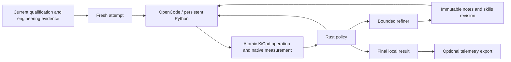

# Continual buck harness

The harness keeps OpenCode as the solver runtime. Ordinary Python runs in a
persistent macOS sandbox, PCB edits and measurements run through KiCad, and Rust
owns admission, hashes, budgets, failure classification, and inheritance policy.
Reusable memory is a versioned pair of `notes.md` and `skills.py`.

This follows the persistent computation and external-evidence ideas in
[Prime Agent](https://arxiv.org/html/2608.23552v1#S2) and the bounded act/refine
and frozen/updating comparison in
[Continual Harness](https://arxiv.org/html/2605.09998v1#S3).
The implementation contract is
[the refinement plan](../docs/plans/2026-09-09-1945-feat-buck-harness-refinement-plan.md),
with the experiment and engineering requirements inherited from
[the engineering plan](../docs/plans/2026-09-09-1635-feat-buck-engineering-validation-plan.md).

## Attempt lifecycle



The admitted tools are `inspect`, `check`, `place`, `replace_copper`, and
`execute`. Native edits are staged with the full fixture context, refilled and
checked independently, then atomically committed. A valid failing DRC result
is feedback during construction. `inspect` succeeding means inspection worked;
it does not mean the board passes construction.

Each attempt has one absolute 1,200-second deadline and a budget of 200
successfully committed mutations. Nested Python calls use that same counter.
A cell has a 120-second elapsed ceiling and 64-KiB returned-output limit.
Oversized protocol frames, output floods, lost workers, or killing timeouts
end the attempt as indeterminate and preserve completed-action evidence.

Updating conditions may request refinement after native measurement at
mutation 20, 60, and 100, once each, while construction still fails. Each
refiner call is limited to 90 seconds and the remaining cell/attempt time.
Refinement never extends either deadline.

The refiner receives instructions, current notes/skills, the current native
observation, and the last 20 complete operation pairs from its own attempt.
Rust trims oldest whole pairs to fit 128 KiB. Indispensable context that cannot
fit is recorded as a rejected refinement. The refiner has only the structured
`update_artifacts` operation and returns both files, jointly at most 64 KiB.

## Persistent state and learned artifacts

`Workspace` owns one running Python process. Variables and the active call
stack survive skill replacement. A replacement module gets a new namespace;
old function aliases keep their original module and revision tag. These tags
are diagnostic provenance, not an independent proof of arbitrary Python state.

The trusted host compiles proposed source without executing it. Rust binds the
artifact contents and source-window metadata to SHA-256 identities. Executable
loading happens inside the sandbox. The store publishes a complete manifest
only after both files have been saved; incomplete writes cannot be consumed.
Reads recompute identities and reject symlinks or changed contents. Failed
proposals, failed loads, earlier revisions, and application receipts remain
available. Unchanged baseline contents cannot be called learned memory.

The sandbox admits a bounded Python runtime and dedicated scratch directory.
Real canaries test denied outside reads/writes, repository and board reads,
bootstrap writes, network connections, and subprocess creation. A missing or
unqualified boundary blocks use; there is no import-filter fallback.

## Cross-unit memory and the block profile (2026-09-10)

The same revision/Store/workspace path now carries an explicit cross-unit
memory package: expert-curated entries in
[`memory/`](memory/README.md), selected deterministically by
[`memory.py`](memory.py) and `src/memory.rs` from declared task capabilities
and current compiled-artifact hashes, and delivered through
`memory.deliver_selection` (materialize → `Workspace.apply_revision` → receipt
→ model-input capture). Selection, delivery, and use are recorded separately;
this does not manufacture a historical buck learning receipt, and the
historical engineering gates are unchanged.

A bounded block profile (`run_block.py::BlockSession`) builds, inspects, and
repairs a source-derived MCU board with the same 200-mutation / 1,200-second
budget and the same native operation primitive. The first attempt was
transport-blocked and remains `apparatus-only`; see
[`docs/hardware/control-assembly/harness-report.md`](../docs/hardware/control-assembly/harness-report.md).

## Recovery and experiment isolation

Recovery may resume the same attempt only after a driver interruption following
a complete, verified provider response. The parent must still own the live
worker and verify a fresh liveness challenge plus the acknowledged board,
action count, revision, and unchanged absolute deadline. Arbitrary Python
globals are never reconstructed from serialized representations.

An incomplete or failed provider response remains terminal even if the worker
survives. Native apparatus faults, missing evidence, stale identities, and
invalid admissions are recorded separately from valid model outcomes.

Development has four slots: `buck-dev-a/b` under `fixed_base` and
`updating_base`. Evaluation has six slots: `buck-res-a/b` under `fixed_base`,
`inherited_frozen`, and `inherited_updating`. Each slot is consumed once;
indeterminate slots are retained rather than silently replaced.

Only an explicit frozen development artifact crosses into evaluation. Rank
usable applied revisions by completed construction first, then lower total
elapsed time, then lexical revision digest. No usable revision means no
inherited evaluation. Independent attempts start with fresh board, Python,
OpenCode conversation, working directory, and isolated XDG state. Reserved
results never feed another attempt.

## Run and verify

```sh
make -C harness-lab build check
python3 harness-lab/run_buck_trials.py harness-lab/runs/new-preflight \
  --phase preflight --qualification /path/to/qualification.json \
  --engineering /path/to/report.json
python3 harness-lab/run_buck_trials.py harness-lab/runs/new-development \
  --phase development --qualification /path/to/qualification.json \
  --engineering /path/to/report.json \
  --preflight-receipt harness-lab/runs/new-preflight/preflight-receipt.json
python3 harness-lab/run_buck_trials.py harness-lab/runs/new-evaluation \
  --phase evaluation --qualification /path/to/qualification.json \
  --engineering /path/to/report.json \
  --preflight-receipt harness-lab/runs/new-preflight/preflight-receipt.json \
  --inheritance harness-lab/runs/new-development/inheritance.json
```

Use fresh output directories. The runner rechecks retained evidence against
current source, board, contract, evaluator, approved evidence, and runtime
identities. Old reports saying “pass” do not bypass these checks. The current
engineering limitations and empty approved component/model registries still
block live full-buck scoring. Software controls do not qualify a SPICE model,
electrical performance, fabrication, or hardware safety.

## Tracing

Tracing is enabled by default for continual buck harness runs. Use
`--no-telemetry` for an explicitly offline/private run or a software control;
`--telemetry` remains accepted. Unit tests disable or replace external export.
The CLI summary reports `exported`, `disabled`, `unavailable`, or `dropped` so
missing traces are visible.

Export runs after the authoritative local result is finalized. It sends a
structured OTLP/HTTP JSON trace through a separate subprocess; credential
lookup and export share a five-second budget. The root trace contains
LangSmith-compatible Input/Output with complete model JSONL conversations and
PCB/project/footprint artifacts, while child spans describe each judged
attempt and native operation with statuses, hashes, measurements, and
mutation/refinement counts. API credentials remain transport-only and never
enter span data. Use `--no-telemetry` for an offline/private run. Export
failures produce a separate diagnostic and cannot change results or retries.

This machine uses the `temper-harness` project at LangSmith's US endpoint.
The credential is stored in macOS Keychain under service
`com.temper.harness.langsmith`, account `temper-harness`. Local, gitignored
`runs/langsmith-local/config.json` selects that destination:

```json
{
  "endpoint": "https://api.smith.langchain.com/otel/v1/traces",
  "project": "temper-harness",
  "credential": "macos-keychain"
}
```

No shell setup is required here. The config contains no key, and the host reads
the credential only when export is enabled. The local Keychain route accepts
only the configured official LangSmith endpoint.

For another collector, set `OTEL_EXPORTER_OTLP_TRACES_ENDPOINT` to a complete
URL or `OTEL_EXPORTER_OTLP_ENDPOINT` to a base URL. Explicit OTLP headers supply
that collector's credentials; a custom endpoint never receives the local
Keychain key. Missing configuration or credentials leaves a visible
`unavailable` diagnostic while preserving local results.

[LangSmith supports non-LangChain OpenTelemetry ingestion](https://docs.langchain.com/langsmith/trace-with-opentelemetry).
The local collector controls pass, and LangSmith accepted a metadata-only
connection trace. No LangChain, LangGraph, vector database, or tracing SDK is
required. Default tracing does not change the engineering admission gates.
