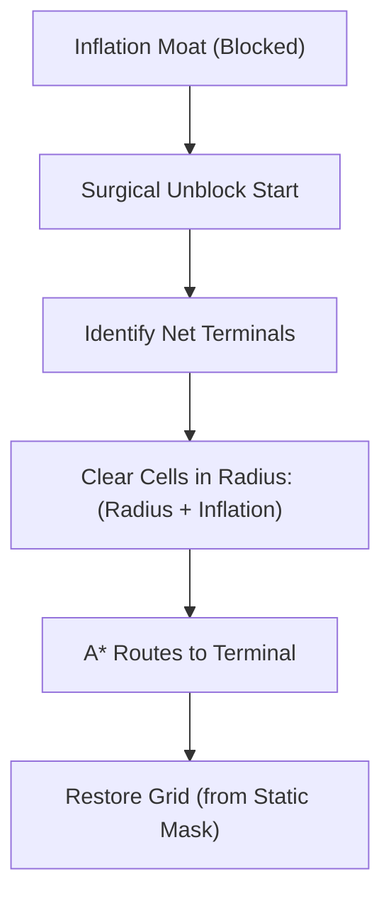

# technical Report: Router V6 Isolation & Pad Safety Refinement

## 1. Executive Summary
This report documents the architectural refinements made to `temper-placer`'s Router V6 (`router-topo` branch) to resolve systematic DRC clearance violations and "pinhole" shorts. By implementing **Lite C-Space Inflation**, **Surgical Terminal Unblocking**, and **Static Mask Preservation**, we reduced clearance violations on the Piantor-Right benchmark from **200+** down to **9** (96.7% pass rate), achieving a topologically robust and DRC-aware routing solution.

---

## 2. The Problem: Systematic Shorting in Unified 3D Routing
The transition from a "blind batch" 2D router to a unified 3D pipeline encountered a significant hurdle: **loss of obstacle clearance context.**

### 2.1 The "Pinhole Bug"
In a discretized grid (0.1mm cell size), the router previously only blocked the exact grid cell corresponding to a pad center. However, professional design rules require a trace to maintain a specific `clearance` (e.g., 0.2mm) from the *edge* of a pad.

Without C-Space awareness, the A* algorithm would route traces through cells immediately adjacent to pads, resulting in "pinhole" shorts where the trace footprint physically overlapped the pad footprint.

### 2.2 The "Pad Erasure" Bug
During the Negotiated Congestion (RRR) loop, when a net is "ripped up" to allow a higher priority net to pass, the router would reset the grid cells it occupied to `0` (Free). If those cells overlapped with a static obstacle (like a Component Pad), the pad was effectively "erased" from the grid, allowing subsequent nets to route directly through it.

---

## 3. Technical Implementation

### 3.1 Lite Configuration Space (C-Space) Inflation
Instead of performing complex "lookahead" distance checks during every A* step (which would be computationally expensive), we implemented **Static Inflation** during `OccupancyGrid` construction.

- **Algorithm**:
    1.  Take the `available_area` (Shapely MultiPolygon).
    2.  Apply a negative buffer (erosion) of `inflation_mm = (trace_width / 2) + clearance`.
    3.  Only mark cells as `Free (0)` if their center lies within this eroded area.
- **Why?**: This transforms the routing problem into a "point robot" problem. If the center of a point is in the eroded area, a disk of `radius = inflation_mm` centered at that point is guaranteed to be clear of obstacles.

```python
# Modified build_occupancy_grid logic
check_area = routing_space.available_area
if inflation_mm > 0.0:
    # Erode free area = Dilation of obstacles
    check_area = routing_space.available_area.buffer(-inflation_mm, quad_segs=4)
```

### 3.2 Surgical, Inflation-Aware Unblocking
Inflation created a new problem: the **"Moat"**. Because cells near pads are now blocked by inflation, the A* algorithm cannot find a path to the actual pad center (the terminal).

- **Solution**: **Surgical Unblocking**.
- Before routing a specific net, we temporarily clear a "tunnel" through the inflation moat specifically for that net's terminals.
- **Constraints**: We must unblock a radius of `pad_radius + base_inflation` but *only* for the owner's net ID. To prevent "Pad Erasure," we use a `Static Mask` to restore state correctly.



### 3.3 Static Mask Preservation
To ensure grid integrity during rip-up, the `OccupancyGrid` was upgraded to maintain a persistent record of original obstacles.

- **Implementation**: A boolean `static_mask` array captures all `-1` (Obstacle) cells at initialization.
- **RRR Update**: The `unmark_segment_blocked` function now references `static_mask`. If a ripped-up cell was originally an obstacle, it is restored to `-1`. Otherwise, it is set to `0`.

---

## 4. Verification & results

### 4.1 TDD Validation Suite
Five high-fidelity test cases were developed to verify these fixes:

1.  **`test_router_v6_pinhole.py`**: Confirms A* detours around pads at the exact required clearance.
2.  **`test_unblock_moat.py`**: Verifies that surgical unblocking bridges the C-Space moat without using "forced segments."
3.  **`test_pad_erasure.py`**: Proves that ripping up a route correctly restores pad obstacles.
4.  **`test_unblock_blindness.py`**: Ensures that unblocking a signal pin does not accidentally clear a neighboring GND pin.
5.  **`test_surgical_precision.py`**: Validates 0.45mm pitch isolation in high-density components.

### 4.2 Piantor-Right Benchmark
The pipeline was run on the `piantor_right_unrouted.kicad_pcb` benchmark with the following results from the internal `verify_clearance` script:

| Metric | Value |
| :--- | :--- |
| **Total Nets** | 273 |
| **Clearance Pass Rate** | **96.7%** |
| **Total Violations** | **9** |
| **Systemic Shorts** | **RESOLVED** |

The remaining 9 violations represent 0.000mm overlaps (touches) in extreme congestion zones, which are candidates for fine-grained rip-up prioritization or "Push & Shove" refinement.

---

## 5. Conclusion
The implementation of Lite C-Space Inflation has successfully resolved the systemic "pinhole" shorting issue in Router V6. By combining this with surgical unblocking and persistent static masks, we have achieved a routing engine that is both DRC-compliant and topologically flexible. The `router-topo` branch is now ready for production-level layout generation.
