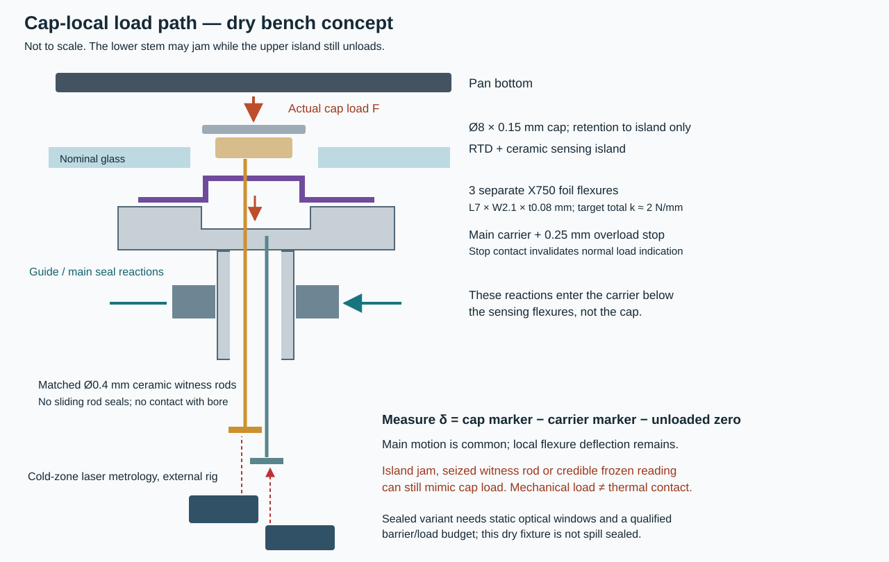

# Revision 2: cap-local differential load sensing

**Design and executable simulation; hardware NOT VALIDATED.** The existing
firmware backend remains unavailable. This study provides a buildable dry-bench
candidate and explicit quantitative requirements; it does not qualify a sealed
production sensor.

The important change is to put a compliant sensing island between the pan-facing
cap and the main plunger. Main guide, spring and seal reactions enter the carrier
*below* this island. A jammed main plunger can retain its old displacement while
the cap island unloads on pan removal. This removes the specific correlated
spring-seat/position failure of revision 1 **within the stated parasitic-force
and metrology bounds**. It does not remove island seizure, witness-rod seizure,
credible frozen readings or mechanically loaded insulating contamination.



## Concrete mechanical arrangement

| Feature | Candidate definition and role |
|---|---|
| Pan-facing cap | Skirtless 316L Ø8 × 0.15 mm disc. Three retention tabs attach only to its ceramic island, never directly to the main carrier. RTD remains directly below the cap. |
| Local sensing island | Ceramic puck supporting cap and RTD, with +0.20 mm intended normal travel and +0.25 mm carrier-mounted overload stop. Main-stem motion is a different degree of freedom. |
| Flexures | Three separate Inconel X750 foil spokes below glass, around z = −6 mm; each candidate L7 × W2.1 × t0.08 mm, inner anchor radius 4 and outer 11 mm. No closed metal ring. Target measured total axial stiffness 1.6–2.4 N/mm, nominal 2.0. Stress, temperature dependence and RF heating belong to the mechanical/EM workstreams; dimensions alone do not prove stiffness. |
| Witness rods | Two matched Ø0.4 mm ceramic rods, nominal length 35 mm, at x≈±0.8 mm: one attached to the island, one to the carrier. Both pass freely through the hollow stem; no sliding contact, bushing or rod seal may transmit a load to them. Route to ≥2 × 2 mm diffuse target flags below the stem. Exact bore clearance and optical access are checked in the mechanical CAD. |
| Metrology | Two Micro-Epsilon ILD1420-10CL1 heads on a common metallic cold-zone fixture. One reads the island flag, one the carrier flag; subtract their unloaded-zero-corrected readings. The bulky external rig is the prototype readout, not an asserted fit in the product enclosure. |
| Normal load window | Target actual cap load≥0.12 N. Candidate upper force 0.32 N, local deflection limited by measured stiffness and the 0.25 mm stop. Reject the observed differential at or above 220 µm. |

Cap retention hooks, RTD leads and any adhesive fillet must not bridge island to
carrier. Such a bridge is another reaction path and can hold the island loaded
without a pan. Wire loops need a measured ≤10 mN total parasitic/restoring force
budget together with witness rods, contamination and any barrier; this is a
qualification target, not a material property already established.

This island consumes available pan depression. The main spring's effective
force and local flexure force must be solved in series, including the top stop:

- Before carrier lift-off from its upper stop, `F = k_island × depression`.
- Afterwards, `F = (effective_preload + k_main × depression)/(1+k_main/k_island)`.

With effective preload 0.12 N, main rate 0.2 N/mm, local rate 2 N/mm and only 0.10 mm
available depression, the model gives **0.1273 N**, local motion 63.6 µm and main
motion 36.4 µm. Counting 0.10 mm for both motions would overstate force and travel.
At0.05 mm depression and 0.15 N effective preload, the main carrier stays at its
upper stop and cap force is0.10 N; that corner does not meet the proposed 0.12 N
qualified-force floor. `results/series_force.csv` includes 36 corners.

## Credible components and their limits

The selected bench head is [Micro-Epsilon ILD1420-10CL1](https://www.micro-epsilon.com/fileadmin/download/manuals/man--optoNCDT-1420--en.pdf), manual §3.5:
20–30 mm range,25 mm midpoint; class 1; ≤±8 µm linearity,0.5 µm repeatability at
2 kHz/median 9, and ±0.015% of10 mm per kelvin temperature stability on a metallic
holder. Operation is0–50°C non-condensing. Use digital RS422 measurements and
error status; analog CL1 output is only 12-bit. The supplier reference target is
white diffuse ceramic; our flags require qualification. A9-sample window at2 kHz
spans 4.5 ms. No supplier claim establishes our two-head differential uncertainty,
rod mechanics, window transmission or end-to-end cutoff.

[KEYENCE LS-9030](https://www.keyence.ca/products/measure/micrometer/ls-9000/models/ls-9030/)
is a credible alternative bench optical micrometer:0.3–30 mm normal range,
160±40 mm transmitter/receiver separation,0–50°C operation, quoted±2 µm accuracy.
Its±0.1 µm repeatability specifies 2048 averages and a10 mm reference rod; those
numbers cannot be transplanted to our flags or a50 ms fault deadline. At16 kHz,
2048 samples alone span 128 ms. It is not selected for the current timing model.

Two laser heads are **one differential measurement**, not independent redundant
proof. They share fixture, calibration, optical contamination and software. The
carrier channel removes common travel; it cannot detect all cap-channel faults.
A second frame containing the same stuck reading is not diagnostic diversity.

## Threshold and drift budget

Candidate signal: `δ = z_cap − z_carrier − unloaded_zero`, positive under cap
compression. After the existing firmware release/acquisition timing contract,
tentative mechanical acceptance is `25 ≤ δ < 220 µm`, with fresh diagnostics.
These thresholds are not programmed into production firmware.

| Differential contribution | Calibration/operating target | Basis |
|---|---:|---|
| Local two-head calibration residual |4 µm|Target over the actual ≤0.25 mm travel and flags; not the global datasheet linearity|
| Sensor-temperature drift |3 µm|Two opposite-sign 1.5 µm/K errors for≤1 K movement of each head after zeroing|
| Unequal rod thermal expansion |2 µm|Target;35 mm × assumed 8 µm/m/K ×7 K differential average gradient ≈1.96 µm|
| Short-window noise/quantization |2 µm|Qualification target for paired timestamped digital samples|
| Cap tilt/cross-axis effects |2 µm|At pickup radius 0.8 mm, allowable unexplained tilt contribution requires roughly≤0.14°; actual geometry must be measured|
| Fixture/reference motion |2 µm|Target after mounting, thermal soak and vibration|
| **Bounded sum** |**15 µm**|Worst-case sum, not RSS or a probability claim|

At minimum external force 0.12 N, residual parasitic force 0.01 N and stiffness
bounds 1.6–2.4 N/mm:

- Loaded lower observation: `(0.12−0.01)/2.4 ×1000 −15 = 30.83 µm`, giving
  **5.83 µm** margin above 25 µm.
- Unloaded upper observation: `0.01/1.6 ×1000 +15 = 21.25 µm`, giving
  **3.75 µm** margin below 25 µm.
- At the 250 µm stop, a−15 µm error still gives 235 µm, above the 220 µm rejection.

These are small, conditional margins. A raw budget using the two heads'±8 µm
linearity, ±5 K head excursions, rod-gradient mismatch and fixture effects is
approximately 45 µm, with **negative loaded and unloaded margins**. The instrument
part number does not close the budget. The 605-case interval sweep varies force,
error and residual force and exposes where the two populations overlap.

Zeroing is allowed only with independently established release, under a defined
thermal condition. Never silently re-zero a possibly loaded, seized or contaminated
island. In-service drift correction that can absorb a jam would destroy the proof.

## Fault truth table

The following results apply to the 15 µm/10 mN bounded target, after a valid
acquisition. The broad sweep also deliberately violates those bounds.

| Physical/fault state | Local differential | Candidate response | What remains unresolved |
|---|---|---|---|
| Main guide jams; pan removed but induction still sees pan | Returns near zero | Reject; 0/81 false mechanical permissions | Requires free island/witness rods and bounded parasitic load |
| Main seal jams; pan removed | Returns near zero | Reject; 0/81 | Same conditions; main-seal force must enter below island |
| Island itself seized at prior loaded deflection | Retains loaded value | **81/81 false mechanical permissions** | Static differential cannot distinguish this from real cap load |
| Witness rod seized or bonded to bore | Can retain loaded flag | **81/81 false mechanical permissions** | Bore clearance and return proof reduce likelihood; do not prove runtime freedom |
| Frozen sensor value with fresh believable timestamps | Retains loaded value | **81/81 false mechanical permissions** | Laser/error-bit diagnostics do not prove target motion |
| Insulating debris transmitting pan force | Legitimately loaded | **81/81 false thermal permissions** | Mechanical load is not thermal conductance |
| Overload stop engaged |≥235 µm including bounded error | Reject; 0/81 | Off-axis stop engagement/tilt still needs physical characterization |
| Sample stale or optical blockage diagnosed | Diagnostics invalid | Reject; 0/81 | Assumes actual detector reports the condition; not every optical fault is diagnosable |
| Credible 100 µm reference shift | Apparently loaded | **81/81 false mechanical permissions** | Outside the 15 µm budget; cannot be called safe through nominal calibration |

The 3,600-case broad sweep produces 75/300 false permissions on guide-jam removal
when error grows to±30 µm or residual force to30 mN. This is intentional evidence
that the location change alone is insufficient. The bounded 972-case subset
shows which errors the proposed requirements would exclude. Counts are exhaustive
grid outcomes, **not failure probabilities or reliability estimates**.

## Sealing and optical access boundary

The dry-bench witness passages are **not spill sealed**. Adding sliding rod seals
would reintroduce unmeasured force and seizure exactly where the measurement must
remain free. A narrow hollow stem also does not automatically transmit the laser
triangulation receive cone; do not aim through it and assume success.

A coherent sealed follow-on is an extended static lower optical chamber with all
rods and flags inside, and side static optical windows at the cold flags. The
window/frame is attached to the stationary chamber, never the sensing island.
Electronics remain outside. There must also be either a qualified cap-to-carrier
flexible barrier or an explicitly wet internal cavity with fluid diagnostics.
A flexible barrier acts in parallel with the island flexures: its stiffness is
included in the 1.6–2.4 N/mm *total* and its hysteresis/return force in the 10 mN
budget. This version no longer senses above **every** seal reaction, and must be
identified as such. A wet cavity can keep liquid from electronics yet invalidate
optical readings and leak into other interfaces; it is not a qualified solution.

Window thickness/index, tilt, deposits, double reflections and temperature alter
triangulation. No compatible calibrated window/receiver-cone combination is
claimed selected. The sealed architecture is dimensioned as a requirement for
mechanical iteration; the deliverable suitable for initial construction is the
dry fixture. Seal completion and detector qualification must advance together.

## Response and active diagnostics

The local oscillator estimate uses 0.2–1.0 g moving mass,1.6–2.4 N/mm stiffness and
assumed damping ratio 0.02–0.40. Conservative 2% settling `4/(ζ√(k/m))` plus 4.5 ms
filter and 10 ms loop gives approximately 17–173 ms across 45 corners. This is a
settling proxy, not a measured detection delay; first threshold crossing can be
earlier, and stick-slip can be much later. Low damping, optical latency and
scheduler behavior must not be hidden inside a claimed 50 ms physical cutoff.
The firmware's existing 50 ms freshness guard only detects absent samples; it
cannot know that a freshly reported mechanical signal is stuck.

A separate microheater pulse could characterize conductance, but it is **not** a
replacement contact detector here. The40-case lumped identifiability example uses
0.25 W for 0.10 s, capacities 0.03–0.30 J/K, clean-contact conductance 0.05–1 W/K and
no-contact losses 0.01–0.20 W/K. Both populations contain identical 0.05,0.10 and 0.20
W/K cases, producing identical pulse responses at equal capacity. Thus a pulse
alone cannot identify contact without independently bounded loss paths. These
values are exploratory intervals, not measured cookware properties. No heater,
RTD overdrive or firmware excitation is added; MAX31865 temperature sensing
cannot be assumed to supply that controlled power pulse.

## Execution, evidence and remaining gates

Run without touching the workspace's shared cargo/PyO3 build cache:

```sh
rustc --edition=2021 --test model.rs -o /tmp/temper-contact-r2-tests
/tmp/temper-contact-r2-tests
rustc --edition=2021 -O model.rs -o /tmp/temper-contact-r2
/tmp/temper-contact-r2 results
```

Source is `model.rs`; CSVs and test output are in `results/`. Ten analytic/fault
regressions pass. No firmware was edited, no apparatus energized, no parts ordered,
and no outputs were published by this workstream. Base commit:
`470ac33eced 8a46791eff 201efc 2a8a57d0ee0c9`.

This closes the concrete **dry-bench concept and executable fault analysis**.
It does not close production release. The remaining measurable gates are the 15 µm
error budget,10 mN parasitic-force bound, minimum 0.12 N force through pan/part
variation, hot flexure stiffness/stress and return, island/rod seizure detection,
thermal-contact discrimination, sealed optical path and physical loss-to-cut
latency. Keep the production backend unavailable until those claims have evidence.
