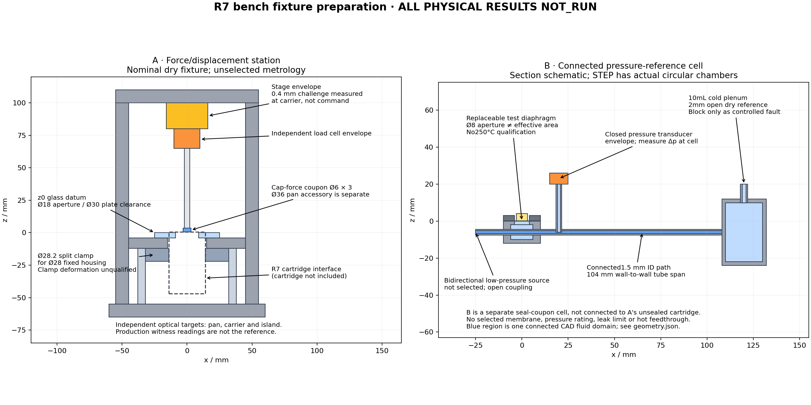

# R7 separate metrology and connected pressure fixture

**Controlled engineering prototype preparation only. All physical results are NOT_RUN.** No component, seal, pressure rating or load rating is released. No hardware operation or production contact detector is implemented.

The package provides two separate dimensioned fixtures. Station A accepts the dry R7 D6 cartridge; cell B accepts a seal coupon. **Cell B is not connected to A:** the cartridge has no complete sealed cavity or pressure port. A connected CAD fluid domain in B does not close that missing cartridge interface.



## Station A: independent force and displacement

`force-displacement-frame.step` defines a120×100mm base, two upright rails, removable glass datum plate, split fixed-housing clamp, load-train envelopes and aØ6×3mm cap-force coupon. AØ36×3mm pan is a separate accessory, not the force-sweep head. The glass top is z0, thickness4mm, aperture18mm. Datum plate opening30mm clears the28mm fixed housing; the clamp has28.2mm nominal bore and spans z−22…−12. These dimensions were coordinated with the cartridge CAD worker. Clamp deformation, tightening, sliding guides, fasteners and local stress are not established. A split alone does not supply a designed clamping mechanism: the drawing requires a real clamp/fastener design and measured housing distortion before fabrication release.

The cartridge is referenced, not duplicated in this STEP. Its expected wire endpoint z−47 has8mm nominal distance to the base top z−55. This is an endpoint check, not a whole moving-wire collision proof. The parent integration must inspect the actual cartridge assembly and all poses. The datum plate has room to support the50mm mock-glass annulus; fixture glass is not qualified cooktop glass.

Load path: translation stage → independent force transducer → thermal standoff → cap-force coupon → cap → cartridge → housing clamp/glass datum → frame. The standoff is a4mm diameter,61.4mm length envelope; material, lateral stability, attachment and thermal isolation remain selection tasks. Gravity, fixture compliance, guide friction and hot drift are included in calibration, never silently tared only once at room temperature. The transducer and translation stage are unselected envelopes. No instrument accuracy follows from their drawn size. The6mm coupon clears the18mm glass aperture throughout the modeled stroke. The36mm accessory touches glass at the loaded pose and intersects it at full stroke; its load reading cannot isolate cap force once the glass supports it. Do not use the small force coupon as a cookware/thermal-contact surrogate.

Read pan height, carrier height and local-island height with independent metrology referenced to the frame/glass datum. Monitor production witness channels separately. The independent measurement must observe actual targets; motor commands and the same witness channel under test cannot be the ground truth. Access/line of sight and targets require the integrated cartridge review. Keep optical heads within their actual supplier temperature limits and record head/window temperature; distance alone does not demonstrate a cold zone.

## Cell B: genuinely connected dry pressure reference

`connected-pressure-cell.step` and `pressure-fluid-domain.step` include a nominal1mL main cavity/throat,1.5mm-ID passage, a10mL remote plenum and an open2mm reference outlet. There is one connected fluid solid, independently reimported as STEP. The side input at x−25 is an open interface for an unselected bidirectional pressure source; the tap at x20 terminates at a closed transducer envelope. The vent at x120/z20 is the atmospheric reference. Actual port joints, sealing faces and the source/transducer are not selected.

The main-to-plenum center distance is120mm; the1.5mm-ID span between their inner cavity walls is104mm. **This is not R5's100mm tube**, so its25.08Pa prediction must not be reused as the fixture result. Extra tap/port dead volume is included in the exported total fluid volume. `geometry.json` records CAD volumes. The membrane is a flat0.1mm envelope under an8mm aperture with a6mm load button: no material, convolution, prestrain, rolling action, stiffness or250°C compatibility is implied. Aperture area is not established effective area. Measure dF/dp through stroke in both directions.

Cell B is a geometry/test-method coupon. Its rigid shell and connecting tube are a fused CAD shape, not a fabrication process. A machinist must split it into inspectable parts, specify joints and materials, and establish strength/leak ratings. Hot/cold thermal zoning and sensor protection remain unresolved. Keep this separate from any claim of a complete cooking/cleaning liquid boundary.

## Metrology calculation and acceptance provenance

`main.rs` uses interval corners for F=pA, including pressure sign, diameter uncertainty and pressure uncertainty. Its numbers are **required capability allocations**, not datasheet claims or measured uncertainty:

- Force uncertainty per reading0.60mN worst case: suggested allocation0.15 calibration +0.10 repeatability +0.15 hot drift +0.05 alignment +0.15 fixture/tare. Substitute calibrated bounds before use; do not RSS assumed independent terms.
- Pressure uncertainty2.2Pa: proposed1.0 zero +0.5 scale +0.5 drift +0.2 resolution. Effective diameter8.00±0.05mm is an illustrative bound awaiting dF/dp measurement, not CAD evidence.
- Paired displacement registration2µm cannot resolve the3mN seal-hysteresis allocation: at2.4N/mm it creates4.8mN force ambiguity before the two force readings add1.2mN.
- A demanding0.20µm **paired** registration target gives0.48mN registration error and1.68mN total hysteresis-measurement bound. Thus measured loop separation must be≤1.32mN to support a guarded3mN bound at that slope. This target is not established with any instrument. Closed-loop matching or interpolation needs its own residual/error validation.
- The production15µm-per-reading channel is unsuitable as a3mN metrology reference. Two independent worst-case errors can differ by30µm; common cancellation needs evidence, not assumption.

Pressure bounds are computed separately for6/8/10/12mm hypothetical effective diameters. At8.00±0.05mm and2.2Pa error, the measured magnitude must be≤56.744Pa (see exact output) to support3mN. Positive/negative excursions cannot cancel in a worst-case envelope. The actual diaphragm may not admit a constant effective diameter.

Inherited R5 development allocations: pressure3mN; seal hysteresis3mN; all harness/witness terms4mN; combined10mN. R6 additionally exposes seal elastic force competing for that same budget: consuming3+3+4 leaves zero additional elastic margin. `combined_budget.csv` preserves this. Do not give each seal its own10mN. A two-seal load path needs both areas and all reactions mapped to the local/main stages.

There are distinct screens: complete installed slope must satisfy the inherited1.6–2.4N/mm assumption; the R6 additional-seal-force budget bounds an uncharacterized added reaction over travel. Do not charge an already characterized linear component twice within one force sum. Conversely, do not remove unknown seal force by subtracting a fitted spring curve and declaring it gone. For a direct total residual measurement, pressure/harness/seal are already present: do not add them again. Component runs diagnose attribution and check allocations; the complete-assembly run is the final combined measurement.

Source requirements: `../../revision5/safety/README.md`, `../../revision5/validation/TEST_PACKAGE.md`, and `../../revision6/seal/README.md` when installed under `revision7/fixture/`. These are development assumptions, not product certification limits. Retention load, leak rate, cleaning media, endurance cycles, overshoot/duty and inhibition latency remain UNDEFINED. Historical1N/2N pull screens are not acceptance loads.

## Reproduce and inspect

```
./run.sh
./check.sh
./build.sh
./integrate.sh ../mechanical
# Override CAD_PYTHON and PLOT_PYTHON if using another prepared environment.
```

The existing prepared CadQuery2.6.1 environment is a local dependency, not bundled into this package. No installation or Cargo invocation is required. Rust owns arithmetic; Python generates geometry and figures. `run.sh` runs tests before calculations and retains failure status. Read `BUILD_AND_TEST.md`, blank templates and `VERIFICATION.md`. Numerical passes and valid solids establish only the stated model/geometry properties.

## Cartridge integration

`integrate.py` imports all12 actual cartridge STEP files (three variants/four poses) and the actual frame STEP. Every cartridge solid—including all four full60mm wire routes—is checked against the fixed frame, datum plate and uncompressed housing clamp. Fixture part names are mapped by unique volume/bounding-box matches to the export metadata; cartridge geometry is not regenerated. The duplicate mock glass is omitted only on the fixture side because the cartridge STEP already includes it. The cartridge glass remains in every collision check.

The force-cell/rod/6mm coupon train is separately positioned by0/−0.6/−1.45mm for rest/loaded/full stroke. It is removed for the cap-capture retention condition. Actuator connection/guide travel is not established by these translations. The36mm accessory intentionally intersects glass in the full-stroke negative control, proving that this load application would be invalid. Optical access is still UNVERIFIED. `integration.json` records source hashes, actual bounds and pair checks; `integrate.sh` rejects input changes during the run and publishes a completion receipt only after a clean result.
