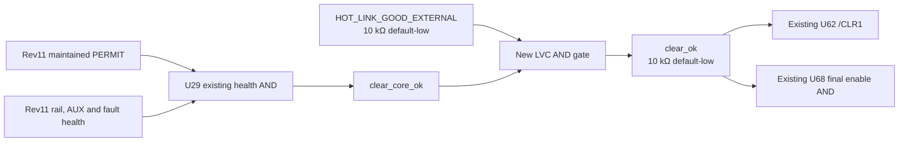

# Revision 28: hardware clear gate and command-boundary model

Status: **compiled review candidate, incomplete control producer**. Date:
2026-09-22. This revision adds a HOT-side hardware gate that makes a low link
health input clear Revision 11's retained RUN latch even when maintained
PERMIT stays high. It also tests a logical one-pulse ARM adapter against the
frozen Revision 13 handshake. The physical link-health detector, isolated
transport, HOT receiver, pulse output driver and shutdown timing are **not**
implemented or qualified. No PCB was changed.

## Compiled circuit change

The [Atopile source candidate](source-candidate/ato.yaml) copies Revision 26
and changes its local F2 control module. U29's existing health output becomes
`clear_core_ok`. A selected SN74LVC1G08DBVR-class AND gate computes
`clear_ok = clear_core_ok AND HOT_LINK_GOOD_EXTERNAL`. Its output goes to the
same SN74HCS74 `/CLR1` and final enable AND input that previously received
U29 directly. A 10 kΩ pulldown on the HOT-side link input makes an open or
high-impedance producer low; another 10 kΩ pulldown on the new `clear_ok`
output biases it low when the LVC gate is unpowered. A 100 nF bypass is
included. The two new resistor MPNs and bypass MPN are
`TBD_REVIEW_ONLY`; the candidate BOM is not a manufacturing BOM.

The candidate is **154 compiled instances**, four more than Revision 26.
Its `HOT_LINK_GOOD_EXTERNAL` signal is a same-domain HOT input, not an
isolator or link detector. The [Rev28 netlist audit](audit-link-clear-tests.rs)
uses the frozen [Rev26 parser](../interface-integration-26/audit_aux.rs) to
check all 150 prior component identities and pin assignments (only U29.8
changes net), the exact 11 pins on the four new parts, the new latch/final-gate
clear net, and the unchanged PERMIT/ARM and clamp wiring. It passes.

| `clear_core_ok` | `HOT_LINK_GOOD_EXTERNAL` | `clear_ok` | Result at retained latch |
|---:|---:|---:|---|
| 0 | 0 or 1 | 0 | Clear asserted; final enable low. |
| 1 | 0 | 0 | Link loss clears RUN even if PERMIT is high. |
| 1 | 1 | 1 | A new validated ARM rising edge may set RUN. |

The last row is a permission, not an automatic start. If the link-good signal
itself is stuck high, or a receiver presents a false-good level, this gate
cannot detect that fault. Startup and reconnection are safe only if the real
producer keeps link-good low until link and receiver qualification are
complete, and keeps ARM low until a fresh accepted START. A direct source
reset/abort path may need to force clear sooner than a watchdog timeout.

## Logical command adapter

The [command model](command-model/README.md) appends a bounded, low-idle ARM
output model to the frozen Revision 13 receiver. Its 22 tests pass, including
link loss with stuck-high PERMIT, receiver reset, source-health loss,
permission recovery without restart, and an in-flight START **after** reset
indication reaches the modeled boundary. The pulse is one model tick, **not a
specified time or voltage**. The model's `source_healthy` term is a proposed
producer condition; this compiled circuit has no separate source-health
connection beyond its existing PERMIT and local health inputs. The model does
not turn an unbuilt receiver into an electrical component.

## Native inspection and limits

The existing schematic generator exported the
[native review schematic](native/power_entry_link_clear.kicad_sch) from the
Atopile netlist. Its KiCad oracle passed **409 pin assignments across 97
connected net groups**, and regeneration diff passed. The
[A0 portrait render](native/renders/a0/power_entry_link_clear_a0.pdf) was
visually checked for the whole component grid, but labels are crowded. This
flat drawing is a connectivity artifact, not a readable release schematic.

[ERC](native/erc.json) reports 335 warnings: 154 generated symbol-library
configuration, 153 off-grid endpoints, 16 footprint lookups and 12 isolated
labels. Revision 26 under the same generator had 327 (150/149/16/12), so
the eight-warning delta is four generated-symbol and four endpoint warnings.
No warnings were waived. Generic generated pin types mean this ERC does not
establish drive compatibility or physical fault response.

The new AND part's DBV package pin functions and 5 V operation are supported
by the [TI SN74LVC1G08 datasheet](https://www.ti.com/lit/ds/symlink/sn74lvc1g08.pdf).
At a 4.5–5.5 V supply its guaranteed high-input threshold is 0.7 × VCC;
the eventual HOT link-good producer must meet that level at the gate pin
(a nominal 3.3 V GPIO is not a guaranteed high at 5 V VCC) and must also
meet the gate's low-input limit and rise/fall requirements. An open-drain
watchdog output needs a pull-up sized against the 10 kΩ input pulldown;
equal 10 kΩ pull-up and pulldown values would leave the input near half
supply, below the guaranteed high level. Any required level translator or
pull-up is part of the missing producer design.
The [TI SN74HCS74 datasheet](https://www.ti.com/lit/ds/symlink/sn74hcs74.pdf)
is the external pin and asynchronous-clear reference for the retained latch.
These data sheets do not specify this assembly's link-loss detection time,
receiver startup behavior, gate turn-off, relay release or isolation barrier.

We considered using a standalone watchdog as the link-good producer, but did
not select one. For example, TI says the
[TPS3430 WDO output](https://www.ti.com/lit/ds/symlink/tps3430.pdf) is high
while its watchdog is disabled and only asserts after a selected timeout.
Raw WDO high therefore cannot, by itself, prove the receiver completed a
fresh command session at startup. The required maximum shutdown delay and a
physical heartbeat/qualified-good producer are still unspecified. The
existing SELV interlock TPS3823 is a different watchdog, with an audited
0.9–2.5 s timeout and no direct Rev11 HOT-clear connection; see the
[Revision 17 audit](../interface-integration-17/watchdog-handback-unaccepted.md).

## Reproduce and exit condition

From `source-candidate/`, use the offline Atopile 0.2.69 command in
[Revision 26's environment record](../interface-integration-26/build-environment.md)
with the entry `PowerEntryPfcLinkClearCandidate`. Two builds produced
byte-identical `default.net` and `default.csv`; the second [build log](source-candidate/build.log)
is retained. From the worktree root, append `audit-link-clear-tests.rs` to
the Rev26 `audit_aux.rs`, compile with `rustc --edition=2021 --test`, and set
`REV26_NET` / `REV28_NET` to the two candidate `build/default.net` paths when
running it. The command-model README gives its exact test command. The
native generator uses this candidate's `layout.json`, netlist and BOM; its
`--check` pass and hashes are in [receipt.json](receipt.json).

Before adopting this circuit, choose and implement a HOT-side link detector
whose **qualified-good is low at boot/reset and on link loss**; show how it
detects stuck-high traffic or a dead receiver; bind source reset and PERMIT
through the isolation boundary; specify the maximum allowed disable latency;
and measure actual RUN clear, driver gate and relay behavior on an assembled
isolated prototype. An unqualified external `HOT_LINK_GOOD_EXTERNAL` level
must stay low during commissioning.
