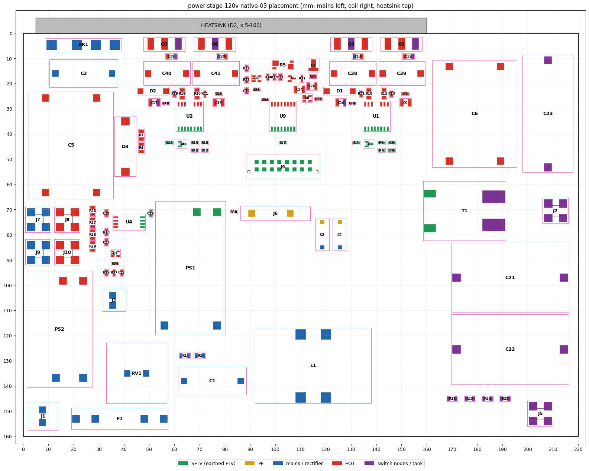

# Placement review — native-03 (unrouted)

First deliberate floorplan, 2026-09-26, branch `feat/ps-placement` from PR
#1615 head `0e7484885`. Source unchanged: 114 components, 75 nets, audit PASS.
**Owner review required (D4). Routing (Part 5) must not start until the
placement is approved in writing.**



Colours: green SELV (earthed ELV), gold PE, blue mains/rectifier, red other
HOT, purple switch nodes and tank. Magenta outlines are courtyards. Full
KiCad layers: [placement.svg](native-03/placement.svg).

## Result

| Gate | Result |
| --- | --- |
| DRC with `section.kicad_dru` (clearance, creepage, courtyard) | **0 violations**; 28 `lib_footprint_mismatch` warnings (F.Fab text, as NATIVE-01/02) |
| Schematic parity | 0 |
| Per-pad net parity vs `frozen/default.net` (independent) | 313/313 source pin nodes; netless pads are stud paste apertures, stud and J4 locating holes |
| Footprint MPN census vs resolved export | 114/114 |
| Rust physical-stackup gate | PASS |
| ERC | 0 errors; warnings as native-02 (synthetic symbols, off-grid, isolated single-pin labels) |
| Unconnected items | 258 (unrouted) |
| Barrier rule self-test | PASS (see below) |
| Tests | 28 unit-local and current-sense tests, including new pose-capture, rule and pad-rotation tests |

## Architecture: a SELV island

The drivers must sit near their gates on the heatsink edge, and all SELV copper
must be 8 mm from HOT copper. The SELV domain is therefore an **island** in the
board interior, surrounded by HOT copper so every HOT net stays connected
around it. Barrier parts straddle its edge:

| Island edge | Barrier parts |
| --- | --- |
| Top, under each leg | U2 (leg B), U1 (leg A) UCC21550, SELV pins facing down |
| Top, between the legs | U9 ISO7710 (fault line from the shunt comparators) |
| Left | U4 AMC1311 (bus sense, beside C5's terminals) |
| Right | T1 CST3015: primary on SW_A outside, secondary inside |
| Bottom | PS1 IRM-20 (AC down, outputs up); C3/C4 Y1 capacitors (line pad down, PE pad up) |

J4 (Micro-Fit 2×8) sits inside the island; its harness leaves vertically. The
PE branch terminal J6 and the functional-earth link R38 are inside the
island too: PE and the earthed ELV return are the same side of every barrier.

## Zones

| Zone | Parts | Notes |
| --- | --- | --- |
| Heatsink row (y < 10) | BR1, Q5/Q6 (leg B), Q3/Q2 (leg A), snubbers C19/C20/C13/C12 | Only these parts are within 10 mm of the heatsink (rule 4 met). TO-247 tabs toward the edge |
| Local bus | C40/C41 (leg B), C38/C39 (leg A), R5 shunt between the legs | HF caps return to HV_RET after the shunt, so shoot-through through them is measured |
| Shunt-side protection | U3 LDO, U5 ref, U6 OCP, U8 NAND, their passives | Between the HF-cap pairs, next to R5's Kelvin pads |
| Bulk and clamp | C5 (left of leg B), C6 (right of leg A), D3 TVS at C5's terminals, R3/R4 bleed | |
| Bring-up links | J7/J8 (rect_p/bus_p), J9/J10 (rect_n/hv_ret), left column | Both rails; studs 4.8 mm apart edge to edge |
| Bus sense | U4, divider R26–R29, R30/C27, U7 OVP and its network | Left edge of the island, below C5 |
| Mains | J1 (left edge) → F1 → RV1/C1/R1/R2 → L1 (outputs up) → C2 X2 **at BR1** | C2 sits directly under BR1 to keep the bridge input loop small |
| Gate supply | PS2 (left column, outputs up), J3 TCO loop | V15_LS/LEG_RET reach the drivers up the left side |
| Tank | T1, C6/C23 (top right), C21/C22, bleed R22–R25, studs J2 (coil feed) and J5 (coil return) on the right edge | D6: coil exits right |

## Rules and values (`tools/write_rules.py` → `section.kicad_dru`)

Domains come from `audit.rs` `SELV_NETS` plus explicit HOT potential groups;
an unclassified or doubly classified net fails generation.

| Rule | Nets | Clearance | Creepage | Basis |
| --- | --- | ---: | ---: | --- |
| SELV ↔ HOT | audit SELV list + SELV-side NC pads ↔ all HOT | 8.0 mm | 8.0 mm | D5 provisional reinforced floor (PD3, IIIa, >125–250 V: 2 × 4.0 mm) |
| PE ↔ HOT | `pe` ↔ all HOT | 8.0 mm | 8.0 mm | D5-BASIS: same floor, since PE is linked to the controller return |
| HOT functional | different HOT potential groups | 3.2 mm | (as clearance) | Table 18, PD3, >125–250 V |
| Tank functional | `res_a`, `crbleed_*` ↔ other HOT | 5.0 mm | (as clearance) | Table 18, PD3, >250–400 V: margin for 33–60 kHz tank voltage |
| Same component, HOT pins | pads of one footprint | 0.2 mm | — | Component rating governs; never applied to SELV/PE rules |

**KiCad 10 finding:** creepage rules are evaluated per net pair, so footprint
conditions (`memberOfFootprint`) never match them; they do match clearance.
A component's own HOT pin spacing (TO-247 pins are 2.95 mm apart) therefore
cannot be exempted from a creepage rule. Functional spacing is enforced as
clearance at the creepage value, which for same-layer copper on a slotless
board is at least as strict. Barrier rules keep both constraints.

**Self-test:** on a copy of this board, moving SELV capacitor C37 into the
shunt-side cluster produced 24 SELV↔HOT violations, and moving C4's PE pad
7.07 mm from J3 produced PE↔HOT violations against the 8.0 mm floor. The
rules fire; the clean result is meaningful.

## Measurements (`native-03/placement-metrics.json`, independent of DRC)

1. **Barrier.** Minimum SELV↔HOT pad distance on the board: **8.10 mm**, inside
   U1 (its TI HV land pattern). Minimum PE↔HOT: **8.50 mm**, inside C3. Every
   other crossing is larger.
2. **Commutation.** Bounding box of Q2/Q3/Q5/Q6, C38–C41 and R5:
   x 47.7–159.3, y 1.6–20.8 mm (≈2,140 mm² for both legs and the shared
   shunt). Each leg's HF loop runs from its high-side drain through its HF
   capacitors, the shunt and its low-side source, so the shunt position sets
   the loop. See compromise 1.
3. **Gate paths** (driver output pad to gate pad, Manhattan): leg B low
   25 mm, leg A high 32 mm, leg B high 36 mm, leg A low 43 mm. Gate
   resistors and hold-offs sit at the driver outputs; route each gate with
   its source return as a tight pair.
4. **Heat.** Within 10 mm of the heatsink edge: BR1, the four MOSFETs and
   their snubbers only. Assumed airflow: along the heatsink fins, off-board,
   exhausting past the right end; the film capacitors and IRM modules are not
   in that path.
5. **Heavy parts.** C5/C6 (4-pin radial, 48 mm tall), C21/C22/C23 (axial
   942C), L1 and the IRM modules need adhesive or a strap. Room is left around
   each; retention is an assembly item (ASSEMBLY.md).
6. **Access.** F1, J1, J3, J4, J6 and all M4 studs are unobstructed. M4 stud
   screw holes are ≥ 4.8 mm from any other net (link studs) and ≥ 10 mm on the
   tank studs, so a protruding screw tip cannot bridge the functional rules;
   specify screw length so tips do not pass through the board.

## Known compromises (in priority order)

1. **Commutation loop through the shared shunt.** The single shoot-through
   shunt must sit in both legs' HF loops, and the shunt-side comparator
   cluster occupies the space between the legs. Closing the legs up around R5
   (moving U3/U5/U6/U8 below the HF caps) would roughly halve each loop, at
   the cost of a longer Kelvin pair. Measure turn-off overshoot first; with
   a 650 V MOSFET on a ≈200 V bus and the TVS at the bulk capacitors, Rev A
   has margin.
2. **Leg A low-side gate path, 43 mm.** UCC21550 OUTB faces away from Q3
   because Q3 is kept next to the shunt. Acceptable with a paired route.
3. **CMC-to-X2 run.** L1 is in the bottom band; C2 (X2) is at BR1 so the
   bridge input loop is small, but L_FILT/N_FILT run about 150 mm from L1 to
   BR1, mostly up the left side. Route as a tight pair.
4. **J1 wire-entry side** is inferred from the Phoenix footprint graphics
   (front face at local +y, placed facing the left edge). Confirm on the part.

## Provisional

D5 basis and every 8.0 mm value (lab review pending); Table 18 values from the
combined IIIa/IIIb lookup; T1 CTI/PD evidence (Coilcraft); J2/J5 assembled
connection and insulation; heatsink extent x 5–160 and airflow; heavy-part
retention; J1 entry side. No routing, fabrication or electrical test is
claimed.

## Decisions

| ID | Status |
| --- | --- |
| D1 | 220 × 160 mm — used; the floorplan fits |
| D2 | Shared PE-bonded heatsink along the top edge, x 5–160 — used |
| D3 | 2 layers, 1.6 mm, 70 µm — applied (stackup gate PASS) |
| D4 | **Open: placement approval required before routing** |
| D5 | Conditionally approved basis (D5-BASIS.md) — encoded as the 8.0 mm rules |
| D6 | Mains left, coil right, heatsink top — used |

## Refining the placement

Move parts in KiCad (`native-03/section.kicad_pcb`), save, then:

```sh
python3 tools/capture_poses.py native-03/section.kicad_pcb     # writes poses.json
rm -rf native-04 && ../../.venv/bin/python tools/build_native.py native-04 --stackup stackup.json
python3 tools/write_rules.py native-04/section.kicad_pcb
kicad-cli pcb drc --severity-all --schematic-parity --format json --output native-04/drc.json native-04/section.kicad_pcb
```

Only positions and rotations survive capture; the board is regenerated from
source, so no KiCad edit can change connectivity. The floorplan behind
native-03 is `tools/floorplan_v1.py` (courtyard-centre coordinates, run under
KiCad's Python against the unrotated native-02 shelf).

## Generator fix found by this placement

`scripts/gen_pcb_skeleton.py` wrote rotated footprints without rotating their
pads: KiCad stores pad orientation in board coordinates, so SOIC pads stayed
horizontal and shorted their neighbours (47 `shorting_items`). Every earlier
native board was an all-0° shelf, so it never showed. Fixed, with a
regression test that fails on the old code.

## Identity

| Artifact | SHA-256 |
| --- | --- |
| `native-03/section.kicad_pcb` | `5bb75c7a80c8133f77fa52e324724e5c824079699237827acc6329a7126a77c3` |
| `native-03/section.kicad_sch` | `5c4ce191ae868a28bee17418fd663b77193a3fab1c700614c6fdf7a1c8428fbf` |
| `native-03/section.kicad_dru` | `476416ce1ec90720c2f2dc791b02ed47303698c79d8776e9bb6e8f3cbb2182e3` |
| `native-03/source-manifest.json` | `b7148186e3d3f60cb4d0c2aca418983a6d2cbc784c1e297239baeffc8afaf3c6` |
| `poses.json` | `a2922684134489035fffdb8c903c36b99a16177e93badb77b3292ea14d90e013` |
| `outline.json` | `e629c0ff9e0de17674c523527df7bb33036429f5be286fabf8d6b147abf9f0bd` |
| `stackup.json` | `f78b19657dd082fe74fa142fb7b294b7f31cf62ec5099304bab8f738b47cf473` |

Digital construction evidence only. Routing, fabrication, assembly, powered
tests, thermal/EMI measurement and certification: **NOT RUN**.
