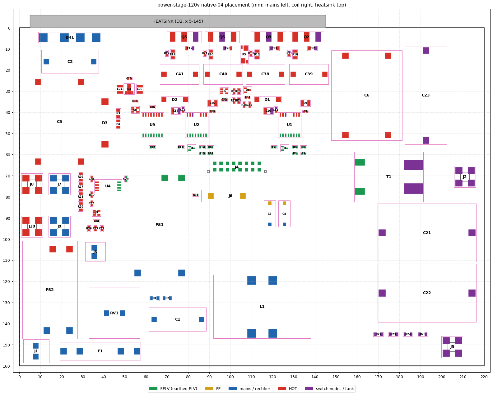

# Placement review — native-04 (unrouted)

Revised floorplan, 2026-09-26, responding to the D4 review of native-03
(`757e30a65`). Source unchanged: 114 components, 75 nets, audit PASS.
**Owner review required (D4). Routing (Part 5) must not start until the
placement is approved in writing.** native-03 is kept as the reviewed prior
version.



Colours: green SELV (earthed ELV), gold PE, blue mains/rectifier, red other
HOT, purple switch nodes and tank. Magenta outlines are courtyards. Full
KiCad layers: [placement.svg](native-04/placement.svg).

## Response to the native-03 D4 review

| # | Finding | Change | Evidence (native-04) |
| --- | --- | --- | --- |
| 1 | Gate networks beside the drivers | Series resistors R10/R12/R18/R20 and hold-offs R11/R13/R19/R21 now sit directly under each gate pin. Each driver is centred between its two gates | Series resistor to gate pad: **6.9 mm** on all four. Driver output to resistor: 30–46 mm, to route as drive/return pairs (leg A's outputs cross once, since OUTA/OUTB order is fixed by the package) |
| 2 | Shared-shunt loop 42/69 mm and the "~200 V gives margin" claim | Legs closed up around R5 (1.5 mm courtyard gaps). R5 at 270°: its LEG_RET current pad faces the low-side sources, its HV_RET current pad faces the local capacitors. Leg B capacitors at 0°, leg A at 180°, so the inner capacitors' HV_RET pads sit beside R5. Comparator cluster moved below the capacitor row. **Claim removed** | Low-side source → R5 current pad 1, plus R5 current pad 4 → inner capacitor HV_RET: **19.4 mm** (leg B), **31.3 mm** (leg A). Per-capacitor paths under "Measurements". Turn-off overshoot at the MOSFET terminals remains a bench measurement |
| 3 | Divider taps shared one exempt group | Groups rebuilt: nets share a group only if joined through something that cannot open **and** within ~30 V in normal operation. Every divider tap, bus-bleed tap and resonant-bleed tap is its own group; so are the nets across F1, the thermal cutoff and the bring-up links | Tests assert the principle. Two DRC mutations of native-04 (a `vdiv_1` track beside other-potential pads) are reported below |
| 4 | Installed terminal hardware not checked | `terminal_envelopes.json` defines installed items (lugs, straps, bare screw + washer) and cable exits for **normal** and **bring-up** configurations. Link rows 20 mm apart, bus studs on the board edge | Superseded by the native-04 follow-up below |
| — | Tank row listed C6 | Corrected: C6 is bulk bus; C23 is resonant | — |

## Response to the native-04 follow-up review

| Finding | Change | Evidence |
| --- | --- | --- |
| Facing jumper lugs overlap 19 × 10 mm at 13 mm stud pitch; the checker skipped joined studs | Each link is now one **removable strap** (tinned copper, 10 × 1.5 × 23 mm, holes 13.0 mm apart, M4 × 8 screws with spring and plain washers; custom part, PROVISIONAL). A new **mechanical check, independent of nets**, rejects any overlap between installed items, and between an item and any courtyard other than the studs it mounts on | Normal and bring-up: 0 mechanical conflicts. A test reproduces the facing-lug collision and asserts the normal configuration uses straps |
| Leg B return used R5's Kelvin pad 2 | Commutation metrics use R5 current pads 1 (LEG_RET) and 4 (HV_RET) only, and report each capacitor's complete path | Leg B 19.4 mm, leg A 31.3 mm (source → pad 1 plus pad 4 → inner capacitor); per-capacitor table below |
| Terminal checker ignored the 5.0 mm tank rule | Tank-net hardware is held to 5.0 mm against other HOT | J2/J5 lugs pass |
| "All four return pads converge under R5" | Qualified: the inner capacitors (C40, C38) return 8.3 / 9.6 mm to R5 pad 4; the outer ones (C41, C39) 28.9 / 30.2 mm | See below |

## Result

| Gate | Result |
| --- | --- |
| DRC with `section.kicad_dru` (clearance, creepage, courtyard) | **0 violations**; 28 `lib_footprint_mismatch` warnings (F.Fab text, as before) |
| Schematic parity | 0 |
| Per-pad net parity vs `frozen/default.net` (independent) | 313/313 source pin nodes |
| Footprint MPN census | 114/114 |
| Rust physical-stackup gate | PASS |
| ERC | 0 errors; warnings as before |
| Unconnected items | 258 (unrouted) |
| Heat zone (10 mm of heatsink, x 5–145) | BR1, Q2/Q3/Q5/Q6, snubbers, R5 only; nothing unexpected |
| Barrier (pad copper, independent of DRC) | SELV↔HOT min **8.10 mm** (inside U1's HV land pattern); PE↔HOT min **8.50 mm** (inside C3) |

## Rules (`tools/write_rules.py` → `section.kicad_dru`)

| Rule | Nets | Clearance | Creepage | Basis |
| --- | --- | ---: | ---: | --- |
| SELV ↔ HOT | audit SELV list + SELV-side NC pads ↔ all HOT | 8.0 mm | 8.0 mm | D5 provisional reinforced floor (PD3, IIIa, >125–250 V: 2 × 4.0 mm) |
| PE ↔ HOT | `pe` ↔ all HOT | 8.0 mm | 8.0 mm | D5-BASIS |
| HOT functional | different HOT potential groups | 3.2 mm | (as clearance) | Table 18, PD3, >125–250 V |
| Tank functional | `res_a`, `crbleed_*` ↔ non-tank HOT | 5.0 mm | (as clearance) | Table 18, PD3, >250–400 V: margin for the 33–60 kHz tank voltage |
| Same component, HOT pins | pads of one footprint | 0.2 mm | — | Component rating governs; never applied to SELV/PE rules |

**Grouping principle.** Two HOT nets share a group, and so are exempt from
each other's functional spacing, only if they are joined by a conductor or
low-impedance element that is not expected to open (not a fuse, thermal
cutoff, link, switch or divider resistor) and differ by at most ~30 V in
normal operation. Groups with more than one net: `L_F` (l_f, l_filt: CMC
winding), `MAINS_N` (CMC winding), `LOW` (≤15 V from LEG_RET; the shunt is
1 mΩ), `SW_A`/`SW_B` (switch node with its bootstrap and high-side gate;
T1's primary is one turn).

**KiCad 10 finding.** Creepage rules are evaluated per net pair, so footprint
conditions never match them; clearance rules see the item. Functional
spacing is therefore enforced as clearance at the creepage value (at least as
strict on a slotless board); barrier rules keep both constraints.

**Self-tests.**
- Barrier (on native-03): moving a SELV capacitor into the HOT cluster gave 24
  SELV↔HOT violations; a PE pad at 7.07 mm gave PE↔HOT violations.
- Functional (on native-04): a stray `vdiv_1` track beside C27/R28 is reported
  as a 3.2 mm `HOT functional` violation. A second mutation with a `vdiv_1`
  track beside only R28's `vdiv_2`/`vdiv_3` pads is reported as
  `vdiv_1` ↔ `vdiv_3` at 1.01 mm against the 3.2 mm floor. Under the native-03
  grouping this divider-tap case went unreported.

## Architecture: a SELV island

The drivers must sit near their gates and all SELV copper 8 mm from HOT
copper, so the SELV domain is an island in the board interior, surrounded by
HOT copper so every HOT net stays connected around it. Barrier parts straddle
its edge:

| Island edge | Barrier parts |
| --- | --- |
| Top, under each leg | U2 (leg B), U1 (leg A) UCC21550, SELV pins facing down |
| Top, left of leg B | U9 ISO7710 (fault line), beside U8 NAND and near the OVP comparator |
| Left | U4 AMC1311 (bus sense, beside C5's terminals) |
| Right | T1 CST3015: primary on SW_A outside, secondary inside |
| Bottom | PS1 IRM-20 (AC down, outputs up); C3/C4 Y1 capacitors (line pad down, PE pad up) |

J4 and the PE branch terminal J6 (with the functional-earth link R38) sit
inside the island; PE and the earthed ELV return share every barrier.

## Zones

| Zone | Parts | Notes |
| --- | --- | --- |
| Heatsink row | BR1, Q5/Q6 (leg B), Q3/Q2 (leg A) | TO-247 tabs toward the edge; legs 1.5 mm apart around R5 |
| Under the legs | Snubbers across drain-source; gate resistor and hold-off at each gate; R5 between the low-side sources | |
| Local bus | C41, C40 (leg B, 0°), C38, C39 (leg A, 180°) | Inner capacitors' HV_RET pads beside R5; outer ones 29–30 mm away |
| Shunt-side OCP | U6, U5, R31–R35, C30–C32 | Below the capacitor row, next to R5's Kelvin pad |
| Fault path | U9 ISO7710, U8 NAND, C35–C37 | Left of leg B |
| HOT 5 V | U3, C24–C26 | Left of leg B, near V15 and U4 |
| Bulk and clamp | C5 (left), C6 (right), D3 TVS at C5's terminals, R3/R4 bleed | |
| Bring-up links | J8/J7 (bus_p/rect_p), J10/J9 (hv_ret/rect_n) | Rows 20 mm apart; bus studs on the edge |
| Bus sense | U4, R26–R29, R30/C27/C28, U7 OVP and network | Island left edge, below C5 |
| Mains | J1 (left edge) → F1 → RV1/C1/R1/R2 → L1 (outputs up) → C2 X2 **at BR1** | |
| Gate supply | PS2 (left column, outputs up), J3 TCO loop | |
| Tank | T1, C23 (resonant, top right), C21/C22, bleed R22–R25, studs J2/J5 on the right edge | C6 beside C23 is bulk bus, not tank |

## Terminal hardware (`terminal_envelopes.json`)

Plan-view envelopes of exposed metal, checked against every other net's pad
copper and other studs' metal, with fitted links treated as one conductor:

| Configuration | Hardware | Closest live metal to another net | Mechanical |
| --- | --- | --- | --- |
| Normal | One removable strap per link (J8–J7, J10–J9); coil lugs on J2/J5 toward +x (off the right edge) | 4.12 mm (positive strap to R26), floor 3.2 mm | 0 conflicts |
| Bring-up | Bench-lead lugs on J8/J10 toward −x (off the left edge); J7/J9 bare screw + washer, mains-live | 3.46 mm (J8 lug to J7 stud), floor 3.2 mm | 0 conflicts |

Electrical floors: 3.2 mm to other HOT, 5.0 mm where tank nets are involved,
8.0 mm to SELV/PE. The mechanical check is independent of net membership:
installed items may not overlap each other or any courtyard other than the
studs they mount on. Cable exits: J1 left edge; J2/J5
right edge; J4 controller harness, J6 PE branch and J3 TCO loop leave
vertically and are clamped; SELV and PE wires must not rest on HOT parts.
Envelopes are placement-stage estimates: replace them with measured hardware
(and heights) before fabrication.

## Measurements (`native-04/placement-metrics.json`)

1. **Barrier:** SELV↔HOT 8.10 mm, PE↔HOT 8.50 mm (pad copper, unrouted).
   These do not cover future routing, zones, attached metal or the heatsink.
2. **Commutation** (pad-centre Manhattan lower bounds through R5's current
   pads; not routed lengths or inductance):

   | Leg | Capacitor | Drain → cap BUS_P | Cap HV_RET → R5 pad 4 | Source → R5 pad 1 | Sum |
   | --- | --- | ---: | ---: | ---: | ---: |
   | B | C40 (inner) | 28.8 | 8.3 | 11.1 | 48.1 |
   | B | C41 (outer) | 27.4 | 28.9 | 11.1 | 67.3 |
   | A | C38 (inner) | 29.8 | 9.6 | 21.7 | 61.1 |
   | A | C39 (outer) | 26.4 | 30.2 | 21.7 | 78.3 |

   The outer capacitors are in parallel and carry less of the fastest current.
   Loop inductance is set mainly by routing: a BUS_P plane on the bottom layer
   under the whole row, overlapping the top-layer HV_RET/LEG_RET pour (Part 5).
   Turn-off overshoot at the MOSFET terminals, the energy-return case and the
   clamp need bench measurement (DC-LINK-CLAMP.md).
3. **Gates:** resistor-to-gate 6.9 mm; driver-to-resistor 30.4 / 35.3 (leg B
   low / high), 32.8 / 45.7 mm (leg A high / low).
4. **Heat:** only BR1, the MOSFETs, snubbers, gate networks and R5 near the
   heatsink. Assumed airflow along the fins, exhausting past the right end.
5. **Heavy parts:** C5/C6, C21/C22/C23, L1 and the IRM modules need adhesive
   or a strap (ASSEMBLY.md).
6. **Access:** F1, J1, J3, J4, J6 and all studs unobstructed; stud envelopes
   as above.

## Remaining compromises

1. **Leg A's low-side source is 21.7 mm from R5.** The TO-247 pin order fixes
   the source on the far side of Q3; mirroring leg A would lengthen it
   further. Route LEG_RET as a pour on both layers.
2. **Leg A's gate outputs cross once** (OUTA/OUTB order is fixed by the
   package); route one output on the bottom layer as a tight pair.
3. **CMC-to-X2 run.** C2 (X2) is at BR1; L_FILT/N_FILT run about 150 mm from
   L1 up the left side. Route as a tight pair.
4. **J1 wire-entry side** is inferred from the footprint graphics; confirm on
   the part.

## Provisional

D5 basis and every 8.0 mm value (lab review pending); Table 18 values from the
combined IIIa/IIIb lookup; T1 CTI/PD evidence (Coilcraft); terminal envelopes,
heights and the custom link strap; heatsink extent and airflow; heavy-part retention; J1 entry side.
No routing, fabrication or electrical test is claimed.

## Decisions

| ID | Status |
| --- | --- |
| D1 | 220 × 160 mm — used |
| D2 | Shared PE-bonded heatsink along the top edge, x 5–145 — used |
| D3 | 2 layers, 1.6 mm, 70 µm — applied (stackup gate PASS) |
| D4 | **Open: placement approval required before routing** |
| D5 | Conditionally approved basis (D5-BASIS.md) — encoded as the 8.0 mm rules |
| D6 | Mains left, coil right, heatsink top — used |

## Refining the placement

Move parts in KiCad (`native-04/section.kicad_pcb`), save, then:

```sh
python3 tools/capture_poses.py native-04/section.kicad_pcb     # writes poses.json
rm -rf native-05 && ../../.venv/bin/python tools/build_native.py native-05 --stackup stackup.json
python3 tools/write_rules.py native-05/section.kicad_pcb
kicad-cli pcb drc --severity-all --schematic-parity --format json --output native-05/drc.json native-05/section.kicad_pcb
KICAD_PY tools/placement_metrics.py native-05/section.kicad_pcb > native-05/placement-metrics.json
```

Only positions and rotations survive capture; the board is regenerated from
source, so no KiCad edit can change connectivity. The floorplan behind
native-04 is `tools/floorplan.py`.

## Identity

| Artifact | SHA-256 |
| --- | --- |
| `native-04/section.kicad_pcb` | `c6c55ce80f3b4165b8bd842c80affd82019e7f0519aa1d19c338b1521adc44fe` |
| `native-04/section.kicad_sch` | `5c4ce191ae868a28bee17418fd663b77193a3fab1c700614c6fdf7a1c8428fbf` |
| `native-04/section.kicad_dru` | `10d8c9a54ccef96d5aaa0bf64f99baae1549398ee10e14b10dae10ea108ba406` |
| `native-04/source-manifest.json` | `fa8c10b94e0a707907718b864c4ae4214802b6301132e126c4aa53305153976b` |
| `poses.json` | `97bd1a56fec72908c7ac8b4fc28a0dcf96266f5b68b19220a0d81fcaae423cfd` |
| `terminal_envelopes.json` | `8524334ac476f166d74cb8785653295d68e32e4d9d13a3b7a01f630bad7870ce` |

Digital construction evidence only. Routing, fabrication, assembly, powered
tests, thermal/EMI measurement and certification: **NOT RUN**.
