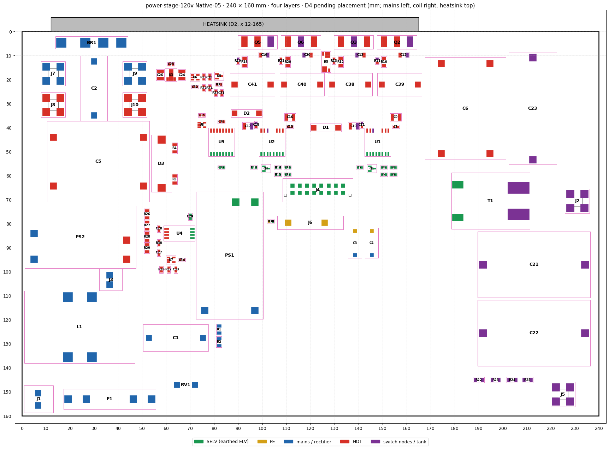

# Revised placement and routing review — native-05/native-06

Status: renewed D4 **conditionally approved** by the owner on 2026-09-26 at
`3c07eea57`; the conditions are recorded in [DECISIONS.md](DECISIONS.md) D4. Condition 1 (BUS_P copper)
must close before fabrication.
Native-07 addresses condition 1 (BUS_P copper) without moving parts; see
[native-07/verification](native-07/verification/README.md). Native-08/09 are the same
placement and routing built to JLCPCB's stackup and 2 oz rules; see
[native-09/verification](native-09/verification/README.md) and [FAB-JLCPCB.md](FAB-JLCPCB.md). The owner approved
the 240 × 160 mm outline and four layers. All five routing batches are now
integrated and checked. This file records the review basis, not owner approval
or a fabrication release. The earlier review is preserved in
[native-04/PLACEMENT-REVIEW.md](native-04/PLACEMENT-REVIEW.md).

The electrical source remains 114 components and 75 nets. Native-05 is the
source-generated placement; native-06 is the routed review candidate. Routing
is explicit and reproducible from the JSON batches under `routes/`.

## Changes from the approved native-04 placement

- The power stage, controller island and tank bank move right to use the extra
  20 mm of board width. Mains remains on the left, coil terminals on the right,
  and the shared heatsink along the top edge.
- The line filter, bridge, auxiliary supplies, left bulk capacitor and removable
  rectifier links are rearranged. Link straps now run vertically near the top
  left, with bench leads leaving the left edge when the straps are removed.
- The bus-divider/over-voltage cluster and HOT regulator move into the western
  routing area. C24 and C26 exchange positions so each bypass sits by its own
  supply pin.
- R25 moves 0.7 mm left to keep its routed escape away from the provisional
  coil-terminal lug envelope.
- The over-current comparator and its nine supporting parts move 46 mm left
  and 11 mm upward, beside the HOT regulator. This removes their via wall from
  the SW_B power corridor. The longer shunt sense pair needs noise testing;
  its two conductors are routed together from R5's Kelvin pads.
- D1 moves into the gap below the capacitor row, at KiCad anchor (131.5, 40.0).
  Its through-hole pads no longer obstruct the bus and tank-return corridors.
  The bootstrap capacitors remain beside their driver.
- The proposed stackup has four 70 µm copper layers and nominal 1.6 mm overall
  thickness. Fabricator acceptance and finished minimum copper/plating remain
  open.

Gate resistors remain at the MOSFET gates. Leg A's high-side drive now has an
explicit nearby SW_A return. Local bus capacitors return through HV_RET and
R5 current pads 1/4; the control pickup stays on Kelvin pad 2, with the opposing
sense on pad 3. The R5 internal connection is discussed in [ROUTING.md](ROUTING.md).

## Review evidence

The routed board hash is `500cdb4b9f3491bfed2535099ad0ed2a59a461f12dd79a7aeedae18014b0f3fe`.
[The verification packet](native-06/verification/README.md) records three
full DRC runs with zero copper-spacing/schematic-match findings, the sole R5
internal Kelvin connection, and 31 retained library/silkscreen warnings.
All 114 part identities and 313 source pins match. The stackup and independent
all-layer 8 mm barrier checks pass. Both normal and bring-up hardware envelopes
clear front-side copper; mechanical conflicts are zero at the current poses.

Copper views, all viewed from the component side:
[front](native-06/previews/front.png),
[inner return](native-06/previews/inner-return.png),
[inner bus](native-06/previews/inner-bus.png), and
[back](native-06/previews/back.png).

## What D4 would accept

- The component moves and four-layer placement described above, including the
  western comparator cluster and longer paired Kelvin-sense run.
- Driver-to-series-resistor copper lengths of 38.2/43.3 mm on leg A and
  30.8/35.4 mm on leg B. These exclude the resistor-to-gate stubs and do not
  establish ringing or loop inductance.
- The overlapping bus/return copper, 5 mm outer HV_RET bypass, and the via
  banks described in the [power review](native-06/verification/power-review.md).
  The western BUS_P width has roughly 6% nominal formula margin at 15 A;
  local current sharing and via transfer remain model-dependent.
- The current terminal/strap locations and provisional hardware envelopes,
  with HOT5 and bus stitching moved clear of exposed metal. Measured hardware
  must replace these estimates before fabrication.

D4 does not close finished-copper/plating, thermal/current or insulation
qualification. J1 wire entry, enclosure fit, airflow, certification-lab review,
Coilcraft/module evidence and the RCA teardown remain open. Overshoot/clamp,
protection timing, CT injection, leakage, hipot and EMI tests have not run.
Three L1/J3 silk-outline overlaps remain for production cleanup.
