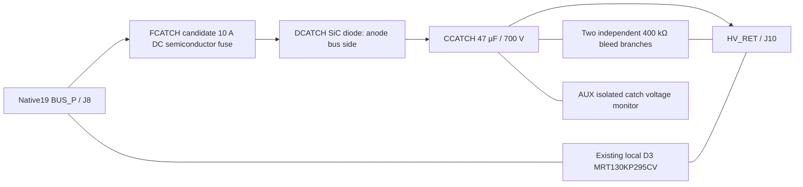

# Round 3 — electrical supervision, control law and returned-energy receiver

**Design proposal for review; native19 is unchanged and remains unreleased.** This packet selects an architecture and quantitative requirements that can be implemented and challenged. Its calculations use an explicit diagnostic energy set, not an approved pan/current envelope. No assembled hardware, mains energization, fault survival, or completed four-output controller is claimed.

Baseline: native19 PCB SHA256 `3557aa444873fa8b45eb7e0ae8ec3a4bc2b5cd526826b338b58d50e57747430b`. Read alongside the [inlet circuit work](../inlet/) and [integration audit](../integration/).

## Decisions

1. Use a **separate electrical supervisor** underneath the cooking UI state machine. It manages independent source contactors K1/K2, precharge bypass KB, proof load KT, permission to switch, discharge and reset. Cooking requests cannot skip it. Independent hardware faults remove gate permission and both source-coil permissions without waiting for UI firmware.
2. Separate **precharge/bypass proof** from **downstream auxiliary-rail startup**. Native IRM supplies can take roughly a second to start. Holding the precharge resistors in series until HOT5 is ready would greatly increase their required fault-energy rating. Qualify the passive charging path using upstream-AUX-powered sensors, bypass it with gates still disabled, then wait for native rails and BUS_FAULT to become valid.
3. Regulate a slowly changing **conductance/current allocation**, not instantaneous constant power divided by the rectified bus. Keep the first prototype in continuous operation; defer burst modulation until its stop/restart and energy accumulation are demonstrated.
4. Prefer a **passive, diode-isolated catch capacitor** for returned tank energy. It works when AUX disappears and does not intentionally feed energy back into the small line-following DC bus. Keep native D3 as local transient backup. This is a proposed accessory/ECO, not an installed native19 feature or a qualified absorber.
5. Keep pre-existing native19 bus/tank bleeds in the model and add two independent catch bleeds. Measure bus, catch and resonant-capacitor voltages before reset/service. Time alone, contactor feedback and a dark display are insufficient.

## What the current firmware actually supplies

These observations are source inspection, not executed target behavior:

| Artifact | Observed behavior | Consequence |
|---|---|---|
| `firmware/main/main.c` | `mcpwm_init()` and `safety_monitor_update()` calls are commented out | The new power sequence is not implemented by enabling a configuration switch |
| `firmware/main/state_handlers.c` | `power_set_level()`, `power_enable()`, PWM and peripheral functions are external hooks; pan detection requests 5%, preheat requests 50/100%, heating calls a temperature PID | These percentages are requests, not a defined bus-current or mains-current law |
| `firmware/test/state_machine_stubs.c` | Host tests implement the actuation hooks as mock state/counters | Passing host state tests does not prove pin waveforms or electrical interruption |
| `firmware/components/hal/esp32/hal_pwm_esp32.c` | Header describes a half bridge; two independently assigned MCPWM groups are available | A synchronized four-output full-bridge adapter and measured capture are new work; do not repurpose the fan channel as a second leg by assumption |
| `firmware/README.md` | IO47 discharge relay contract refers to an older board revision | Native19 has passive bus/tank bleeds; do not claim its nonexistent discharge relay follows this GPIO contract |
| Native19 J4 | `.1` is PS1 V15 **output**, `.3` V3V3 input, `.9` PERMIT input, `.10` BUS_FAULT output, `.11/.12` isolated bus feedback | Upstream AUX must not backfeed J4.1. Additional supervisor signals need a distinct connector/interface |

The AMC1311 path has a nominal 119.987:1 divider and 0–2 V linear input, so its useful linear bus range ends at approximately 239.975 V and disappears with downstream HOT5. Add a separate AUX-powered isolated bus monitor with **at least 600 V measurement range**, diagnostics, and enough bandwidth for the intended threshold. The monitor is not the energy absorber. Integration independently verified this issue against [TI AMC1311 Rev C](https://www.ti.com/lit/ds/symlink/amc1311.pdf), input/electrical tables.

## Proposed sequencing contract

**First-prototype cold start uses separate guarded inlet-pod START PRECHARGE, RESET FAULT and STOP operators**, connected to the independently AUX-powered pod supervisor. `POD_START` is a normally open, active-high input with a pulldown; only a fresh released-to-pressed edge in OFF may start precharge. `POD_RESET` is a separate normally open, active-high input that can clear an eligible fault to OFF after all required checks, but never starts. Never OR these inputs. `POD_STOP_OK` is a normally closed hardware healthy chain: pressing STOP or breaking its wire immediately removes gate permission and coil enables. No certified emergency-stop function is claimed. Buttons held during power-up or rail restoration cannot initiate precharge; observe release and require a subsequent fresh START. The cooking controller remains supplied by native PS1 downstream and boots only after passive charging/bypass. Its UI HEAT_REQUEST is not an OFF-state bootstrap prerequisite. After rail and communication qualification it can request heating; it cannot independently close a cold inlet. Upstream powering of the cooking controller would require a separately selected converter, power budget and harness, and is not assumed here.

All numbers below are **engineering requirements for the proposed prototype supervisor**, not inherited product limits or measured timing. `PERMIT=0` is the invariant until RUN. Hardware PERMIT gating must default low if either supervisor rail, connector, watchdog, sensor-valid signal or reset state is missing. Existing fast CT/shunt/HOT5 faults remain direct interlock inputs.

| State | K1/K2 | KB | KT proof load | Gate permission | Required exit evidence |
|---|---|---|---|---|---|
| OFF / SELF_TEST | Off | Off | Off | 0 | AUX valid; all three contactor NC mirror contacts indicate released; manual unplugged/discharged four-wire resistor inspection recorded for this attempt; measured bus/catch/tank below 30 V; fresh local POD_START edge after observed release; sensor plausibility |
| PRECHARGE | On through independent drivers | Off | Off | 0 | Two complete 50/60 Hz cycles of independent voltage/current evidence; voltage across Rpre below 5 V at settled line crests; downstream bus peak at least 95% and at most 110% of contemporaneous upstream peak; crest charging current below 0.5 A; no source/thermal/OVP fault |
| BYPASS_CLOSE | On | On | Off | 0 | KB mirror transition within contactor timing budget; initial K1/K2 command to KB confirmation at most 300 ms; no high current/overvoltage |
| BYPASS_PROVE | On | On | On for 100 ms maximum | 0 | At least two complete cycles with actual proof-branch current at least 0.40 A RMS, agreeing with measured proof voltage / 220 Ω within ±10%; Rpre peak drop below 1 V; then KT off and measured proof current returns to zero |
| RAIL_QUALIFY | On | On | Off | 0 | Up to 2 s proposed timeout: native HOT5/V15/V3V3 valid, BUS_FAULT low continuously for 20 ms, no faults, catch charged plausibly through diode, four-output PWM capture/phase/dead-time self-test passed while permission remains 0 |
| ARMED | On | On | Off | 0 | Fresh user heat request, validated pan profile/commissioning current cap, all run prerequisites true; start from zero phase command and a qualified line phase |
| RUN | On | On | Off | Hardware AND of all qualified conditions | Current/conductance control active; asynchronous faults dominate all software states |
| STOP / DISCHARGE | K1/K2 off | Hold only for ordered stop until source-open evidence; may drop immediately on total supply loss | Off | 0 | No automatic reclose; measured currents and voltages decay; contacts released; voltages below 30 V continuously for 1 s |
| LATCHED_FAULT | Off | Off after source-open evidence where supply survives | Off | 0 | Separate POD_RESET after fault removed and full OFF checks returns to OFF only; a subsequent released-then-pressed POD_START is required. A power cycle never automatically resumes heating |

**Masking is narrowly defined:** during PRECHARGE through RAIL_QUALIFY, the native BUS_FAULT high caused by absent HOT5 does not prevent passive charging/bypass, but it always prevents gate permission. Independent AUX-powered bus overvoltage, inlet current, resistor energy/temperature, invalid sensor and contact checks remain active. This is not a blanket fault-mask mode. If independent cold-power sensing is absent, precharge is prohibited.

Schneider LC1D18BD maximum closing time from the inlet agent's verified table is 72.45 ms and opening 24 ms. The original 100 ms total startup proposal was therefore rejected. A 300 ms initial command-to-KB-confirmation deadline, followed by a separate 100 ms proof window, fits the proposed two-cycle checks only if measured timing and sensor filters meet their sub-budgets. The resistor fault calculation uses a conservative 500 ms exposure including dropout, independent of software timing. Contact bounce and supply-dependent dropout still need measurement.

An open KB contact cannot be proven closed by its mirror opening, or by zero no-load voltage drop. The switched 220 Ω load and **actual branch current sensor** are essential. Inferring current solely from voltage divided by nominal resistance would falsely pass an open proof resistor. A welded KT is detected by current/voltage when commanded off. A welded KB prevents the released-mirror startup check; a shorted Rpre requires a separate continuity test before K1/K2 close.

**Binding first-prototype Rpre check:** unplug and discharge the assembly, measure each 22 Ω branch and the 11 Ω pair using four-wire measurement before every attempt, and record the result. No automatic continuity coverage is credited. **Future automated Rpre continuity test:** with K1/K2/KB released and downstream voltage verified low, inject a current-limited isolated test current across Rpre and measure resistance using separate sense leads. Proposed acceptance 9.9–12.1 Ω for the selected 11 Ω assembly, after error/lead allocation. The circuit owner must select and qualify the injection isolation and disconnection network; this test is not already implemented.

## Gate, contactor and measurement interfaces

VLINE is sensed at L_AUX/N_AUX after the manual switch and before K1/K2; I_INLET is measured before the AUX split. Require two complete OFF-state source cycles within the proposed 100–140 V RMS window before closure. This permits an OFF-state input-range check and counts the entire appliance current.

The following are logical signal assignments for a **new supervisor interface**, not assigned spare J4 pins or established ESP32 GPIOs. Do not parallel 24 V coil signals onto 3.3 V logic.

| Signal | Direction / domain | Asserted state and default | Meaning |
|---|---|---|---|
| `POD_START` | Local NO operator → pod supervisor | Active high, pulldown; fresh edge after release | Starts only from OFF; held-at-boot input cannot start |
| `POD_RESET` | Separate local NO operator → supervisor | Active high, pulldown | Clears eligible fault to OFF only; never starts |
| `POD_STOP_OK` | Local NC operator → hardware healthy chain | Closed/healthy permits; wire open inhibits | Immediate gate and source-coil inhibit, independent of normal firmware |
| `HEAT_REQUEST`, `P_REQUEST_W` | Cooking controller → electrical supervisor, SELV framed link | Heartbeat/sequence checked; stale or invalid → 0 | Request only; never directly drives gates/contactors |
| `SUP_RUN_OK` | Supervisor hardware → interlock, 3.3 V SELV | High permits; local pulldown defaults low | Independent AND includes watchdog, contact proof, rails, sensors, electrical limits and latched faults |
| `PWM_REQUEST` | Full-bridge adapter → interlock, 3.3 V | High request; pulldown | AND with `SUP_RUN_OK` and existing interlock to form J4.9 PERMIT |
| `BUS_FAULT` | Native19 J4.10 → interlock/supervisor | High fault; receiver pullup | Low required in RUN; no software override |
| `CMD_K1`, `CMD_K2` | Supervisor → separate 24 V low-side drivers | Energize high; each gate pulldown; separate fault cutoffs | Two source interruption channels; independence must extend through drivers and fault logic, not merely two coils on one transistor |
| `CMD_KB`, `CMD_KT` | Supervisor → 24 V drivers | Energize high; default off | Timed bypass/proof sequence; hardware timeout aborts source closure |
| `K1_RELEASED`, `K2_RELEASED`, `KB_RELEASED` | Mirror NC contacts → monitored SELV inputs | Closed contact indicates released; wire break fails proof | Monitor contradictory/stuck states; mirror behavior is not proof of electrical conduction |
| `VLINE`, `VPRE`, `VBUS_AUX`, `VCATCH_AUX`, `VTANK_AUX` | Isolated sensor outputs → supervisor | Explicit validity/rail diagnostics | Independent startup, absorption headroom and discharge evidence; bus/catch range ≥600 V; tank range must cover the simulated >1.5 kV diagnostic (use at least 2 kV for this measurement plan) |
| `I_INLET`, `I_PROOF`, `I_TANK` | Independent sensor outputs → supervisor/interlock | Validity tested, zero/range faults trip | Whole-inlet RMS includes upstream AUX/fans/coils; separate proof current; tank waveform is not line current |
| `FAST_INHIBIT` | Analog fault latch → gate and source-enable chain | Asserted fault opens permission | Bus OVP, current fault, KB opening, thermal and rail failures bypass normal control software |

Truth condition: `PERMIT = RUN ∧ PWM_REQUEST ∧ SUP_RUN_OK ∧ INTERLOCK_LATCH_OK`. Every input must be actively qualified. `SUP_RUN_OK=0` in OFF, PRECHARGE, BYPASS_CLOSE, BYPASS_PROVE, RAIL_QUALIFY, ARMED, DISCHARGE and FAULT, regardless of UI state or PWM requests. The new permission signal must not introduce a shared single transistor that can defeat both original shutdown paths.

Proposed independent supervision thresholds: bus overvoltage latch at 230 V nominal with a total ±5 V allowance; catch-overvoltage latch at 250 V; Rpre drop above 10 V while RUN immediately inhibits gates and commands K1/K2 open. These are design targets requiring threshold error, filter delay, dv/dt immunity and fault-model qualification. They do **not** replace native19's thresholds or establish allowed operation. An inlet voltage window of 100–140 V RMS is the current design-study range; loss/outside-window inhibits/requires reset. Do not apply a fixed bus-undervoltage threshold to its normal rectified-line valleys.

For an ordered stop, command no new drive, remove permission, open K1/K2, verify source opening/current decay, then drop KB. For an emergency, gate inhibition and source opening occur together; do not delay an emergency to wait for a zero crossing. On complete AUX loss, all coils drop and no ordering is guaranteed. Rpre must survive insertion into the remaining source interval until K1/K2 open. Neither MCU persistence nor AUX hold-up is credited for the passive catch function.

## Control law that addresses the filter failure

The native19 film bus intentionally follows the rectified mains. It is not an energy reservoir that can provide constant instantaneous heating power at each zero crossing. The round2 instantaneous-CPL experiment demanded additional current as voltage fell and produced unacceptable input current and damping loss.

For the first prototype:

- Measure whole-inlet voltage/current synchronously over each **complete** line cycle, including upstream AUX, fans and contactor coils. Establish RMS, real power and power factor; no presumption that watts / RMS volts equals RMS current.
- Start with a commissioning limit of **zero** until a measured pan/capacitor/device envelope is entered. A later **13.5 A RMS** supervisory target is a proposed 10% reserve below the 15 A allocation, not permission to operate at that current. The independent input-current limit and sensor tolerances must preserve the 15 A allocation in all validated modes.
- Set `P_budget = min(user_request, characterized_pan_budget, Vline_rms × 13.5 − auxiliary_and_loss_reserve)`, then `g_target = max(P_budget,0) / Vline_rms²`. This is an initial power budget only. Whole-inlet RMS feedback reduces it if measured current or low power factor exhausts the allocation; do not subtract AUX a second time from that measured current.
- Use a nominal 2 Hz first-order outer response (79.58 ms time constant) and limit upward requested-power change to 2000 W/s. Downward fault/current corrections are immediate; the upward ramp is not a shutdown delay. Hold the resulting conductance command through a complete line cycle.
- At a fixed, qualified switching frequency above the actual tank's resonance, map conductance to relative phase of two synchronized 50% bridge legs. The native 396.6–488 ns hardware dead-time band is retained. The map is characterized from actual pan voltage/current/ZVS data, with slow correction (initial design bandwidth ≤20 Hz); there is no instantaneous `P/Vbus` divisor. Saturation, insufficient ZVS or a command outside the characterized map reduces power or stops; it does not force frequency through resonance.
- Keep hardware CT and shunt trips as independent ceilings, with measured delay/error bounds. They are not precision mains RMS regulation. A fast input peak-current latch is also required; its threshold depends on measured crest factor and input/fuse coordination and is not numerically selected here.
- Disable burst for the initial powered prototype. Future low-power modulation must use bounded-energy, full-cycle packets with qualified restart phase, catch-headroom checks and no net DC tank excitation. The earlier ideal 50 Hz square command is not an implementation.

For the idealized law `i=g(v_filtered)·v` with a first-order line-voltage compensation and no other dynamics, linearization gives `Y(s)=G(sτ−1)/(sτ+1)`. Its real part changes from negative below the outer pole to positive above it; at 2 kHz with a 2 Hz outer pole, `Re(Y)/G≈0.999998`. This explains why moving power compensation below filter resonance is a useful design direction. It is **not** a converter stability proof: the actual tank, sampled control, PWM saturation, current limiting, line-cycle estimator, source impedance, feedback polarity and aliasing must be joined into the nonlinear model. At very low frequency the source still sees constant-power behavior. Verify loop gain/input impedance, line steps and load removal rather than claim a stronger damping resistor solves them.

Required firmware deliverable: a four-output synchronized full-bridge adapter with timer-shadow updates, force-low hardware fault inputs, configured/measured phase/dead-time checks that reject missing capture, rail startup/decay tests, and the electrical supervisor. The present half-bridge HAL and host mock actuation are not that deliverable. This round specifies its contract; it does not modify shared firmware or claim target execution.

## Passive energy receiver selected for detailed design



Each of two independent catch bleed branches comprises **four 100 kΩ high-voltage resistors in series** (400 kΩ per branch, 200 kΩ effective). Candidate family: Vishay VR37, 0.5 W at 70°C, 3500 V maximum operating voltage; thermal derating still applies. At 350 V each healthy resistor dissipates 0.0766 W; one shorted resistor leaves three sharing its branch at 0.1361 W each. Set local ambient ≤105°C as a proposed integration limit and verify the manufacturer derating curve and assembly thermal rise. Proposed exact ordering code `VR37000001003JA100` is composed from the manufacturer's VR37/100 kΩ/5% ordering scheme; supplier line-item verification remains before procurement. This removes the previously rejected two-resistor branch whose single-short condition exceeded the resistor rating. [Vishay VR25/37/68, p. 1](https://www.vishay.com/docs/28907/vr25vr37vr68.pdf).

Candidate components and constraints:

| Function | Candidate / checked manufacturer fact | Decision and remaining work |
|---|---|---|
| Catch film capacitor | TDK `B32778H8476K000`, 47 µF ±10%, 700 V at 85°C; 30×45×57.5 mm; 52.5 mm pitch, four pins | 42.3 µF minimum used. Listed 5.4 mΩ ESR and 14 nH ESL are typical; model uses 50 mΩ total path and sweeps 50 nH–1 µH. Manufacturer 700 V/52.5 mm pulse row is 15 V/µs, corresponding to 705 A at nominal capacitance; actual waveform, temperature and terminal-current sharing still need review. [TDK pp. 15, 18–19](https://www.tdk-electronics.tdk.com/inf/20/20/ds/MKP_B32774H_778H.pdf) |
| One-way charge diode | Infineon `IDW40G65C5XKSA1`, 650 V/40 A, PG-TO247-3 | Datasheet nonrepetitive 10 ms half-sine current is 182 A at 25°C / 153 A at 150°C and I²t 166/118 A²s. These do not directly certify the shorter simulated pulse or reverse-voltage/thermal duty. Obtain actual hot model/SOA/pulse interpretation. [Infineon datasheet p. 4](https://www.infineon.com/assets/row/public/documents/non-assigned/49/infineon-idw40g65c5-datasheet-en.pdf), [exact OPN](https://www.infineon.com/part/IDW40G65C5) |
| Catch-branch short protection | Eaton `FWP-10A14F`, 10 A, 700 V DC, 14×51 mm aR fuse | Manufacturer lists 4 A²s pre-arcing and 22 A²s clearing under specified AC test conditions; those are not a DC coordination result. Match DC time constant, available current, diode/capacitor/lead withstand, repetition and pulse aging. aR is not general overload protection. Integration selected Mersen US141 / Z331153 as a holder candidate (1000 V DC UL, DC20B non-load operation, −25…60°C); fuse/holder pairing, installed rating, access and creepage still need verification. [Eaton product data](https://www.eaton.com/ca/en-gb/skuPage.FWP-10A14F.html) |
| Native local backup | Microchip `MRT130KP295CV` D3, already fitted in native19 | 295 V stand-off and 410 V maximum clamp at 282 A/6.4–69 µs at 25°C. Temperature, waveform, duty and lead effects matter; the datasheet warns fast lead-induced overshoot can be large. Its table alone cannot establish a hot 450 V bus ceiling. It is not a repetitive braking load or an unlimited short-circuit absorber. [Microchip DS00005551B, pp. 3, 5–9](https://ww1.microchip.com/downloads/aemDocuments/documents/HRDS/ProductDocuments/DataSheets/130-kW-Transient-Voltage-Suppressor-TVS-Device-00005551.pdf) |

No catch connection may use LEG_RET or either Kelvin sense pad. Before each first-prototype attempt, manually verify the catch fuse, capacitance, both separate bleed branches and diode one-way behavior with the assembly unplugged and discharged. Automatic in-service receiver fault coverage remains unqualified. Use bus-side J8 and J10, preserving the shunt current path and existing link stack integrity. Packaging found no room for the full module adjacent to those posts: the current rear-bay reservation entails approximately 150–220 mm conductor routing. It is only an allocation; a paired/laminated route, insulation, fuse, contact stack and full commutation/catch-loop extraction are necessary. The 1 µH sensitivity is not a measurement or guarantee of that route. The original 80×60×60 mm catch box is **rejected historical geometry**. Packaging now provides a [wider, lower rotated catch carrier](../packaging/catch-alternative.md) and [declarative layout](../packaging/catch-alternative.json): holder 107×76.5×26.5 mm at world [17,348,12], capacitor 57.5×45×30 mm at [25,355,45], and separate raised diode/card pockets. Its current STEP SHA-256 is `44800fe207b7de12a2b993bff371fece61790fc0f37a4a427e982b05e11d9de5`; the receipt reports 572 valid solids and six empty nominal collision lists. These body-envelope checks do not establish complete fit, insulation or service qualification. Supplier permission for the rotated holder, its rail/support, opening motion, terminals, capacitor leads and actual wiring remain open.

**The bleed/sense-card allocation is only 36×20×10 mm at world [45,404,45], constrained by the adjacent exhaust duct.** Eight VR37 resistors plus the complete isolated monitor, required spacing, terminals and fault diagnostics have not been laid out and are not demonstrated to fit. This allocation is a binding layout constraint; use a separately reviewed local card or another packaging change if the actual circuit cannot fit. Do not omit isolation space or components to satisfy the envelope. Keep native local film capacitors and D3; the remote catch must not become the only high-frequency commutation path.

### Energy calculation and why a line relay is insufficient

The deliberate diagnostic set uses `L=140 µH`, `|I|=85.551033 A`, `Ctank=0.54 µF`, `|Vtank|=640 V`, initial bus/catch at most 280 V. It combines independent limits and is not asserted reachable during approved operation. Tank energy is **0.622920547 J**. With minimum native bus capacitance 5.22 µF, total-energy concentration could raise an initially 280 V bus to **563.087 V** in a lossless calculation. Nominal 5.8 µF gives a lower bound value; neither is a predicted waveform.

Adding minimum 42.3 µF catch capacitance initially at 280 V gives an equal-final-voltage energy screen of **323.446 V**. This is a useful capacitance sizing calculation, **not an instantaneous bus bound**: diode voltage, path inductance, initial voltage mismatch and switching dynamics can produce higher bus peaks before equalization. The fresh `catch-template.cir` study explicitly includes path inductance and finite diode drop. Its results are in `evidence/` once the run is frozen.

The catch stores rather than destroys energy. It must be sensed independently and reset only after discharge. With 200 kΩ effective healthy bleed, nominal 47 µF discharges 350→30 V in 23.09 s; one 400 kΩ branch left gives 46.19 s; +10% C/+7% R (5% initial plus 2% temperature allocation) gives approximately 54.36 s. Require **60 s minimum retry lockout plus Rpre case below 60°C**, and all voltage checks; elapsed time is never permission to touch. Failed-open bleed/wiring or an invalid sensor leaves the assembly in service-required lockout. The remaining native bus bleed worst example is about 7.98 s from 450→30 V using +10% C/+5% R. Resonant capacitor voltage must be separately checked; it is not inferred from bus voltage.

Normal catch bleed power is 0.196 W at 198 V. One catch charging event at 198 V stores approximately 0.92 J, which the upstream precharge model must include. Repeated energy capture can ratchet its voltage upward: latch a catch/OVP event, withdraw line power, and prohibit automatic restart. No continuing burst operation is allowed to treat the catch as an infinite sink.

### New conditional simulation evidence

The retained run is **52 ngspice 45.2 cases**: 48 combinations of 198/280 V bus, ±85.551033 A initial tank current, ±640 V initial capacitor voltage, 0.25/5 µs turn-off delay, and 50 nH/200 nH/1 µH catch-path inductance; two timestep refinements; and two invalid-restart probes. All main cases use 140 µH / 0.2 Ω, 0.54 µF tank, minimum 5.22 µF native bus and 42.3 µF catch, 50 mΩ path resistance, and catch initially equal to bus. This **low-loss combination differs from the round2 L/R pairs**; the larger tank peak is not a controlled before/after attribution to the catch.

| Metric, main 48-case set | Result |
|---|---:|
| Maximum bus voltage | 324.5694 V |
| Maximum catch voltage | 321.6036 V |
| Maximum catch diode/path current | 138.6607 A |
| Maximum catch-path I²t | 0.155225 A²s |
| Maximum tank current | 100.6682 A |
| Maximum resonant-capacitor voltage | **1580.831 V — unresolved stress** |

These maxima occur in different cases. The maximum normalized energy residual across all 52 cases is 0.000000574107 (0.0000574%). Two 20→10→5 ns refinements change the six tested peak/I²t metrics by at most 0.0004947%. Remaining current at 300 µs is not proof of current extinction. With catch initially at 350/500 V, the bus instead reaches **380.8473/518.2453 V**. These deliberate invalid-restart probes show why discharged/known catch state and fault latching are mandatory.

The model includes all four bridge diode paths, finite local bus energy, a piecewise-linear receiver diode (1.5 V + 20 mΩ), assumed 100 pF diode capacitance, path inductance and complete stored/lost-energy accounting. It excludes line recharge, actual nonlinear semiconductor models, TVS response, fuse action, PWM control dynamics, hot SOA and physical wiring. One attempted ideal-diode model without junction capacitance failed with a too-small timestep; it remains an incomplete local run and is not retained as evidence. The added capacitance is an explicit model assumption, not a validated vendor fit.

The tank stress requires an **energy admission rule**, not simply a larger bus clamp. At the actual shutdown instant, conservatively require

`0.5 L I² + 0.5 C Vcap² + Ebridge_added_until_all_off ≤ 0.5 C Vcap_allow²`,

where `Vcap_allow` is the selected capacitor bank's hot, frequency- and pulse-qualified allowance after a deliberate design margin. Use time-correlated I/V, the characterized pan/coil L range and the full sensing-to-all-off delay. A simplified illustration with **assumed** 1200 V allowance, 140 µH, 0.54 µF and initial 640 V gives 63.043 A *before* any added drive energy. This is not a proposed trip setting, not an approved current limit, and does not resurrect 45 A. Actual allowable energy may be lower. Choices are a lower characterized operating envelope, faster verified interruption, revised tank topology/capacitor bank, or a qualified local tank clamp; increasing capacitance or voltage rating alone changes resonance/loss/control and must be reanalyzed.

### Alternatives considered

| Approach | Reason for disposition |
|---|---|
| Gate disable plus line contactor only | Rejected as energy management: diodes still return tank energy, and source contactors cannot remove stored bus/tank energy or stop its discharge through an already shorted switch |
| Existing D3 alone | Retain as backup, not sole newly qualified receiver: hot clamp/waveform/repetition/loop response remain unbounded for the proposed design |
| Directly add bulk DC capacitance | Not selected: changes line-following bus, conduction angle, inrush, input harmonics, regulator behavior and stored short-circuit energy throughout normal operation |
| Active braking chopper | Possible later alternative; needs comparator/driver availability through rail collapse, MOSFET SOA, pulse resistor, switching-loop design and fail-short/open behavior. No claim that AUX alone ensures it |
| Diode-isolated catch | Selected for detailed prototype study: passive on loss of AUX and does not intentionally return stored energy to the inverter. Adds new diode/capacitor/fuse faults, monitored precharge and placement work |

## Fault matrix and actions

| Fault / edge case | Immediate action / path | Residual hazard or verification |
|---|---|---|
| Pan removed / detuned / no-pan request | Stop new PWM, hardware OCP/OVP dominates, contactors open on fault | Tank/capacitor stress needs actual pan envelope and matched switching model; do not infer safe current from this diagnostic set |
| MCU hangs / stale command / missing PWM capture | Independent watchdog forces permission low and K1/K2 off | Verify all four outputs and timing under real rail collapse; mocks do not close this |
| AUX/manual switch loss at worst tank phase | Passive catch and native D3 remain present; coil releases and default gate disables | Gate receiver/driver supply decay and residual current paths still require measurement/model; no active hold-up credited |
| One source contactor welded | Other independent source contactor opens; released-mirror discrepancy latches | Simultaneous weld/common driver fault is not covered by merely duplicating contacts; fuse/guarded containment still needed |
| KB fails open or opens during RUN | Independent Rpre-drop monitor inhibits gates and releases K1/K2; startup proof fails | Rpre survives source-opening delay, coil timing and total supply loss; controller does not continue cooking through it |
| KB welded / Rpre short before startup | Released-mirror check / isolated continuity test rejects startup | If continuity-test hardware is absent, precharge single-short protection is an open blocker |
| Catch diode or fuse open | Startup catch-charge plausibility/controlled test rejects missing receiver; fault during operation may demand D3 backup | Not fully single-fault tolerant; periodic/continuous receiver availability evidence and D3 worst-case qualification remain required |
| Catch diode short | Catch becomes additional bus bulk; detect failure of peak-hold/decoupling behavior and latch, command contactors open | Input-current and bus-ripple law changes before detection; add this case to coupled D22/current-limit model |
| Catch capacitor short | Catch branch fuse and upstream interruption must isolate; gate kill on bus collapse/current | DC fuse coordination with capacitor/diode/PCB and source impedance unqualified; no fault survival claim |
| Catch bleed open / sensor wire off | No reclose or service-ready assertion unless all independently valid voltages are below threshold | Sensor diagnostics cannot be replaced by waiting 60 s; catch remains hazardous after bus drains |
| Shorted bridge MOSFET | Disable remaining gates and interrupt source using K1/K2/fuse | Stored capacitor energy can still flow through the failed bridge. Catch does not interrupt it. Semiconductor survival/containment and fuse coordination remain separate critical work |
| Low line / line interruption/reclose | Electrical supervisor returns to OFF/fault path; no automatic warm restart | Requalify contact states, resistor continuity, catch discharge, precharge and rails on every restart |
| Low bus at ordinary rectified zero crossing | Follow qualified conductance law; do not classify as lost AUX | True rail brownout is sensed on rails, not inferred from instantaneous bus minimum |

## Verification required before implementation release

This packet closes the architecture choice and identifies implementation interfaces. It does not finish these digital tasks: detailed supervisor schematic/independence analysis; four-output full-bridge adapter; coupled finite-bandwidth control/precharge/catch/fault simulation; catch fuse and diode coordination; full native19 field solutions; load-dependent reachable initial conditions and component stress. Those are genuine design tasks, not all physical-measurement holds.

Physical gates remain: coil/pan/capacitor characterization, contact/sensor timing including supply loss, inductance and voltage overshoot of the installed catch route, capacitor/diode/fuse thermal and fault tests, first guarded unit with line-current/LISN correlation, and manufacturing inspection. Proposed thresholds and a green conditional model must not be relabeled as production requirements already met.

## Reproduction and retained files

Run from this worktree with a new output directory:

```sh
sh zapote/power-stage-120v/prototype-closure/round3/control-energy/run.sh /private/tmp/temper-control-energy-replay
```

The wrapper checks native/source hashes, builds standalone Rust programs (no shared Cargo/PyO3 cache), runs seven tests, requires ngspice 45.2, retains decks/logs, and verifies case completeness, finite data, energy residual and timestep metrics. Existing output directories are refused. `study.rs` writes INCOMPLETE before simulations and only marks conditional completion after all cases. `verify.rs` independently checks all 52 CSV rows and rejects duplicate/truncated/nonfinite data. Three executable negative controls also verify rejection of nonfinite data, invalidation of a prior PASS before failure, and refusal to overwrite an existing output directory. Neither status is a physical pass.

Retained: [interface.json](interface.json), [primary-source index](sources.json), [calculations](evidence/calculations.json), [52-case CSV](evidence/catch.csv), [numerical verification](evidence/verification.json), [deck/log archive](evidence/decks-and-logs.tar.gz). `evidence.sha256` binds authored files and compact evidence. Raw intermediate runs under `output/.../control-energy/run01` through `run03` are superseded; run04 supplies final evidence. No vendor PDFs are included.
