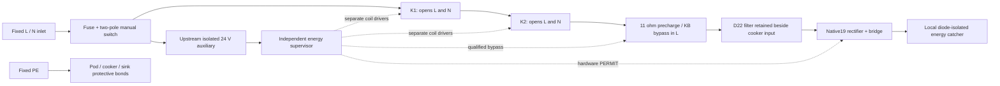

# Inlet and stored-energy design for the first Temper prototype

**Design proposal; not a fabrication or powered-test release.** Keep native19 as
the frozen power-board article. Add a guarded upstream precharge/disconnect pod,
a separate energy supervisor, and a local passive bus-energy catcher. The
prototype pod is test hardware; it is not the intended finished cooker form.

The catcher improves the conditional bus-energy result, but **does not solve
all tank stress**: the new diagnostic set still reaches 1580.831 V across the
resonant capacitor. That set is not a measured or approved operating envelope;
it must be narrowed using reachable states and actual part limits before a
powered prototype is released. Gate inhibition, line interruption and stored-
energy accommodation remain three distinct functions.

The target is nominal US/Mexico 120/127 V, 60 Hz, with a 15 A RMS whole-inlet
allocation. Actual line limits, coil/pan envelope, protection coordination and
installed thermal/EMI performance still require qualification. No physical
unit, purchased-part inspection or powered measurement is represented here.

## Architecture decision

| Approach | What it solves | Why it is or is not selected |
| --- | --- | --- |
| NTC plus one mains switch/relay | Simple first inrush reduction | Reject for this prototype: hot reclose changes limiting, no deliberate charge/bypass proof, and one welded main switch removes the independent mains cutoff. It does not manage returned tank energy. |
| Resistor precharge/bypass and one two-pole contactor | Explicit startup limit and normal low-loss path | Better startup control, but a welded main contactor leaves no second commanded mains interruption. Still requires local energy absorption and a separate auxiliary bootstrap supply. |
| **Resistor precharge/bypass, two independently driven two-pole series contactors, upstream auxiliary power, and local passive catch** | Separates startup limiting, normal conduction, gate inhibit, removal of new mains energy, and stored-energy accommodation | **Selected for the few guarded prototypes.** Larger and less integrated, but lets each function be measured and fault-injected. Mirror-contact feedback supports defined diagnostics; it does not turn the assembly into a certified safety system or prove a main contact closed. |

The drawing groups fuse/switch functions and suppresses terminal detail. The
inlet packet owns actual pole order, branch fusing, component terminals and
coil circuits. PE never passes through a fuse or switching contact. Contactors
remove future mains energy; they do not make the tank or DC link instantly safe.

## Binding integration decisions

1. **Bootstrap supply before the contactors.** Power the supervisor independently
   of native19's downstream supplies. A local pod START input requests
   cold precharge; it must not depend on a command from the still-unpowered
   cooking controller. After bypass, native19's PS1 starts that controller
   through its intended J4.1 V15 output. Do not connect a second supply onto
   J4.1. Preserve defined J4.3 3.3 V input and ELV return, and prevent the
   always-powered supervisor signals from backfeeding unpowered controller pins.
2. **Cold precharge is not RUN.** Hold PERMIT low throughout precharge and bypass
   qualification. Downstream HOT5/BUS_FAULT need not be valid before charging,
   but independent input, timeout, thermal and contact diagnostics stay active.
   After bypass, require valid downstream rails and an authentic healthy fault
   channel before any pan-detection or heating pulse.
3. **Retain D22 close to the power board.** The external pod's output is an
   enclosed mains cable, not a long high-frequency filtered board feed. Its
   cable parasitics still change the installed model and must be included.
4. **Keep stored-energy accommodation inside the cooker.** Use a diode-isolated
   catch branch so its capacitance does not supply the normal rectified-bus
   valleys. Its diode, fuse, capacitor, bleed and voltage-sense conductors are
   a new hazardous-energy assembly. Packaging finds no room for its current
   80 × 60 × 60 mm reservation immediately beside J8/J10; the selected fuse
   holder also cannot fit that box. The [wider rear carrier](../packaging/catch-alternative.md)
   instead rotates the holder and stacks the capacitor above it, with an
   estimated 150–220 mm bus route. That route needs
   a paired-conductor/busbar design and extracted/measured inductance; it is not
   yet a validated local clamp connection. Long external-pod leads are rejected.
5. **Use independent, auxiliary-powered voltage qualification.** Native19's
   AMC1311 channel has approximately 240 V nominal linear bus range and loses
   HOT5 after downstream supply removal. It cannot alone qualify the new bus
   ceiling or prove discharge. Catch voltage is a distinct state, not the same
   measurement as the rectified bus.
6. **Do not regulate instantaneous constant power through bus valleys.** Design
   the bridge envelope around bounded conductance and whole-inlet current,
   with finite upward slew and no first-prototype burst mode. The existing
   firmware has neither this deployed full-bridge adapter nor the contactor
   sequence; design-level controller results do not establish implementation.
7. **Treat failures as latched no-restart conditions.** No automatic reclose
   after a fault or brownout. Reset cannot hide a warm precharge resistor,
   charged catcher, missing sensor, welded contact or failed protective path.

The detailed [source audit](source-audit.md) and
[fault review checklist](adversarial-review.md) record why these decisions are
required.

## Detailed design authorities

| Packet | Owns | Boundary |
| --- | --- | --- |
| [Inlet circuit](../inlet/README.md), [BOM](../inlet/bom.csv), [terminals](../inlet/terminals.csv) | Mains power topology, exact component candidates, coil drive, precharge/bypass proof and timer component allocations | A reviewed supervisor netlist/PCB, full sensor front ends and protection coordination are not yet implemented. |
| [Electrical supervisor and catcher](../control-energy/README.md) | State transitions, gate permission, control-law requirements, energy model and catch component candidates | Conditional models are not an approved pan envelope or a deployed controller. |
| [Packaging](../packaging/README.md), [dimension authority](../packaging/interface.json) | Guarded pod, replacement R4 PCB barrier, wire/service allocations and cold geometry | Rectangular part reservations, nominal fit and boolean profile seams do not establish insulation, tolerance or thermal performance. |
| [Catch holder](catch-holder.md), [revised carrier](../packaging/catch-alternative.md) | Exact holder candidate, source-backed dimensions and widened/rotated cold layout | The old box is rejected. The new arrangement has nominal space, but mount orientation, actual leads/boots and the small sense/bleed card remain unqualified. |

Use these packets together. Source-current contracts take priority over older
round2 suggestions (10 Ω/20 ms ideal precharge, one fuse holder, or the stale
cooling STEP hash). If a component or interface changes, update its owner packet
and the connected model before retaining the prior result.

## Cross-module connections

The selected component candidates are three Schneider **LC1D18BD** contactors;
two Ohmite **HS200 22R F** precharge resistors in parallel; **HDR-60-24** upstream
auxiliary supply; **KLDR015/002/001.TXP** main/auxiliary/proof fuses in three
**LPSC0001Z** holders; a **G5Q-1A-EU DC24** proof relay and **HS100 220R F** load.
The catch uses **B32778H8476K000** 47 µF film, **IDW40G65C5XKSA1** diode,
**FWP-10A14F** fuse, **US141/Z331153** holder and two independent strings of four
100 kΩ VR37 bleed resistors. Their exact selection status and qualification
limits stay in the owner BOM/energy packet; this is not an approved purchase list.

| Boundary | Binding connection / behavior |
| --- | --- |
| Input admission | VLINE measures `L_AUX − N_AUX` **before K1/K2**. Require two complete valid line cycles in the proposed 100–140 V RMS window before any source-coil command. VPRE remains `L_SER − L_PRE`; VOUT remains `L_PRE − N_PRE`. Do not assume their different neutral references form an exact voltage-sum identity. |
| Cold start and stop | Separate local pod START and RESET are active high on pulled-down supervisor inputs. START requires release then a fresh press in OFF. RESET only returns to OFF after faults/voltages/manual checks clear; it cannot start. A distinct STOP normally-closed healthy chain drops gate/source permission when pressed or broken. No certified emergency-stop claim. Stuck switches, reboot and restored AUX do not initiate heat. |
| Pod to cooker | `L_PRE`, `N_PRE`, PE feed the **input** of D22 through a fixed guarded harness. The electrical proof-load loop stays in the pod before D22. No PE current-return substitution. |
| Supervisor to power interlock | `PERMIT = RUN ∧ PWM_REQUEST ∧ SUP_RUN_OK ∧ INTERLOCK_LATCH_OK`; local pulldowns and power-domain handling must fail closed. J4.9 is the existing PERMIT connection; J4.10 is active-high BUS_FAULT. New interface signals have no invented spare J4/GPIO assignment. |
| Controller power | Native PS1/J4.1 powers the cooking controller after passive charging/bypass. Always-powered pod electronics never parallel this output or backfeed its unpowered signal pins. |
| Catch branch | J8 `BUS_P` → DC fuse → diode anode/cathode → catch capacitor positive; negative and local bleeds return to J10 `HV_RET`. Neither `LEG_RET` nor a Kelvin terminal is a catch return. |
| Energy sensing | Separate valid AUX-powered raw-bus and catch channels, each at least 600 V study range; separate differential tank channel, at least 2 kV diagnostic range. These are circuit requirements, not already available ADC pins or qualified sensor paths. |

## Checks completed on the proposal

The integration pass independently reran **8 inlet calculation tests, 4 energy
calculation/parser tests and 3 energy-CSV verifier tests**, checked the eight
pinned simulation input hashes, and replayed the numerical verifier against the
retained 52-case CSV. This replay is not another 52 simulations. The source owner
ran those transients and retained the decks/logs and negative-control evidence.

The conditional main cases peak at 324.5694 V bus and 321.6036 V catch, with
138.6607 A catch current and 0.155225 A²s catch current integral. Those maxima
are not simultaneous and do not qualify diode/fuse survival. The model omits
line feeding, vendor nonlinear device/SOA behavior and local TVS action. Its
low-loss tank set also differs from round2, so the 1580.831 V tank result is not
a controlled before/after comparison. The actual design needs the energy
admission rule in the control packet and a coupled reachable-state model.

The final cold carrier has empty nominal body, shell, opening-projection and
wire-channel intersection sets. That closes the reported body-space conflicts,
while the 36 × 20 mm bleed/sense card, actual wires, holder orientation, cover
joints and tolerances remain to be engineered. The [integration manifest](manifest.json) pins
the exact inputs and distinguishes these recorded checks from physical evidence.

## Native19 and the next actual implementation

The current power PCB is unchanged, SHA-256
`3557aa444873fa8b45eb7e0ae8ec3a4bc2b5cd526826b338b58d50e57747430b`.
This round creates a design package and cold geometry. It does **not** create a
native20 board. The concrete implementation split is:

| Deliverable | Required change | Acceptance before it advances |
| --- | --- | --- |
| Inlet module | Capture K1/K2/KB/KT, fuses, resistor/TCO branches, AUX, drivers, timers, monitoring and connectors in a new source-controlled module. Preserve the point-to-point terminal identities. | Compile/audit connectivity and logic including every power/reset state; selected-device fault/thermal/coordination review. |
| Electrical supervisor | Complete watchdog/fault latches, hardware timeouts, sensor excitation/diagnostics, rail-good and separate coil permits; define real connector pins and controller power direction. | Fault injection for the [review matrix](adversarial-review.md), including stuck signals and asynchronous rail failures. A prose truth table is not a circuit test. |
| Firmware power adapter | Add the separate energy states and a synchronized four-output bridge interface. All application power requests, including pan detection, pass through it. | Host transition tests plus target waveform/capture tests; no missing-edge pass, no arbitrary GPIO reuse, generated transition/config artifacts updated where changed. |
| Catch assembly | Implement selected capacitor/diode/fuse/bleeds and independent measurement, with a completed carrier and paired bus route at J8/J10. | Exact-source simulation and DC fuse/device coordination, loop extraction, cold assembly/clearance review and physical first-unit correlation. |
| Main PCB | Preserve native19 until the selected interface or quiet-return/sensing ECO actually requires copper changes. An accessory may use existing studs only if stack, torque, insulation and loop behavior qualify. | If changed: compile source, pin exports, audit component/pad/net identity, typed ERC, repeated filled-zone DRC, re-extract both legs and refresh mechanical models. |
| Mechanics | Detail the pod, purchased-part mounts, cover overlaps/fasteners, feedthroughs, strain relief, PE and enlarged catch carrier. | Exact parts and tolerance stack, complete collision/contact checks, manufacturable drawings and cold mockup. |

## Gates that remain separate

**Digital design work remains:** the joined supervisor circuit and full-bridge
adapter, the final line/filter/precharge/catch/control model, fault-current and
protection coordination, catch carrier/routing, and unsolved native19 field
matrices. These should not be described as tasks blocked solely by lack of
hardware.

**Physical evidence remains:** actual coil/pan impedance, component pulse and
hot limits, installed contact/sensor timing, catch-loop overshoot, enclosure and
PE/insulation, thermal/EMI and controlled first-unit fault tests. Complete the
first unit's evidence before building its siblings. The 15 A inlet allocation,
13.5 A proposed control reserve and diagnostic tank-current cases are different
quantities; none releases a 45 A tank operating limit.
