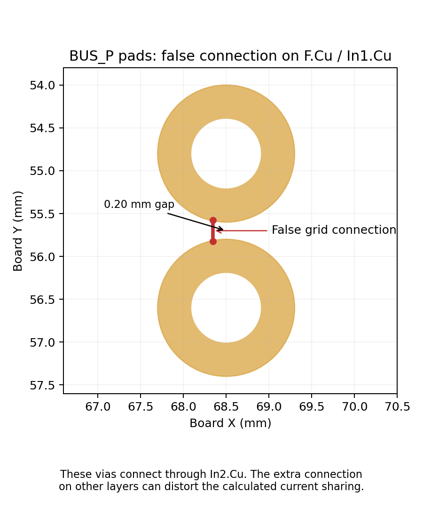

# Simulation continuation from 267dcee72

Two GPT-6 Sol workers at extra-high reasoning ran in isolated checkouts based
on `267dcee72`. This round addresses the corrected copper solver and the
complementary-drive switching model; it does not rerun the complete task set.
Native-13 board SHA-256 remains
`8056fc952675bc6987bcc9d32c12a88eebc4cec9bc3696f8cbd4876700a39129`.

## Kit repair verification

The corrected sheet solver passes its seven self-tests, including the original
four-layer barrel and multiple-source analytic cases. The coordinator also
checked the runner's transport behavior independently: success, nonzero main
exit, nonzero raw exit, and a missing raw file. All four produce the intended
status, preserve both return codes and save both transcripts. These checks
use controlled subprocess fixtures and do not simulate an electrical circuit.
See [the script](check_runner.py) and [results](runner-checks.json).

## Task results

- Task 04: the original four repairs are verified. The board raster audit found
  an additional false connection across a real same-net copper gap; current
  sharing and thermal acceptance remain blocked. See the
  [task 04 round-two report](../../04-board-current-thermal/round2/README.md).
- Task 01: six complementary-drive reference configurations and four half-step
  repeats completed. Both polarities, commanded deadtime, die-gate timing and
  residual incoming-device voltage are checked. The 3 V gate and 5% bus
  thresholds are diagnostics, not project acceptance criteria. Details are in
  the [task 01 round-two report](../../01-switching-parasitics/round2/README.md).
  Board loop/return inductances and local-capacitor ESL remain unresolved, so
  reference behavior cannot establish native-13 switching or ZVS acceptance.

The coordinator independently read both via centres, 1.6 mm pad diameters and
0.8 mm drills from native-13 with KiCad. The diagram illustrates the task-04
reported raster edge; it is not a new board copper feature.

## C1/C2 decision

The proposed R463N410000N1M has the correct 22.5 mm pitch and nominal
26.5 × 11.0 × 20.0 mm body. The [review](../../07-conducted-emi/round2/C1-C2-PROPOSAL.md)
records the exact ordering code, primary source, dimensional tolerances and
required footprint/model changes. No source-change approval has been inferred
from the proposal; the owner was asked separately. No part, footprint, copper
or placement change is included in this simulation continuation.

## Coordinator replay

The coordinator reran the task-04 topology audit and obtained byte-identical
JSON. It also reran one low-current switching case and reproduced the
command gap, incoming-device voltages and both peak values; both ngspice
processes exited zero. The [receipt](coordinator-checks.json) records these
checks. They verify reproducibility without upgrading reference inputs to
board-derived values.
