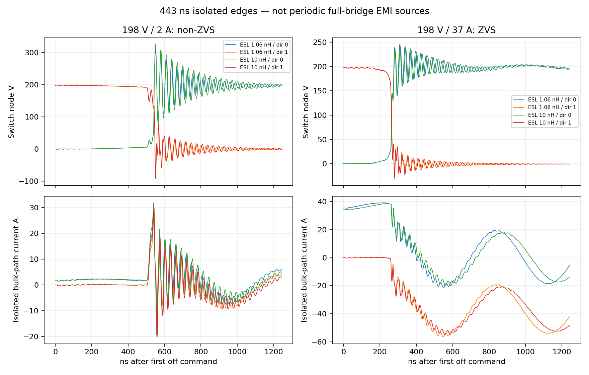
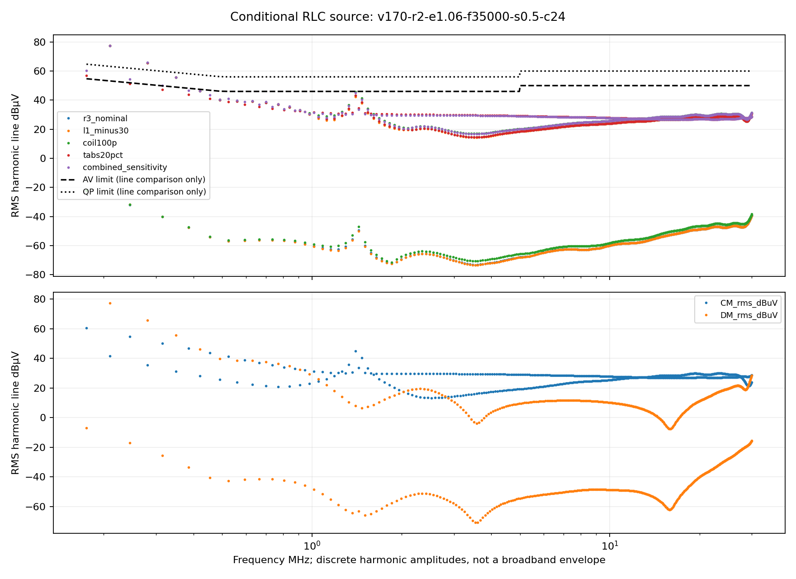

# D-19 — modeled switching edges and conditional EMI source work

**The worst available conditional result is −24.21 dB AV-line headroom at 210 kHz (170 V, 35 kHz, R=2 Ω, ESL 1.06 nH, combined filter sensitivity): reserve additional damped DM filtering. The full operating-envelope margin and final component change remain indeterminate because periodic cases abort or fail to settle.**

**Status: PARTIAL for task 07 B5/C1.** The original 16-case periodic sweep has 15 aborts and one unsettled run. Three follow-up executions settle at two operating points (170 V/1.06 nH/R=2 Ω at 35 and 60 kHz); the extra 60 kHz execution is a timestep comparison, not another load case. No 198 V, 10 nH or R=100 Ω periodic source is qualified. The initial prescribed-current failure and six-cycle RLC trial are separate from this 19-execution inventory.

Source base: `b30b3ae35a4bd3ad5c22d8c300c4640986e1232a`. Analysis by OpenAI GPT-6, 2026-10-03. No board, netlist, firmware or licensed vendor library is changed. This report preserves unsuccessful runs rather than treating convergence or a single edge as proof of periodic operation.

## Isolated switching edges

[edge-table.md](edge-table.md), [edges.csv](edges.csv) and [edges.json](edges.json) contain all 16 combinations of 170/198 V, 2/37 A, ESL 1.06/10 nH and both commutation directions. Direction 0 raises SW; direction 1 lowers it. These are D2's best extracted leg-A matrix, 443 ns commanded gap, 27 °C vendor model and the inherited driver approximation. The 0.2 ns maximum step and all raw waveforms/logs are retained in [raw/](raw/). The inherited common options use Gear integration, RELTOL=1e-3, ABSTOL=1e-9 and VNTOL=1e-6; D-14's `.options itl4=100000` is explicit in [edge.cir](edge.cir).



The table's 10–90% time uses the first interpolated threshold crossings after the off command. Mean slope is 0.8×bus/time; maximum slope is the largest adjacent-sample derivative in the reported transient window, including ringing. Neither is a bandwidth-limited probe measurement. D-14 recommends 0.1 ns or finer for its quantitative peak comparisons; this 0.2 ns edge census is diagnostic, not a newly converged peak qualification. Ring frequency and decay are **estimates** from absolute-residual peaks during 500 ns after the 90% crossing; multimode oscillation and moving bus voltage invalidate a single-pole interpretation. ZVS is the inherited diagnostic `abs(incoming VDS)<5 V` at the on-command sample, not a guarantee for a built gate driver. Every 2 A case is non-ZVS; every 37 A case satisfies that diagnostic.

A single-transition deck has no switching-frequency parameter: its edge is reused as a diagnostic for 35/60 kHz, not counted twice as independent frequency evidence. In particular, `i(Vbus)` and `i(Lbulk)` are **not a full-bridge DC-link source**: the original prescribed current is connected between bus and SW. Their waveforms are retained and labelled isolated-path currents. Periodizing those traces would manufacture a load-current spectrum.

## Acceptance anchors

- [fixture.json](fixture.json) exactly reproduces round 3's original AC fixture JSON, including independent capacitor-current and coherent-superposition checks. [prepare.py](prepare.py) asserts equality with the committed fixture before the replacement-source work.
- [baseline-comparison.json](baseline-comparison.json) compares the actual matching 170 V/37 A/direction 0/443 ns/10 nH case with `d2/results/grid-best-longdt/results.jsonl`; all three compared switching quantities match within 1 ppm. The raw waveform, parameters and both runner logs are committed.
- The approved fetch script verified the licensed Infineon model; [smoke.txt](smoke.txt) records the passing smoke test. The model is downloaded at replay time and is never committed here.

## Periodic source and its limits

[periodic-table.md](periodic-table.md) lists every attempted source case and its status. [periodic-runs/](periodic-runs/) contains per-case parameters, both ngspice logs, compressed raw waveforms and complex FFT arrays. [sweep.py](sweep.py) calls `run_ngspice.run(..., raw=True)`. Both the measurement and raw run must succeed; a completed run must reach the requested end time and contain finite values. Aborts, including an empty last-window raw file, remain **indeterminate**.

The initial [periodic.cir](periodic.cir) prescribed sinusoidal-current source aborted before a complete cycle; [trial.json](trial.json) and its logs/raw record that failure. The subsequent [periodic-tank.cir](periodic-tank.cir) uses a series 70 µH/0.54 µF tank, first checked in a six-cycle trial ([tank-trial.json](tank-trial.json)). The actual sweep uses [periodic-sweep.cir](periodic-sweep.cir), a shared DC link and two copies of the best leg-A matrix. Both legs operate at 50% nominal duty, 180° apart, with a 443 ns command gap on both transitions. There is no independent leg-B extraction or cross-leg mutual matrix in this model.

The R=2 Ω tank retains the original A7 load scenario; R=100 Ω is an explicitly assumed light-current diagnostic. **These are not controlled 37 A/2 A operating points or certified full/light rated power.** At 60 kHz the same tank is detuned and its real power falls. The table therefore reports the calculated mean inverter input current times nominal bus voltage, not a claimed output-power setpoint. [source-metrics.json](source-metrics.json) independently reconstructs periodic tank current from `(VSW_A−VSW_B)/(R+jωL+1/jωC)` using [source_metrics.py](source_metrics.py). The settled 170 V/35 kHz case is 31.95 A peak, 21.09 A RMS and 889.16 W in the tank resistor versus 912.55 W estimated inverter input; the 60 kHz coarse case is 11.86 A peak and 101.54 W tank power versus 104.74 W input. The remaining input includes modeled inverter loss and approximation error; it is not a thermal-loss measurement. Neither case is demonstrated to be the deployed rated-power operating point. The controller's phase/power policy and actual pan/load map must establish the deployed operating envelope.

The source ports are SW_A, SW_B and the sum of the two high-side feed currents (including their snubber branches, excluding local DC-link capacitors). These three complex spectra are injected coherently into A7; arbitrary independent magnitudes would lose cancellation and current/voltage phase. The transfer analysis is a one-way source approximation: loading by the mains/filter model is not fed back into the nonlinear transient. Both the source and A7 use their documented DC-link assumptions; their differing parasitic lumping is a model limitation, not a physical bound.

### FFT and steady-state gate

The sweep first attempts 12 cycles and saves the final two. Each period is resampled onto 32,768 equally spaced points. `2*rfft(x)/N` is a complex peak coefficient; DC is halved, and a nonzero sinusoidal line's RMS amplitude is peak/√2. The final period is a rectangular integer-period window, with harmonic spacing equal to 35 or 60 kHz. No Hann taper hides an endpoint mismatch. Resampling does not improve the original 2 ns transient integration accuracy.

The relative RMS change between the last two periods must be below 1% for **each** switch voltage and the inverter current before a case can produce a margin row. This is an explicit numerical screening threshold, not a physical uncertainty bound or proof that every small harmonic has converged. [step-comparison.json](step-comparison.json) compares the settled 60 kHz source at 2 ns and 0.5 ns. Its worst combined-sensitivity 240 kHz line changes only **0.00059 dB**, supporting that low-frequency shortfall within this model. However, other combined-sensitivity lines change by as much as **6.72 dB** across the band. Perfectly symmetric cancellation nulls move much more in relative dB; this is not a meaningful uncertainty bound. The 36 µH/4.7 µF proposal's minimum AV-line headroom changes from **−0.99 to +5.47 dB**. Therefore the **full-band spectrum is not timestep-qualified**, and the coarse 30 MHz shortfall must not be treated as a confirmed physical filter requirement. The 35 kHz case has only one successful timestep tier. A longer settling run and the finer-step comparison are retained, without claiming all-band convergence. [replay_periodic.py](replay_periodic.py) recomputes FFT coefficients and settling metrics directly from committed compressed raw files. High-frequency headroom requires timestep convergence and receiver/bench confirmation even when this gate passes.

## A7 transfer and receiver reference

[spectrum.py](spectrum.py) keeps round 3's filter, LISN, coil-to-PE model, fixed rectifier crest state and component parasitics. It solves independent unit SW_A, SW_B and bus-current drives on the original 30,000-point 150 kHz–30 MHz AC grid, retaining the exact receiver/PE complex AC arrays in [transfer/](transfer/). Real and imaginary transfer parts are interpolated at each switching harmonic and added before taking magnitude.

One round-3 limitation needs an explicit correction: `RsenseL/RsenseN` connect each receiver node to **PE**, but its old plots used `v(lisn_l/n)` relative to global earth. The corrected result is `v(lisn_l/n)-v(pe)`. [margin-table.md](margin-table.md) and [margins.csv](margins.csv) show both corrected and original-reference minimum headroom. The per-line CSVs also retain both earth-reference amplitudes. The circuit and original fixture remain unchanged. This is a model measurement-reference correction, not a contradiction between the frozen board and netlist.

Sensitivity cases retain the same sources while changing L1 to −30%/+50%, total coil-to-PE capacitance to 10/100 pF, and the two low-side tab capacitances to +20%/−20%. A combined low-L1/high-coil/asymmetric-tab scenario is also shown; it is an exploratory combination, not a stacked manufacturing bound. Source ESL and switching regime vary in the attempted transient cases, not by changing an arbitrary assumed dv/dt number. The isolated edge table covers both ZVS diagnostics and both ESL values; the periodic aborts prevent a qualified hard-switching-versus-ZVS or ESL spectrum comparison. No missing sensitivity is reported as zero change.

## Harmonic headroom, not compliance

[margin-table.md](margin-table.md), [margin-results.json](margin-results.json) and compressed per-line CSVs in [spectra/](spectra/) report the worse L/N terminal at every regulated harmonic and each scenario's minimum headroom. An absent row means no settled source, **not zero emissions or a pass**. [provenance.json](provenance.json) records the minimum available model line and the counts of complete/unsettled/indeterminate cases.

The limit reference is induction cooking equipment under [47 CFR 18.307(a)](https://www.ecfr.gov/current/title-47/chapter-I/subchapter-A/part-18/subpart-C/section-18.307), verified 2026-10-03: QP 66→56 dBµV logarithmically from 150–500 kHz, 56 to 5 MHz, then 60 to 30 MHz; AV is 10 dB lower. The tighter value is used at a boundary. Section 18.307(e)'s exclusions use [18.301](https://www.ecfr.gov/current/title-47/chapter-I/subchapter-A/part-18/subpart-C/section-18.301): 6.78 MHz±15 kHz, 13.56 MHz±7 kHz and 27.12 MHz±163 kHz within this span.

“AV-line headroom” is the AV limit minus a modeled **RMS harmonic amplitude**, not an average-detector reading. “QP-line” is the analogous comparison to the QP limit, not a quasi-peak simulation. The JSON additionally reports peak-line amplitude versus AV (3.0103 dB less headroom). There is no 9 kHz receiver filter, detector weighting, mains-cycle modulation, burst operation or line-to-line frequency sweep. The plotted points are discrete harmonics, not a broadband envelope. No statutory or engineering pass is claimed from these comparisons.



## Filter and owner decisions

The settled **35 kHz** case is the worse available source: nominal AV-line headroom **−24.15 dB**, combined sensitivity **−24.21 dB**, at **210 kHz**. Its final two cycles differ by 0.00042 dB in minimum headroom. This is a 0.5 ns run; the 2 ns/12-cycle counterpart aborted, so there is no successful 35 kHz timestep pair. The numerical shortfall is an indication requiring qualification, not a bound. The 36 µH/2.2 µF proposal still has **−9.41 dB** at 210 kHz; 36 µH/4.7 µF yields only **+0.13 dB** in this one nominal-filter proposal case, with no useful design reserve and no manufacturing qualification.

The settled 170 V/R=2 Ω/60 kHz/1.06 nH/48-cycle example predicts a 240 kHz DM line with nominal AV-line headroom **−16.08 dB**, or **−16.14 dB** in the combined sensitivity case (QP-line headroom −6.14 dB). Its estimated inverter input is **104.74 W**, not full rated power. At that worst combined line, DM is 68.12 dBµV and CM 34.88 dBµV. These numbers come from `v170-r2-e1.06-f60000-s2-c48` in the linked tables/CSV; its final two cycles change the minimum headroom by about 0.000006 dB. The 240 kHz shortfall survives the recorded timestep comparison; high-frequency results do not establish convergence.

**Reserve room for additional damped differential-mode filtering, then qualify its values.** Increasing common-mode inductance alone barely changes this DM-dominated example because the sensitivity holds differential inductance fixed. The exploratory `proposal_dm36u_x2p2u` case doubles modeled differential inductance to 36 µH and increases both X capacitors to 2.2 µF: the minimum AV-line headroom remains −1.33 dB at 240 kHz. Using 4.7 µF instead gives a coarse-step minimum of −0.99 dB at 30 MHz, but the finer-step source gives +5.47 dB minimum: the apparent 30 MHz failure is numerically unresolved. Neither is a releasable design or a complete fix, especially given the 35 kHz case's +0.13 dB result and absent tolerance qualification. Both unchanged and changed circuits are retained.

These proposals change idealized lumped values while retaining the old ESL/ESR/RF assumptions. Real capacitor/choke selection changes those parasitics and needs voltage/current/saturation ratings, mains reactive-current and inrush checks, resonance damping and control interaction review. No part or layout change is authorized by these exploratory AC cases.

Do not release the existing input filter on round 3's assumed-edge margin, or select a replacement solely from the conditional lines here. Keep its values as the controlled starting configuration while closing the missing full-bridge source and receiver evidence. The available evidence does **not** determine a defensible replacement L1/C1/C2 value or certify that no change is needed. A negative model line would require at least that line's shortfall plus the chosen design reserve in the model; it would still not specify a physically qualified filter part.

The inherited RF choke model uses a fitted typical first resonance and is unqualified above it; X-capacitor high-frequency extrapolation, bridge capacitance at actual reverse voltage, mounted capacitor ESL, pad/clamp-to-sink capacitance and coil/pan/PE geometry remain uncertain. D-18's cooling/pad selection can change the tab capacitances materially. Perfectly matched opposite legs artificially cancel CM; pad asymmetry and actual leg-B/harness geometry must be retained in release work.

Owner decisions are the actual power/phase operating map, pad/heatsink/PE assembly and EMI reserve target. Next acceptance evidence is a stable full-bridge source at the required controlled loads and frequencies, timestep-converged critical harmonics, followed by a LISN pre-scan on both terminals with the selected enclosure, pan, harness and mains-cycle operating modes. Aborted cases must be solved or measured; they cannot be interpolated into passing margins.

## Replay and review

Use Python 3.12 with NumPy, SciPy and Matplotlib and ngspice 45.2. Run `manifest.py --verify` to check the published bytes before replay. Cached results are evidence reuse, not fresh simulations; source/model changes require a fresh output folder. AC cache reuse also checks its exact saved deck. Fresh simulator runs change log/raw metadata, so compare parsed results before recording a new manifest. From repository root, set a shell variable `d19` to this output directory, then:

```sh
zsh zapote/power-stage-120v/validation-plan/sim-kit/models/fetch_models.sh
python3.12 zapote/power-stage-120v/validation-plan/sim-kit/smoke_test.py
python3.12 "$d19/prepare.py"
python3.12 "$d19/edges.py"              # reruns SPICE; --replay uses retained raw
python3.12 "$d19/sweep.py"              # cached cases are retained; remove only own outputs to rerun
python3.12 "$d19/sweep.py" --repairs
python3.12 "$d19/sweep.py" --fine
python3.12 "$d19/replay_periodic.py"
python3.12 "$d19/spectrum.py"
python3.12 "$d19/source_metrics.py"
python3.12 "$d19/step_compare.py"
python3.12 "$d19/summarize.py"
python3.12 "$d19/report.py"
python3.12 -m unittest discover -s "$d19" -p test_spectrum.py
```

The regression checks cover Fourier normalization/phase, coherent source addition, PE reference and limit boundaries/exclusions. Main-context review checked source ports, peak/RMS conversion, status gating and restricted paths; no independent peer-review receipt or bench validation is claimed. See [VALIDATION.md](VALIDATION.md) for command outcomes and unresolved acceptance items.
