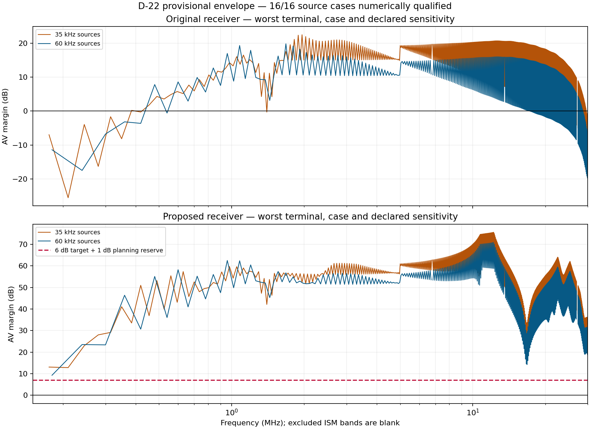
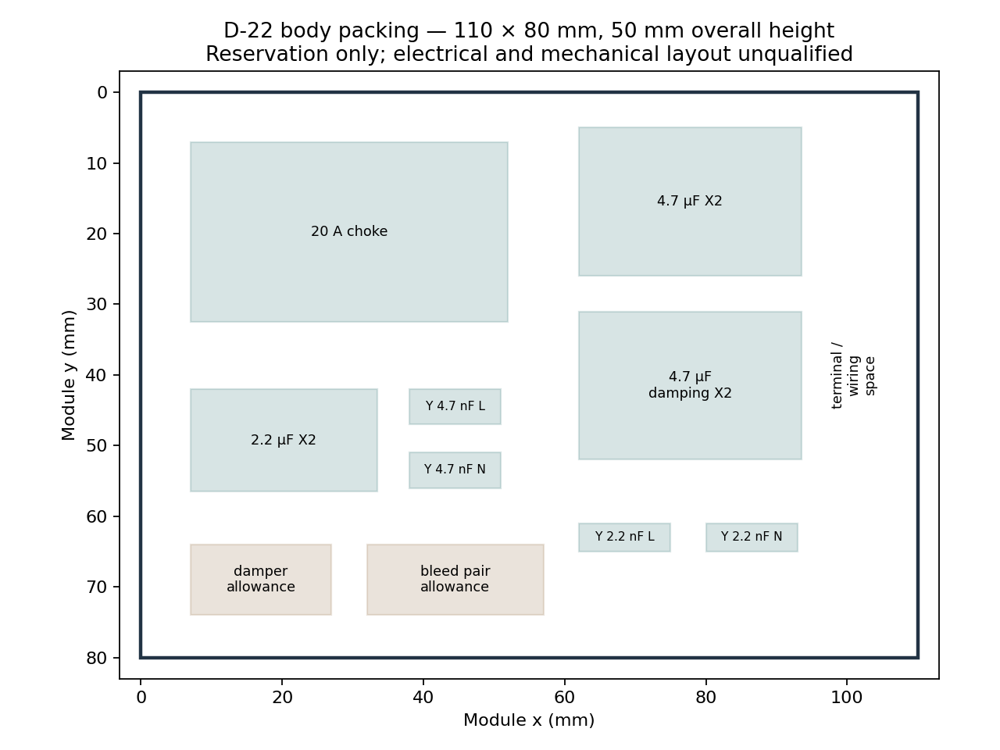
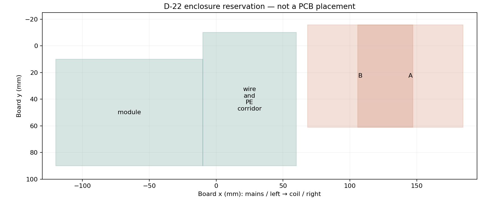

**Recommend a 20 A damped DM/CM inlet stage, 110 × 80 × 50 mm, 8 W planning allowance and approximately $45: all 16 source cases qualify numerically, with 9.28 dB worst modeled AV margin (8.28 dB after a 1 dB reserve).**

This is a model-based pre-check and an enclosure proposal. It is not a compliance result or permission to release the filter for manufacture. The source circuit, board, netlist and firmware are unchanged. Base: `fda5ab9ece24ef1ee6f2317604c5ca73367d5201`.

## Result and numerical qualification

All declared campaigns have finished. All 16 operating points pass the unchanged timestep and cycle criteria; every regulated receiver line in every declared added-stage sensitivity exceeds the 6 dB target after the separate 1 dB planning reserve. The last point, 198 V / 60 kHz / 100 Ω / 1.06 nH, changes by at most 0.102047 dB on significant lines from 0.25 to 0.0625 ns and passes the weak-line and cycle checks. Earlier aborted trials remain indeterminate in `ATTEMPTS.md`; they are not used as passing evidence.

D-19's two settled cases reproduced with **bit-identical complex spectra before changing numerics** (`reproduction.json`). Smaller maximum timesteps recover operating cases that D-19 could not complete. Completion alone is insufficient: the last two cycles must settle, and spectra must survive refinement through the same PE-referenced receiver.

The full operating envelope and its current qualification status are below. R=100 Ω is D-19’s inherited light-load diagnostic; at 60 kHz it can draw more power than R=2 Ω. These fixed-RLC cases are not a validated full-power controller map. **Provisional margins are not qualified margins.** Every expected case appears, including missing or indeterminate results. The acceptance calculation requires both timestep and cycle comparisons for every sensitivity and both receiver terminals, then subtracts a separate **1 dB planning reserve** before testing ≥6 dB. This reserve is not a mathematical truncation-error bound and does not waive failed numerical checks.

<!-- BEGIN GENERATED TABLES -->
Generated by `summarize.py`. Margins below are provisional unless the numerical status passes. QP/AV are CW-equivalent estimates; negative margin exceeds the limit. Original columns take the worse of nominal/combined sensitivity. Proposed columns take the worse of all declared added-stage sensitivities. Different mode minima may occur at different frequencies.

## Original receiver

| Bus V | kHz | R Ω | ESL nH | Step ns | Terminal AV / QP dB | DM AV / QP dB | CM AV / QP dB | Worst terminal MHz |
| ---: | ---: | ---: | ---: | ---: | ---: | ---: | ---: | ---: |
| 170 | 35 | 2 | 1.06 | 0.0625 | -24.21 / -14.21 | -24.11 / -14.11 | -5.64 / 4.36 | 0.21 |
| 170 | 35 | 2 | 10 | 0.05 | -24.21 / -14.21 | -24.11 / -14.11 | -5.65 / 4.35 | 0.21 |
| 170 | 35 | 100 | 1.06 | 0.1 | -8.21 / 1.79 | -3.01 / 6.99 | -5.64 / 4.36 | 29.96 |
| 170 | 35 | 100 | 10 | 0.125 | -15.39 / -5.39 | -10.62 / -0.62 | -12.98 / -2.98 | 29.96 |
| 170 | 60 | 2 | 1.06 | 0.0625 | -16.14 / -6.14 | -16.02 / -6.02 | -10.06 / -0.06 | 0.24 |
| 170 | 60 | 2 | 10 | 0.08 | -16.15 / -6.15 | -16.02 / -6.02 | -10.06 / -0.06 | 0.24 |
| 170 | 60 | 100 | 1.06 | 0.125 | -12.99 / -2.99 | -7.84 / 2.16 | -10.28 / -0.28 | 30 |
| 170 | 60 | 100 | 10 | 0.125 | -20.11 / -10.11 | -15.41 / -5.41 | -17.67 / -7.67 | 30 |
| 198 | 35 | 2 | 1.06 | 0.08 | -25.53 / -15.53 | -25.44 / -15.44 | -6.97 / 3.03 | 0.21 |
| 198 | 35 | 2 | 10 | 0.0625 | -25.53 / -15.53 | -25.44 / -15.44 | -6.97 / 3.03 | 0.21 |
| 198 | 35 | 100 | 1.06 | 0.125 | -7.33 / 2.67 | -1.79 / 8.21 | -6.96 / 3.04 | 29.96 |
| 198 | 35 | 100 | 10 | 0.1 | -14.72 / -4.72 | -9.71 / 0.29 | -12.46 / -2.46 | 29.96 |
| 198 | 60 | 2 | 1.06 | 0.125 | -17.47 / -7.47 | -17.35 / -7.35 | -11.39 / -1.39 | 0.24 |
| 198 | 60 | 2 | 10 | 0.0625 | -17.48 / -7.48 | -17.35 / -7.35 | -11.39 / -1.39 | 0.24 |
| 198 | 60 | 100 | 1.06 | 0.0625 | -12.05 / -2.05 | -6.58 / 3.42 | -11.39 / -1.39 | 30 |
| 198 | 60 | 100 | 10 | 0.125 | -19.41 / -9.41 | -14.49 / -4.49 | -17.11 / -7.11 | 30 |

## Proposed receiver

| Bus V | kHz | R Ω | ESL nH | Step ns | Terminal AV / QP dB | DM AV / QP dB | CM AV / QP dB | Worst terminal MHz |
| ---: | ---: | ---: | ---: | ---: | ---: | ---: | ---: | ---: |
| 170 | 35 | 2 | 1.06 | 0.0625 | 14.15 / 24.15 | 14.67 / 24.67 | 14.41 / 24.41 | 0.21 |
| 170 | 35 | 2 | 10 | 0.05 | 14.15 / 24.15 | 14.67 / 24.67 | 14.41 / 24.41 | 0.21 |
| 170 | 35 | 100 | 1.06 | 0.1 | 14.42 / 24.42 | 36.89 / 46.89 | 14.42 / 24.42 | 0.175 |
| 170 | 35 | 100 | 10 | 0.125 | 14.42 / 24.42 | 29.28 / 39.28 | 14.42 / 24.42 | 0.175 |
| 170 | 60 | 2 | 1.06 | 0.0625 | 10.61 / 20.61 | 25.58 / 35.58 | 10.61 / 20.61 | 0.18 |
| 170 | 60 | 2 | 10 | 0.08 | 10.61 / 20.61 | 25.58 / 35.58 | 10.61 / 20.61 | 0.18 |
| 170 | 60 | 100 | 1.06 | 0.125 | 10.60 / 20.60 | 32.02 / 42.02 | 10.60 / 20.60 | 0.18 |
| 170 | 60 | 100 | 10 | 0.125 | 10.60 / 20.60 | 24.45 / 34.45 | 10.61 / 20.61 | 0.18 |
| 198 | 35 | 2 | 1.06 | 0.08 | 12.83 / 22.83 | 13.35 / 23.35 | 13.09 / 23.09 | 0.21 |
| 198 | 35 | 2 | 10 | 0.0625 | 12.83 / 22.83 | 13.35 / 23.35 | 13.09 / 23.09 | 0.21 |
| 198 | 35 | 100 | 1.06 | 0.125 | 13.09 / 23.09 | 38.11 / 48.11 | 13.09 / 23.09 | 0.175 |
| 198 | 35 | 100 | 10 | 0.1 | 13.09 / 23.09 | 30.19 / 40.19 | 13.09 / 23.09 | 0.175 |
| 198 | 60 | 2 | 1.06 | 0.125 | 9.28 / 19.28 | 24.25 / 34.25 | 9.28 / 19.28 | 0.18 |
| 198 | 60 | 2 | 10 | 0.0625 | 9.28 / 19.28 | 24.25 / 34.25 | 9.28 / 19.28 | 0.18 |
| 198 | 60 | 100 | 1.06 | 0.0625 | 9.28 / 19.28 | 33.28 / 43.28 | 9.28 / 19.28 | 0.18 |
| 198 | 60 | 100 | 10 | 0.125 | 9.28 / 19.28 | 25.37 / 35.37 | 9.28 / 19.28 | 0.18 |

## Numerical acceptance

Significant-line checks use the 0.2 dB target. Weak-line checks require the absolute complex difference to be no more than `10**(0.2/20)-1` times the AV-minus-40-dB floor. Step and cycle checks are separate; passing the significant-line column alone does not qualify a case.

| Bus V | kHz | R Ω | ESL nH | Cycles | Finest step ns | Largest significant-line step change dB | Failed checks | Status |
| ---: | ---: | ---: | ---: | ---: | ---: | ---: | --- | --- |
| 170 | 35 | 2 | 1.06 | 32 | 0.0625 | 0.1058 | — | numerically qualified |
| 170 | 35 | 2 | 10 | 32 | 0.05 | 0.0707 | — | numerically qualified |
| 170 | 35 | 100 | 1.06 | 24 | 0.1 | 0.1212 | — | numerically qualified |
| 170 | 35 | 100 | 10 | 24 | 0.125 | 0.1305 | — | numerically qualified |
| 170 | 60 | 2 | 1.06 | 48 | 0.0625 | 0.0467 | — | numerically qualified |
| 170 | 60 | 2 | 10 | 48 | 0.08 | 0.0142 | — | numerically qualified |
| 170 | 60 | 100 | 1.06 | 48 | 0.125 | 0.1128 | — | numerically qualified |
| 170 | 60 | 100 | 10 | 48 | 0.125 | 0.1268 | — | numerically qualified |
| 198 | 35 | 2 | 1.06 | 32 | 0.08 | 0.0940 | — | numerically qualified |
| 198 | 35 | 2 | 10 | 32 | 0.0625 | 0.0241 | — | numerically qualified |
| 198 | 35 | 100 | 1.06 | 24 | 0.125 | 0.0855 | — | numerically qualified |
| 198 | 35 | 100 | 10 | 24 | 0.1 | 0.1199 | — | numerically qualified |
| 198 | 60 | 2 | 1.06 | 48 | 0.125 | 0.1521 | — | numerically qualified |
| 198 | 60 | 2 | 10 | 48 | 0.0625 | 0.0532 | — | numerically qualified |
| 198 | 60 | 100 | 1.06 | 48 | 0.0625 | 0.1020 | — | numerically qualified |
| 198 | 60 | 100 | 10 | 48 | 0.125 | 0.1064 | — | numerically qualified |

Qualified 16/16; all cases meet ≥6 dB after the explicit 1 dB planning reserve: **True**.

Within the qualified subset, the minimum proposed AV margin is **9.2801 dB**, or **8.2801 dB** after the planning reserve. Unqualified cases do not enter that acceptance claim.

<!-- END GENERATED TABLES -->

### What happened to the 6.72 dB discrepancy

Increasing the FFT interpolation grid from 32768 to 524288 samples leaves the original 60 kHz / 2 ns versus 0.5 ns difference at **6.7213 dB**. The largest interpolation-grid effect is only **0.0373 dB** (`resampling.json`). The discrepancy is in the transient solution, not fixed by a denser FFT grid.

The declared significant-line target is **0.2 dB** between the finest steps; weaker lines retain their absolute complex-voltage comparison. The original 170 V / 60 kHz / R=2 Ω / ESL=1.06 nH point now passes at 0.0625 ns against 0.125 ns: the maximum significant-line change is **0.046750 dB**, and its cycle comparison also passes. This resolves the original point’s timestep sensitivity under the declared finite-refinement criterion; it is not a universal error bound. At 170 V / 35 kHz the 0.5→0.25 ns comparison still moves some significant lines by **1.87 dB**. The 170 V / 35 kHz / R=2 Ω / ESL=10 nH case aborts at 0.125 ns. The original 170 V / 60 kHz / R=2 Ω / ESL=1.06 nH case also aborts at 0.25 ns. Neither abort can establish a finer-step spectrum.

The diagnostics retain tests of higher iteration limits, tighter error tolerances, trapezoidal integration, KLU and device-bypass settings. The completed 0.5 ns trapezoidal case differs from Gear by up to **1.8684 dB** on significant lines; its 0.25 ns follow-up aborts, so changing integration method does not supply a qualified replacement. See [ATTEMPTS.md](ATTEMPTS.md) for every scheduled outcome. Read their campaign JSON, per-run `result.json` and `run.log`; aborted or timed-out attempts are **indeterminate**, never zero emissions or a passing margin. D-14's **`.options itl4=100000`** remains the baseline. No physical shunts, changed GMIN, altered gate edges, supply ramps or imposed initial conditions were used. [METHOD.md](METHOD.md) and [NUMERICS.md](NUMERICS.md) describe the protocol and its limits.

The filter below meets the ≥6 dB numerical requirement across the qualified 16-case envelope and declared sensitivities. It remains a conditional enclosure allocation because the physical component, receiver and coupled-system qualifications in `METHOD.md` still require hardware evidence. The 1 dB reserve is a planning allowance, not an error bound.



The plot joins discrete harmonic estimates for readability; it does not model a continuous emission spectrum. Its curves use the selected numerically qualified source for each of the 16 operating points.

## Proposed stage

Place the module after the appliance's upstream fuse/disconnect and before the existing board filter:

- Across the incoming L–N pair: **2.2 µF X2**.
- In both conductors: one **TDK B82726S2203A020**, 20 A current-compensated choke. Its typical **18 µH differential leakage** provides the extra DM inductance; 1.6 mH/winding provides CM filtering.
- Across the output L–N pair: **4.7 µF X2**, plus a **3.9 Ω / 5 W + 4.7 µF X2** series damping branch.
- From each output conductor to PE: **4.7 nF Y2 in parallel with a separate 2.2 nF Y2 branch**, with short returns matching the modeled parasitic ranges.
- Across L–N: **two 15 kΩ / 2 W bleed resistors in series**.

The original receiver's CM result exceeds the AV limit, so the CM addition is needed by this model. A DM-only addition is insufficient. `filter-exploration.json`, `filter-topology-exploration.json` and the retained candidate results show the alternatives. The final lower-Y proposal reduces the added leakage allocation while retaining the modeled margin; it does not change the power board.

[PARTS.md](PARTS.md) gives exact order codes, datasheet revisions/pages, current and voltage ratings, safety classes, damping/bleed calculations and cost basis. [TABLES.md](TABLES.md) and the `qualified-spectra/*.csv.gz` members of `receiver-spectra.tar.gz` retain every harmonic, the regulatory mask, L/N totals and complex-mode-derived DM/CM levels. The word “qualified” in historical output filenames is not an acceptance flag; use `envelope-summary.json`.

QP and AV are **CW-equivalent estimates** for isolated fixed-frequency harmonics. Limits are task 07's [47 CFR §18.307(a), (e), (g)](https://www.ecfr.gov/current/title-47/chapter-I/subchapter-A/part-18/subpart-C/section-18.307), with ISM-band exclusions and the tighter boundary values. Only total terminal emissions are compared with the limits; mode minima are diagnostic. No time-domain CISPR detector, mains modulation, startup/burst spectrum or physical compliance test is represented.

## Fifteen-ampere and enclosure allocation

At **15 A RMS**, added-choke copper loss is **2.025 W** using typical cold DCR, or **2.700 W** with the explicit 6 mΩ/winding hot estimate. The choke's 20 A rating applies at 60 °C ambient and 50 Hz; the 60 Hz pulsed-input application still needs a hot-current check. Its hot leakage inductance and impedance under rectifier current peaks are not manufacturer-bounded here; the 9–27 µH leakage sweep is a sensitivity study.

At **140 V / 60 Hz**, line-frequency damping loss is **0.305 W**, the bleed pair's initial-tolerance loss is **0.688 W**, and added Y leakage is **0.437 mA** for one conductor energized to that voltage at +20% capacitance. Switching-harmonic currents and losses are separately recorded in `harmonic-loss-results.json`; capacitor current-chart/case-temperature acceptance and the complete appliance leakage budget remain necessary. The stated connected-X-capacitor and resistor assumptions discharge a 198 V crest below 34 V in **0.901 s**. That is a design acceptance target, not certification or DC-link discharge credit.

Reserve **8 W of module heat** as a planning allowance. Keep the module out of the heatsink exhaust duct. The **$44.54** material estimate includes a $15 carrier/terminal/cover allowance, excludes freight/tax, and uses catalog snapshots plus labeled allowances. No parts were purchased.



`module_plan.py` checks body packing; it does not route the carrier or approve insulation distances, terminal placement or mounting. A 41 mm choke plus the stated carrier/underside/cover allowances fits the proposed 50 mm height.

## Placement and the existing FEM matrices

[placement.json](placement.json), generated from the mesher's leg boxes plus the same 20 mm padding used by `leg_region_diff.py`, records these board-coordinate regions:

| Region | x min / max, mm | y min / max, mm |
| --- | --- | --- |
| Leg A | 105.865 / 184.600 | −15.785 / 61.125 |
| Leg B | 68.400 / 147.135 | −15.785 / 61.125 |
| Proposed module | −120 / −10 | 10 / 90 |
| New wiring / PE corridor | −10 / 60 | −10 / 90 |

Both new envelopes have **zero intersection area with either padded leg region**. The nearest new-conductor boundary is 8.4 mm left of the already-padded leg-B region. Under this reservation, unchanged original leg copper, stackup and mounting need no new local FEM extraction. Extending new metal, brackets or wiring into either region invalidates that conclusion. This geometric result is not a claim of zero enclosure coupling.



## Reproduce and inspect

Use Python 3.12, NumPy, Matplotlib and ngspice 45.2. This record uses macOS arm64 and the runners invoke `/opt/homebrew/bin/ngspice`; another host needs that executable path adapted and a fresh smoke check. From `zapote/power-stage-120v/validation-plan/sim-kit`, run `./models/fetch_models.sh` and then `python3 smoke_test.py`; `fetch.txt` and `smoke.txt` record the original successful checks. **Never commit the model library.**

From this output directory:

```sh
python3 -m unittest test_evidence -v
python3 replay.py --ac
python3 provenance.py --verify
```

The replay reconstructs every completed binary capture's FFT, reruns the final AC decks and verifies every member of the exploratory AC archives and the receiver-spectrum archive. The three `exploratory-*.tar.gz` archives preserve the earlier transfer caches. Extract a named archive with `tar -xzf <archive>` under this directory if inspection is needed; `exploratory-ac-archive.json` records every member hash. `receiver-spectra.tar.gz` contains every receiver-line CSV with original member paths; `receiver-spectra-archive.json` records each member hash. Run `tar -xzf receiver-spectra.tar.gz` here to inspect those files or redraw the plot without recomputing the receiver. Packing avoids exceeding GitHub’s review file-count limit and preserves every CSV byte. To repeat nonlinear simulations without replacing historical captures:

```sh
python3 periodic.py envelope-0.5.json --workers 4 --runs-dir recomputed-0.5
python3 periodic.py envelope-0.25.json --workers 4 --runs-dir recomputed-0.25
python3 periodic.py envelope-0.125.json --workers 4 --runs-dir recomputed-0.125
python3 periodic.py anchor-0.0625.json --workers 2 --runs-dir recomputed-anchors
python3 periodic.py targeted-refinement.json --workers 6 --runs-dir recomputed-targeted
python3 periodic.py additional-refinement.json --workers 1 --runs-dir recomputed-additional
python3 periodic.py fine-refinement.json --workers 1 --runs-dir recomputed-fine
python3 periodic.py recovery-refinement.json --workers 1 --runs-dir recomputed-recovery
python3 periodic.py weak-refinement.json --workers 1 --runs-dir recomputed-weak
python3 periodic.py retry-refinement.json --workers 1 --runs-dir recomputed-retry
python3 periodic.py last-refinement.json --workers 1 --runs-dir recomputed-last
python3 periodic.py closing-refinement.json --workers 1 --runs-dir recomputed-closing
python3 periodic.py terminal-refinement.json --workers 1 --runs-dir recomputed-terminal
python3 periodic.py final-light-refinement.json --workers 1 --runs-dir recomputed-final-light
```

Each attempted run has its generated deck, parameters, simulator/model/input hashes, outcome, log and compressed raw output when produced. Default runs use `periodic-runs/`; a changed input cannot silently reuse an old cache. `reproduce.py` and `resampling.py` reproduce the original D-19 comparison. `qualify_filter.py`, `numeric_compare.py` and `summarize.py`, in that order, rebuild the receiver, convergence and complete-envelope tables. `figures.py` rebuilds the margin plot after the receiver CSVs are regenerated or extracted. Run `pack_spectra.py` after plotting and before replay/provenance generation to verify and archive the complete receiver set again. `budget.py`, `module_plan.py` and `damping.py` rebuild the enclosure/parts calculations and passive damping check.

## Decisions and remaining evidence

The owner can reserve the proposed **0.44 L / 8 W / approximately $45** allocation now. The source numerical qualification is complete under the stated finite-refinement criteria. Freeze of the exact filter still awaits hot biased-choke measurements, X-capacitor ripple acceptance, a complete leakage-current allocation, and the actual carrier/PE/terminal geometry. Mains/rectifier/filter/controller interaction and burst operation need a coupled or bench check; the present one-way AC receiver does not establish closed-loop stability.

D-21 remains a separate draft pending real-chip shutdown validation. No D-21 code or status is changed by this report.
