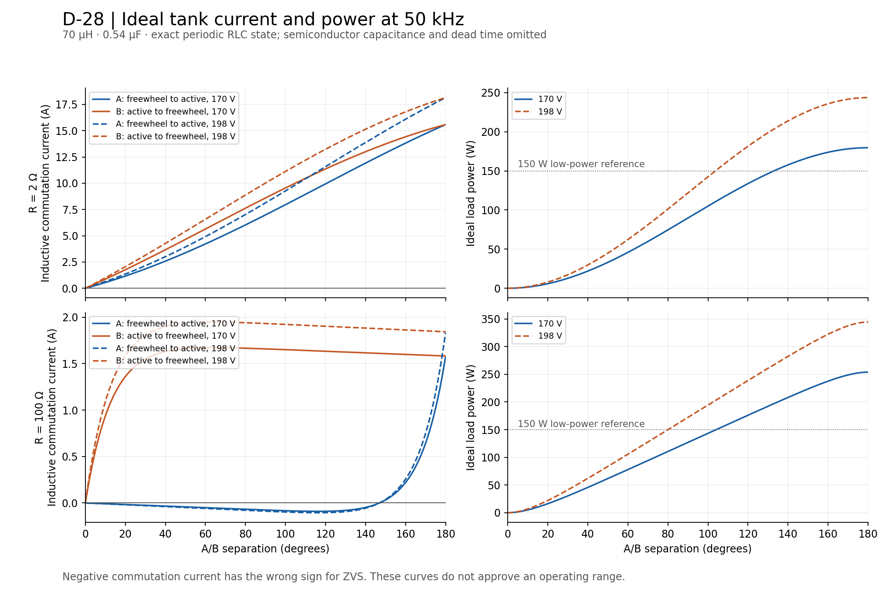
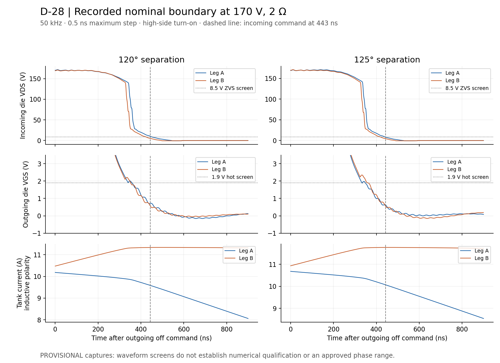

# D-28 — phase-shift validation at 50 kHz

**No new continuous phase-shift operating range is demonstrated by this packet; keep the existing 180° decision.** No native-19 phase point meets the complete D-22 numerical qualification. Completed waveform screens locate a possible low-power boundary, but an unqualified capture or an isolated sampled point cannot approve an interval. The authoritative numerical/switching decisions are in [verdicts.csv](verdicts.csv), with every comparison in [CONVERGENCE.md](CONVERGENCE.md) and every attempted capture in [TABLES.md](TABLES.md). This is a simulation/proposal packet, not a change to [`DECISIONS.md:76`](../../../../../DECISIONS.md#L76).

The requested operating frequency is **50 kHz**, from the prototype's disabled bench configuration at [`mcpwm_target.c:88`](../../../../../prototype-closure/round5/firmware/esp32/mcpwm_target.c#L88). The proposed low-power mode comes from [`POWER-SECTION.md:111–112`](../../../../../../../docs/hardware/power-section-120v/POWER-SECTION.md#L111). The simulated 70 µH / 0.54 µF tank, fixed DC buses, 2 Ω and 100 Ω loads, 443 ns command gap and duplicated native-19 leg-A matrix are specified in [METHOD.md](METHOD.md). The duplicated matrix is a placeholder until leg B's own extraction exists.

## What the current map establishes

Leg A enters the active interval from freewheeling; leg B ends it. A_H rises at zero phase and B_H at separation δ. This explicit convention avoids assigning the wrong leg from a leading/lagging label. Positive reported commutation current has the desired polarity for discharging the incoming device's capacitance. [Circuit and definitions](METHOD.md#current-and-phase-convention).

The exact ideal-RLC solution covers every integer degree from 0 through 180 at both buses and both loads. An independent ngspice oracle checks six operating points; its worst transition-current disagreement is **1.703 µA**. The ideal model omits semiconductor capacitance and dead-time distortion, so current sign alone cannot establish ZVS. Sources: [ideal.csv](ideal.csv), [oracle-check.txt](oracle-check.txt), [ideal oracle outputs](ideal-oracle-v2.json).

At 100 Ω, the ideal leg-A current has the wrong sign at every sampled nonzero separation through 146°. It becomes positive at 147° (170 V: −8.327 mA at 146°, +0.632 mA at 147°), still far from proving sufficient commutation charge. At 2 Ω the nonzero sampled currents have inductive polarity, but the device model locates a higher-current ZVS boundary below. [Ideal grid](ideal.csv), [nominal waveforms](TABLES.md).

## Nominal waveform boundary — provisional, not approved

The following completed **0.5 ns** captures use R=2 Ω. Values are rounded for reading; linked replay JSON and [TABLES.md](TABLES.md) preserve both edges separately. “Clears” means only the nominal waveform screen. Numerical qualification is a separate gate, and these rows do not establish monotonicity or tolerance margin.

| DC bus | Phase | Tank resistor W | A/B commutation A | Worst incoming VDS A/B, V | Nominal ZVS observation | Bridge overlap proxy W |
|---|---:|---:|---|---|---|---:|
| 170 V | 120° | 133.07 | 10.183 / 10.477 | 10.442 / 5.226 | A misses 8.5 V; B clears | 5.721 |
| 170 V | 125° | 139.71 | 10.679 / 10.933 | 7.995 / 4.379 | Both clear 8.5 V | 5.780 |
| 198 V | 100° | 141.27 | 9.545 / 10.010 | 14.993 / 7.161 | A misses 9.9 V; B clears | 5.550 |
| 198 V | 110° | 161.57 | 10.697 / 11.159 | 9.270 / 4.030 | Both clear 9.9 V | 6.065 |

Sources, in table order: [170 V / 120°](runs/complementary-v170-r2-p120-s0.5/replay/analysis.json), [170 V / 125°](runs/boundary-v170-r2-p125-s0.5/replay/analysis.json), [198 V / 100°](runs/boundary-v198-r2-p100-s0.5/replay/analysis.json), [198 V / 110°](runs/boundary-v198-r2-p110-s0.5/replay/analysis.json).

Thus the sampled nominal ZVS boundary is bracketed by **120–125° at 170 V** and **100–110° at 198 V** for this load. The corresponding leg-A current brackets are approximately 10.18–10.68 A and 9.54–10.70 A. These are sampled observations, **not universal minimum-current thresholds**. The 198 V bracket straddles the intended 150 W floor, so it establishes no below-floor operating interval. The 170 V / 130° solver abort remains indeterminate; it is not evidence of a physical discontinuity. [Attempt and waveform evidence](TABLES.md).

The complete per-leg/per-edge table reports the full commanded-off gate interval against both **3.0 V and 1.9 V**, full-cycle die VDS against **520 V**, incoming VDS, current polarity, CT delay and overlap energy. For example, the 170 V / 100 Ω / 90° capture has wrong-sign leg-A current and a 3.656 V off-gate peak; it misses both gate screens. That capture is numerically unqualified, so it motivates an inhibit rather than proving a physical failure. The 1.9 V check uses a 27 °C model; it is not a hot simulation. [Light-load replay](runs/complementary-v170-r100-p90-s0.5/replay/analysis.json), [screen definitions](METHOD.md#switching-measurements-and-limits).

The four-transition overlap proxy near the sampled R=2 Ω boundary is about **5.55–6.07 W per bridge**. It integrates positive die-terminal power over finite commutation windows and includes capacitive and conduction effects. It is not dissipated switching heat, efficiency, total appliance loss or pan heating; do not add it unchanged to a separate conduction/Coss budget. All quoted tank powers are fixed-DC resistor powers. [Definition](METHOD.md#switching-measurements-and-limits), [per-transition energies](TABLES.md).

## Numerical evidence and its limit

The matching **180° legacy-matrix, 170 V, 35 kHz, 2 Ω, 0.5 ns, 24-cycle** anchor reproduces D-22's two switch-node and bus-current FFT arrays exactly. This checks the source reproduction under matching conditions; it is separate from the new native-19 / 50 kHz campaign. [anchor-reproduction.json](anchor-reproduction.json), [reference capture](../out-D22/periodic-runs/envelope-v170-f35000-r2-e1.06-s0.5/result.json).

The native-19 campaign retains every aborted, interrupted, unsettled and step-sensitive attempt. D-22's RMS and **all 56 receiver-terminal spectral checks** must pass for both cycle and timestep comparisons. For example, the 170 V / 90° and 120° 0.25 ns captures pass all cycle checks but only **24/56** timestep checks each against 0.5 ns. Those completed transients remain indeterminate. No threshold is relaxed to produce a phase approval. [CONVERGENCE.md](CONVERGENCE.md), [D-22 criteria](../out-D22/NUMERICS.md#L7), [Rust verdicts](verdicts.csv).

The final 170 V / 125° candidate also passes 56/56 cycle checks but only **24/56** timestep checks (worst significant-line change 0.915872 dB; worst weak-line difference 0.195064 of the floor). Its 0.25 ns waveform still clears the nominal switching screens at 139.714 W tank power and 5.801 W bridge overlap proxy, but remains **indeterminate**. [Candidate qualification](boundary-v170-r2-p125-s0.25-qualification.json), [candidate replay](runs/boundary-v170-r2-p125-s0.25/replay/analysis.json).

All **49 attempts** are terminal: 24 complete transients (22 settled by the RMS check, two unsettled), and 25 incomplete/aborted/interrupted attempts, including four explicit interruptions. None is promoted to a native-19 numerical pass. The legacy anchor reproduction remains a separate successful identity check. [verification.json](verification.json), [captures.csv](captures.csv), [verdicts.csv](verdicts.csv).

The bounded campaign refines through 0.25 ns at selected points; it does not claim that smaller steps could not converge. No unsimulated phase, load, dead-time, temperature or parasitic corner is inferred to pass. [Declared campaigns and method](METHOD.md#bounded-follow-up-and-replay).

## Proposed inhibit and handback

For 50 kHz, propose a delay-corrected next CT zero **1–9 µs after each outgoing off command**, with the correct current polarity and the entire capture uncertainty interval inside those endpoints. Also require a qualified commutation-charge envelope for both legs; timing alone would accept some of the observed hard-switching cases. Apply updates only at timer zero. The 1 µs reserves are explicit proposed allocations, not measured guarantees. The full proposal, reference planes and bench calibration requirements are in [INHIBIT.md](INHIBIT.md).

Keep phase-shift heating gated. Numerical follow-up needs smaller-step/longer-budget qualification of the candidate boundary, followed by the actual leg-B matrix and load/dead-time/temperature coverage. Bench work still includes real CT and gate timing, recovery, phase ramps, startup/bursts, and coupled inlet/thermal behaviour. This packet changes no board, netlist, controller or firmware and does not revise the 180° owner decision. Sources: [D-28 brief](../D28-phase-shift-validation.md), [frozen model limitations](METHOD.md), [`DECISIONS.md:68,74,76`](../../../../../DECISIONS.md#L68).

[Reproduction instructions](REPRODUCE.md) · [evidence verification](verification.json) · [repository checks](repo-gates.json)
