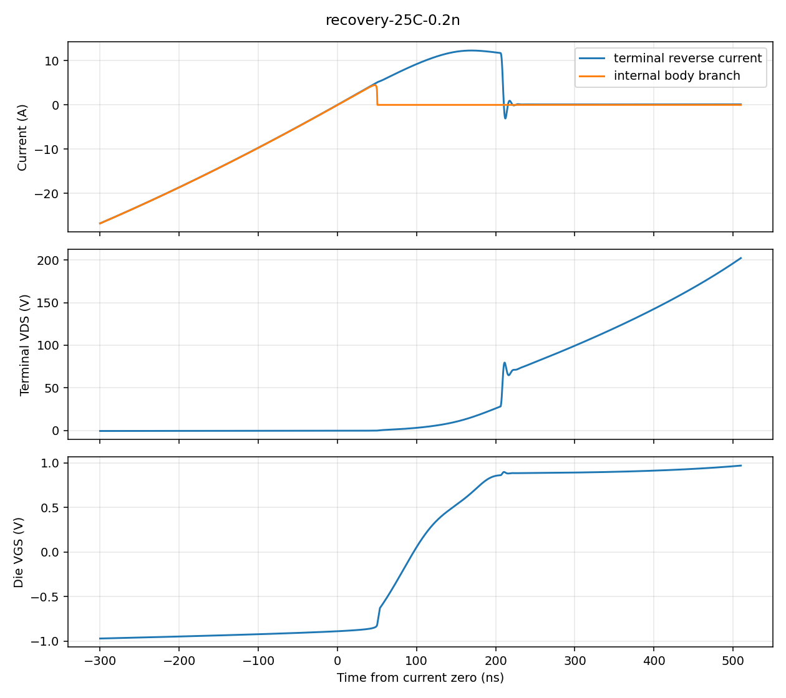
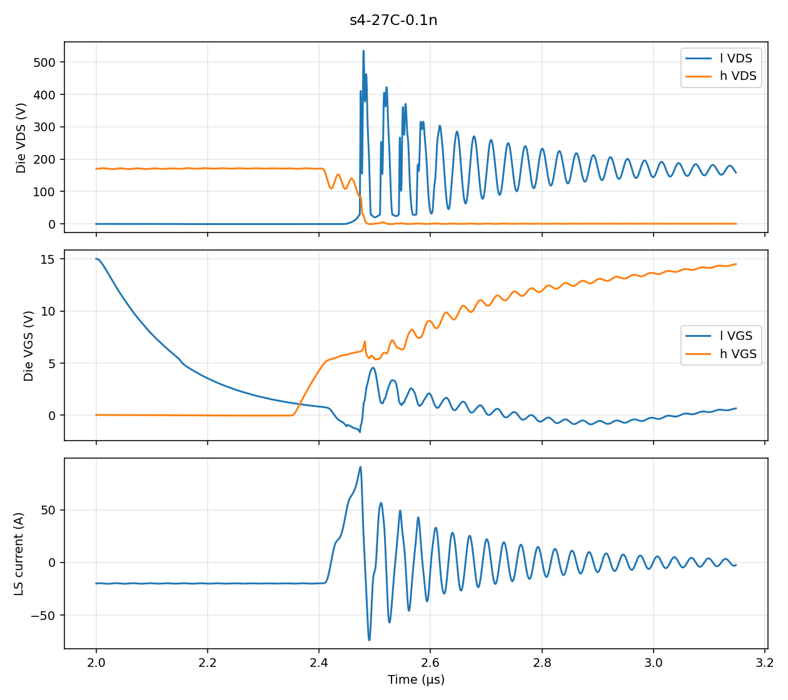

# D3 — body-diode recovery

**The L1 model gives 24.4% less terminal recovery charge than the datasheet typical at the matched test point; S4 still reproduces at 25 °C, but the datasheet does not validate its snap-off waveform or gate rebound.**

## Datasheet and model

Primary source: Infineon **IPW65R018CFD7, Final Data Sheet Rev. 2.0, 2021-04-19**, [official PDF](https://www.infineon.com/assets/row/public/documents/24/49/infineon-ipw65r018cfd7-datasheet-en.pdf). The existing repository copy is `validation-results/03-loss-thermal-budget/round3/sources/ipw65r018cfd7.pdf` under `zapote/power-stage-120v/`. Table 7, printed page 6, gives:

| Quantity | Typical | Maximum |
|---|---:|---:|
| Qrr | 2.30 µC | 4.60 µC |
| trr | 236 ns | 354 ns |
| Irrm | 15.0 A | unspecified |

Conditions: IF = 58.2 A, diF/dt = 100 A/µs, VR = 400 V; Tj = 25 °C under the section default on printed page 5. Table 8, printed page 11, shows equal external gate resistors, the off gate returned to source, and trr ending at the descending 10% Irrm crossing. It does not specify a numerical softness factor or measured recovery trace. Diagrams 1–15, printed pages 7–10, contain no Qrr-versus-slew or Qrr-versus-temperature curve. Table 4, printed page 5, gives VGS(th) = 3.5/4/4.5 V min/typ/max.

The downloaded library is Infineon version 1007, dated 2022-10-27. Its hash is recorded in [provenance.json](provenance.json), and matches the kit fetcher's pinned hash. The selected **IPW65R018CFD7_L1** includes package parasitics and an internal diode; it was not replaced by a generic diode. L1 drives its internal junction-temperature node from global `TEMP`; `.temp 25` and `.temp 27` therefore exercise different temperatures, without self-heating. The library identifies SIMetrix as its evaluation simulator; this study uses ngspice 45.2 in PSpice compatibility mode, not a vendor certification of that port.

## Method and condition differences

[recovery.cir](recovery.cir) uses two L1 devices in the Table 8 half-bridge arrangement. The load is an ideal constant-current sink, the large-load-inductance limit; it ramps up before commutation to avoid a failed initial operating point. A 400 V ideal supply clamps the bus. The incoming gate command is 13 V with a 5 ns edge, and both external gate resistors are 730 Ω. These are fixture choices, not board recommendations. They produce a measured zero-crossing slew of 100.564 A/µs and a pre-commutation current of 58.199996 A at 25 °C.

The DUT's terminal gate is returned through the equal resistor rather than clamped ideally at the die. Its maximum **die gate-minus-source** during recovery is 0.8962 V ([audit.json](audit.json)); unintended channel turn-on does not explain the recovery pulse. The internal gate-node absolute voltage is separately named `gate_node_peak_V` in the run results and is not VGS. The DUT terminal voltage at the end of the 12 µs run is 395.951 V, rather than exactly 400 V, because the incoming L1 switch has finite drop and slow gate settling. These differences, the ideal load, and unspecified datasheet fixture parasitics prevent claiming an exact test-equipment replica.

[run.py](run.py) measures positive terminal drain current after its interpolated zero crossing. Irrm is its maximum; trr ends at the first descending 10% Irrm crossing; Qrr is the trapezoidal integral between those interpolated endpoints. No negative ringing or late tail is folded into that integral. Softness here explicitly means `tb10/ta`, where `ta` is zero-to-peak and `tb10` is peak-to-10%; it is not an extrapolated tangent-to-zero factor. The slew is a linear fit within 20 ns either side of current zero. [audit.py](audit.py) independently re-integrates committed CSV data and verifies input hashes.

The failed constant-load startup at 730 Ω is retained in [calibration/cal730](calibration/cal730/), along with the preceding resistor trials. The final fixture uses the kit's ramped-load startup and completes. No failed or partial waveform contributes to the reported results.

## Recovery results

Full numerical values, parameters, return codes and end times: [summary.json](summary.json). Each linked folder includes CSV, PNG, solver logs and parameter files.

| Case | Slew (A/µs) | Qrr (µC) | trr (ns) | Irrm (A) | tb10/ta |
|---|---:|---:|---:|---:|---:|
| [25 °C, 0.2 ns](results/recovery-25C-0.2n/) | 100.564 | 1.738815 | 209.958 | 12.302259 | 0.239345 |
| [25 °C, 0.1 ns](results/recovery-25C-0.1n/) | 100.571 | 1.738782 | 209.947 | 12.302236 | see result.json |
| [27 °C, 0.2 ns](results/recovery-27C-0.2n/) | 100.288 | 1.738355 | 210.162 | 12.290927 | see result.json |

At 25 °C the model is below typical by **24.399% Qrr, 11.035% trr and 17.985% Irrm**. It is also below the published maxima, which does not establish a model accuracy tolerance. Halving the maximum timestep changes these quantities by −0.00189%, −0.00519% and −0.00019%, respectively. The small numerical sensitivity does not remove fixture or model uncertainty.



The internal body-diode branch peaks at **4.474 A**, contributing **0.122184 µC** over the same terminal recovery window, versus **1.738815 µC** terminal charge. Terminal reverse current includes charging the model's nonlinear capacitances. The internal branch collapses before the terminal pulse ends; the later abrupt terminal-current fall is not a direct measurement of minority-carrier recovery alone. These branch diagnostics are model internals, not independently measured silicon quantities.

The waveform is visibly abrupt, and its measured softness is small under the stated definition. **Whether it is softer, similar, or snappier than real IPW65R018CFD7 silicon cannot be quantified from this datasheet.** Its schematic waveform is not a measured trace; Qrr/trr/Irrm do not uniquely determine tail shape. The lower-than-typical charge rejects the idea that this matched test demonstrates an excessively large recovery-charge model, but does not clear the high-slew S4 waveform as physically accurate.

## Specified S4 rerun

The requested input is the committed provisional `d2/legA-h0-lin12.matrix.txt`, VBUS 170 V, IL −20 A, DIR 0, DT 348 ns, capacitor ESL 10 nH. The original runner's unchanged matrix conversion is used. [s4.cir](s4.cir) differs from upstream only by adding `TJ=27` and `.temp {TJ}`. The unmodified upstream `run_d2.py` entry point is separately exercised with its output redirected to a private temporary directory; all its eight reported measurements match the copied 27 °C case exactly ([original-runner.log](original-runner.log)). Upstream files are not edited.

| Case | LS die VDS peak (V) | LS off-gate VGS peak (V) | LS terminal current peak (A) |
|---|---:|---:|---:|
| [27 °C, 0.2 ns](results/s4-27C-0.2n/) | 536.7271 | 4.565682 | 90.7744 |
| [25 °C, 0.2 ns](results/s4-25C-0.2n/) | 536.5731 | 4.567120 | 90.7882 |
| [27 °C, 0.1 ns](results/s4-27C-0.1n/) | 535.5322 | 4.560759 | 90.8466 |



The change from 27 °C to the datasheet's 25 °C does not remove the modeled high-voltage excursion or gate rebound. Timestep refinement changes the voltage peak by −0.223% and off-gate peak by −0.108%. These are simulated results for the specified matrix and driver; neither temperature correction nor this recovery check makes S4 a passing physical qualification. The rebound crosses the datasheet threshold range, but the CSV alone is not a measurement of real shoot-through current. No claim of a high-temperature bound is made; the datasheet's recovery table is a 25 °C specification.

## Reproduce and limits

From repository root, after fetching the licensed library:

```sh
zsh zapote/power-stage-120v/validation-plan/sim-kit/models/fetch_models.sh
python3 zapote/power-stage-120v/validation-plan/sim-kit/smoke_test.py
python3 zapote/power-stage-120v/validation-results/01-switching-parasitics/round17/delegation/out-D3/run.py
python3 zapote/power-stage-120v/validation-results/01-switching-parasitics/round17/delegation/out-D3/audit.py
```

The measurement run used `/Users/bennet/miniforge3/bin/python3` with NumPy and Matplotlib. Runs are sequential. Temporary vendor copies and rawfiles are not committed. CSVs retain every adaptive sample in the plotted transition window; logs and checked `final_time_s` establish completion of the longer simulations. No downsampling is used. The committed decks plus original kit runner regenerate full-window rawfiles during execution.

[smoke-test.log](smoke-test.log): SMOKE PASS. [import-check.log](import-check.log): five contracts kept, zero broken. [regen-check.log](regen-check.log): all derived artifacts consistent. The initial sandbox/cache import-tool failure is retained separately; it was resolved using an isolated venv containing only import-linter and PyYAML, with no workspace sync or builds. Checks were `PYTHONPATH=packages/temper-placer/src .venv/bin/python scripts/import_linter_gate.py` and `python3 scripts/regen_derived.py --check`; the latter is read-only because this brief prohibits changes outside its output folder.

Source and fixture identities are in [provenance.json](provenance.json). The upstream source revision is 67aec36f8c876a7026c07ce3752105ab34d3ce46; the D3 scripts were uncommitted during measurement and are identified by their hashes, not represented as bytes belonging to that upstream commit. PCB geometry is an untouched input to the upstream matrix and was not re-extracted. No board/netlist/datasheet contradiction requiring a design change was found in this scoped recovery study. A measured commutation waveform or vendor-validated high-slew recovery model remains necessary to decide whether S4's snap is real.
