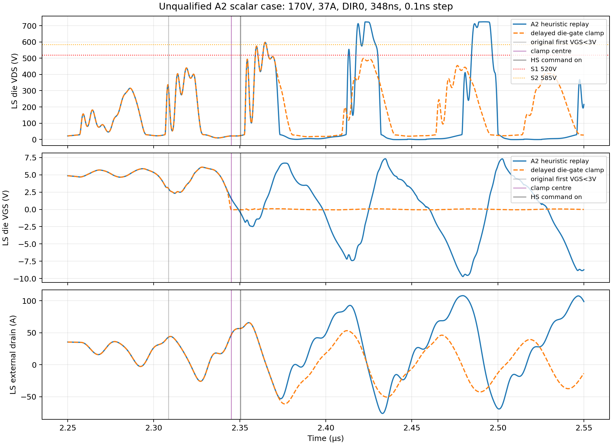

# D2 switching — independent legacy replay and recorder

- Board: native-15 `section.kicad_pcb`, SHA-256 `a3ac1249f5052afe52944804cdc3f6ef0e8f895668360e79c1fa7b6fb7322155`.
- Date: 2026-09-28; ngspice 45.2; scientific Python `/Users/bennet/Miniforge3/bin/python3`; Sol worker.
- Evidence class: simulation/model-based **diagnostic on A2 heuristic scalar inductances**, not a field-solved board prediction or bound.
- Verdict: **partial handback**. The original 723.9 V run is reproduced and instrumented. The D1 matrix, matrix counterfactuals, full grid and physical stress verdict remain pending.

## Summary

The original A/min leg-A 170 V, 37 A, DIR=0, 348 ns run reproduces **723.918 V** with a 0.2 ns maximum step. Scanning the entire saved interval from T1 through the end gives the same VDS peak as the original measurement window for all five runs; both peaks and times are now recorded separately. Adding voltage and current probes and extending the saved waveform to 3.368 µs changes the peak by under 0.001 V; halving the step changes it by **0.0000155 %**. At the 723.918 V low-side die VDS peak (2.492085 µs), its die VGS is **−2.141 V**, not the later maximum 7.368 V at 3.160310 µs. The events must not be conflated.

The Infineon model's internal `V_Ichannel` probe includes an explicit exponential drain-breakdown term in `G_chan`; it is **not pure inversion-channel current**. At the peak it reports +49.327 A despite negative die VGS, while the external low-side drain is −2.071 A and body-diode forward current is negligible. The internal epi branch is +49.255 A. Approximately 51 A of opposing displacement/internal current separates the epi branch from the external terminal. These signed currents do not demonstrate simultaneous forward MOSFET channel conduction at the voltage peak. They also do not rule out an earlier gate disturbance as a cause.

A diagnostic die gate-to-die source conductance was ramped in after the original die VGS first fell below 3 V, centered at **2.345 µs**, 5.5 ns before the high-side command-on. It holds the off die VGS within about 0.104 V after command-on. The peak falls to **598.154 V** at 0.1 ns (599.074 V at 0.2 ns, a 0.154 % step change). The original and clamped waveforms match closely through the initial turn-off and at command-on. This shows that subsequent off-gate dynamics materially increase the peak *in this heuristic model*. The imposed finite 0.01 Ω clamp perturbs gate dynamics; it is not proof of the physical mechanism. Even the clamped value exceeds the numerical S1 520 V criterion and S2 585 V threshold; this 37 A case is assessed against S1.



## Method and inputs

The round-3 raw bundle was verified **3327/3327**, then the sim-kit returned `SMOKE PASS`. The [frozen run provenance](outputs/frozen-run-provenance.json) pins the input identities captured with these runs and SHA-256 hashes of each run's copied deck, parameter file, logs, and ignored raw waveform. The [comparison](outputs/legacy-comparison.json) validates those saved artifacts and reuses the frozen input identities; it does not hash the checkout's current files and present them as historical inputs. It also requires complete finite raw vectors, matching row counts, full transient coverage, six finite measurements, and clean logs. The legacy control has a recorded zero exit status for both ngspice processes. The other four historical runs did not retain process exit codes, so their completed logs and waveforms are checked, but their exit status cannot be reconstructed. The frozen netlist hash below is retained from the prior report; the netlist itself is not among these five saved run artifacts. Input identity includes:

| Input | SHA-256 |
| --- | --- |
| Frozen netlist | `32f40a8f08f04278619300b9e1df985d378008c3ce18b13626c91e57d606df5f` |
| Round-3 A2 heuristic JSON | `4365536d40dfdc2580e01ac10657874f72f4ce873e331d0248581c061bf49b35` |
| Original B1 `complementary_leg.cir` | `bc3c4e72d174694c9637906c7af18f010cdd5da938054f84a3196a842a5d830c` |
| Infineon CFD7 L1 model | `02ac6634f47c25be04e8de3c6eec4ec8cf403b659001b7f176c8f98bb6e9ce3b` |

`scripts/legacy_control.cir` is byte-identical to round-3 B1. `scripts/extended_instrumented.cir` adds a zero-volt high-side external drain sensor, both devices' internal `V_Ichannel`, `V_Iepi` and `V_sense2` probes, driver-output and local-capacitor-pad voltages, and a 1.02 µs post-command window. The zero-volt sensor changes the 0.2 ns peak by only 0.0004 V. Positive `-i(V_sense2)` denotes forward body-diode current. `scripts/heuristic_ideal_offgate.cir` adds the delayed 0.01 Ω asymptotic die gate-to-die source clamp; clamp current is imposed and must never be counted as shoot-through.

The B1 model remains a constant-current load, simplified push-pull gate output, 27 °C Infineon electrical model, heuristic A2 copper inductances, and assumed 5 nH local-capacitor ESL. Its 723.9 V response is beyond the 650 V MOSFET design range; absolute amplitude and post-breakdown currents are not calibrated predictions. The cap-pad bus was about 170.45 V when the low-side die VDS peaked, showing this is local switching stress in the model rather than a 724 V bus.

## Reproduce

To replay the supplied frozen waveforms from `zapote/power-stage-120v`:

```sh
/Users/bennet/Miniforge3/bin/python3 validation-results/01-switching-parasitics/round4/d2-switching/scripts/compare_legacy.py
/Users/bennet/Miniforge3/bin/python3 validation-results/01-switching-parasitics/round4/d2-switching/scripts/plot_legacy.py
```

The comparison refuses a changed copied deck, parameter file, log, or raw waveform. For a fresh simulation, verify the raw bundle and sim-kit, then run the same cases into a new directory with `run_one.py ... --runs-root /tmp/d2-fresh-runs`. `run_one.py` now refuses an existing case directory and exits nonzero on aborted, failed, incomplete, or nonfinite evidence. Its run result records hashes of the current inputs and copied deck, parameters, and vendor model before that model copy is removed. The existing frozen manifest must be reviewed and replaced explicitly before comparing a new run as a new evidence set; do not overwrite the five saved runs.

`run_one.py` removes the copied vendor library from each raw run after use; the original licensed library remains in the local sim-kit only. Raw `outputs/runs/` is gitignored. The tracked JSON summaries and plot come from those runs.

## Pending D1 handoff and physical confirmation

This packet deliberately contains **no invented D1 port mapping**. After D1 delivers its converged frequency-dependent L/R matrix, coupled SPICE include, and port map, replace the scalar copper terms in the copied deck and rerun the exact comparison on both legs and both ESL bracket ends. Distinguish a physical shared source conductor from magnetic mutual coupling when testing K=0. A true ideal off-gate counterfactual must hold gate-to-**die source** at 0 V while commanded off; the present delayed finite conductance test is preliminary. Save both external drain and model branches in the matrix runs, then complete the grid and sustained gate-off assessment in ROUND-4 §3 D2. Low-voltage staged bring-up must measure both die-referenced VGS proxies, VDS, and current before claiming physical stress margins.
